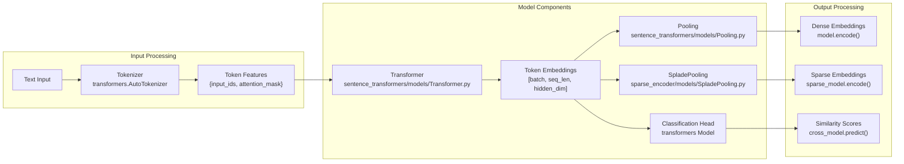
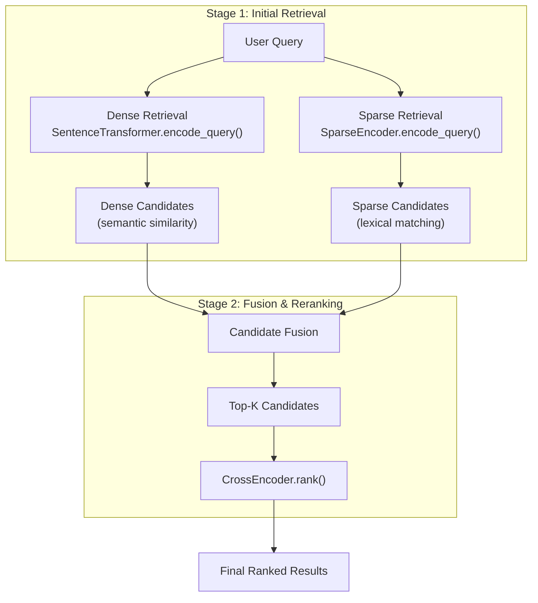
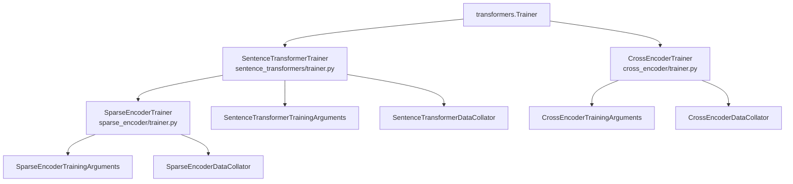
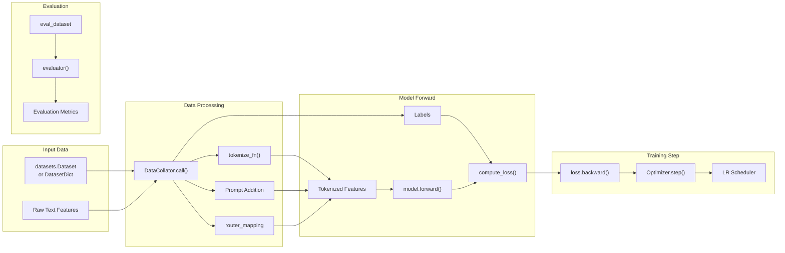

```

**Sources:** [sentence_transformers/cross_encoder/CrossEncoder.py:392-486](), [sentence_transformers/cross_encoder/CrossEncoder.py:488-590](), [README.md:93-132]()

## Data Flow and Processing Pipeline

The following diagram shows how text data flows through the different model architectures and their underlying components:



**Sources:** [sentence_transformers/models/Transformer.py:226-257](), [sentence_transformers/models/Pooling.py:135-241](), [sentence_transformers/sparse_encoder/models/SpladePooling.py](), [sentence_transformers/cross_encoder/CrossEncoder.py:341-342]()

## Common Usage Patterns

### Typical Model Selection

| Task | Model Type | Example Model | Key Method |
|------|------------|---------------|------------|
| Semantic similarity | `SentenceTransformer` | `all-mpnet-base-v2` | `encode()` |
| Vector database search | `SentenceTransformer` | `all-MiniLM-L6-v2` | `encode()` |
| Lexical + semantic search | `SparseEncoder` | `naver/splade-cocondenser-ensembledistil` | `encode()` |
| Reranking search results | `CrossEncoder` | `cross-encoder/ms-marco-MiniLM-L6-v2` | `rank()` |
| Text pair classification | `CrossEncoder` | `cross-encoder/nli-MiniLM2-L6-H768` | `predict()` |

### Hybrid Retrieval Pipeline



**Sources:** [README.md:213-216](), [sentence_transformers/SentenceTransformer.py:416-675](), [sentence_transformers/sparse_encoder/SparseEncoder.py:181-410](), [sentence_transformers/cross_encoder/CrossEncoder.py:488-590]()

## Next Steps

- **Model Selection**: Browse available models in [Pretrained Models](#5) or on the [Hugging Face Hub](https://huggingface.co/models?library=sentence-transformers)
- **Training**: Learn to fine-tune models for your domain in [Training](#3)
- **Applications**: Explore real-world use cases in [Applications](#6)
- **Performance**: Optimize inference speed using techniques in [Advanced Topics](#7)

**Sources:** [index.rst:133-154](), [docs/sentence_transformer/pretrained_models.md:1-49]()

# Training


This page covers the training system architecture and common concepts shared across all model types in sentence-transformers. The training system provides a unified interface for training `SentenceTransformer`, `SparseEncoder`, and `CrossEncoder` models using PyTorch and 🤗 Transformers.

For specific training guides, see [SentenceTransformer Training](#3.1), [SparseEncoder Training](#3.2), and [CrossEncoder Training](#3.3). For loss function details, see [Loss Functions for SentenceTransformer](#3.4), [Loss Functions for SparseEncoder](#3.5), and [Loss Functions for CrossEncoder](#3.6).

## Training Architecture Overview

The sentence-transformers training system is built on top of 🤗 Transformers `Trainer` with specialized components for each model type:

```mermaid
graph TB
    subgraph "Model Types"
        ST["SentenceTransformer"]
        SE["SparseEncoder"] 
        CE["CrossEncoder"]
    end
    
    subgraph "Trainer Classes"
        STTrainer["SentenceTransformerTrainer"]
        SETrainer["SparseEncoderTrainer"]
        CETrainer["CrossEncoderTrainer"]
    end
    
    subgraph "🤗 Transformers Base"
        BaseTrainer["transformers.Trainer"]
    end
    
    subgraph "Common Components"
        Args["TrainingArguments"]
        DataCollator["DataCollator"]
        Loss["Loss Functions"]
        Evaluator["Evaluators"]
        Router["Router Module"]
    end
    
    ST --> STTrainer
    SE --> SETrainer
    CE --> CETrainer
    
    STTrainer --> BaseTrainer
    SETrainer --> STTrainer
    CETrainer --> BaseTrainer
    
    STTrainer --> Args
    SETrainer --> Args  
    CETrainer --> Args
    
    STTrainer --> DataCollator
    SETrainer --> DataCollator
    CETrainer --> DataCollator
    
    STTrainer --> Loss
    SETrainer --> Loss
    CETrainer --> Loss
    
    STTrainer --> Evaluator
    SETrainer --> Evaluator
    CETrainer --> Evaluator
    
    STTrainer --> Router
    SETrainer --> Router
```



**Training Architecture Overview**

Sources: [sentence_transformers/trainer.py:59-127](), [sentence_transformers/sparse_encoder/trainer.py:31-98](), [docs/sentence_transformer/training_overview.md:17-46]()

## Trainer Class Hierarchy

The training system uses specialized trainer classes that inherit from the 🤗 Transformers `Trainer`:



**Trainer Class Hierarchy and Components**

Sources: [sentence_transformers/trainer.py:59](), [sentence_transformers/sparse_encoder/trainer.py:31](), [sentence_transformers/data_collator.py:13]()

## Data Flow During Training

The training process follows a consistent data flow across all model types:



**Training Data Flow**

Sources: [sentence_transformers/trainer.py:391-441](), [sentence_transformers/data_collator.py:35-119](), [sentence_transformers/trainer.py:545-592]()

## Common Training Components

### Data Collator

The `SentenceTransformerDataCollator` handles tokenization and batch preparation:

| Component | Purpose |
|-----------|---------|
| `tokenize_fn` | Tokenizes text inputs using the model's tokenizer |
| `router_mapping` | Maps dataset columns to router tasks (e.g., "query", "document") |
| `prompts` | Adds prompts to input texts before tokenization |
| `valid_label_columns` | Identifies label columns ("label", "score") |

Sources: [sentence_transformers/data_collator.py:13-31]()

### Training Arguments

Each model type has specialized training arguments:

- `SentenceTransformerTrainingArguments` - Basic sentence transformer training
- `SparseEncoderTrainingArguments` - Adds sparse-specific parameters  
- `CrossEncoderTrainingArguments` - Cross encoder specific settings

Key parameters include `batch_sampler`, `multi_dataset_batch_sampler`, `router_mapping`, and `learning_rate_mapping`.

Sources: [sentence_transformers/trainer.py:36-40]()

### Loss Functions

Training supports both single loss functions and multi-dataset loss dictionaries:

```python