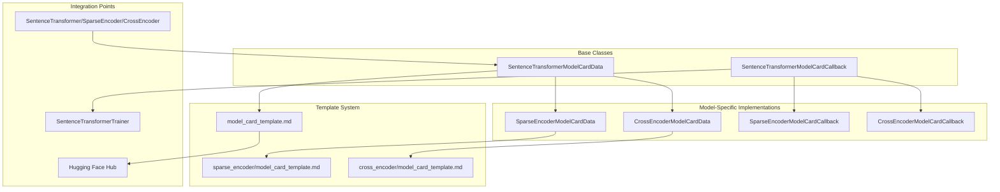
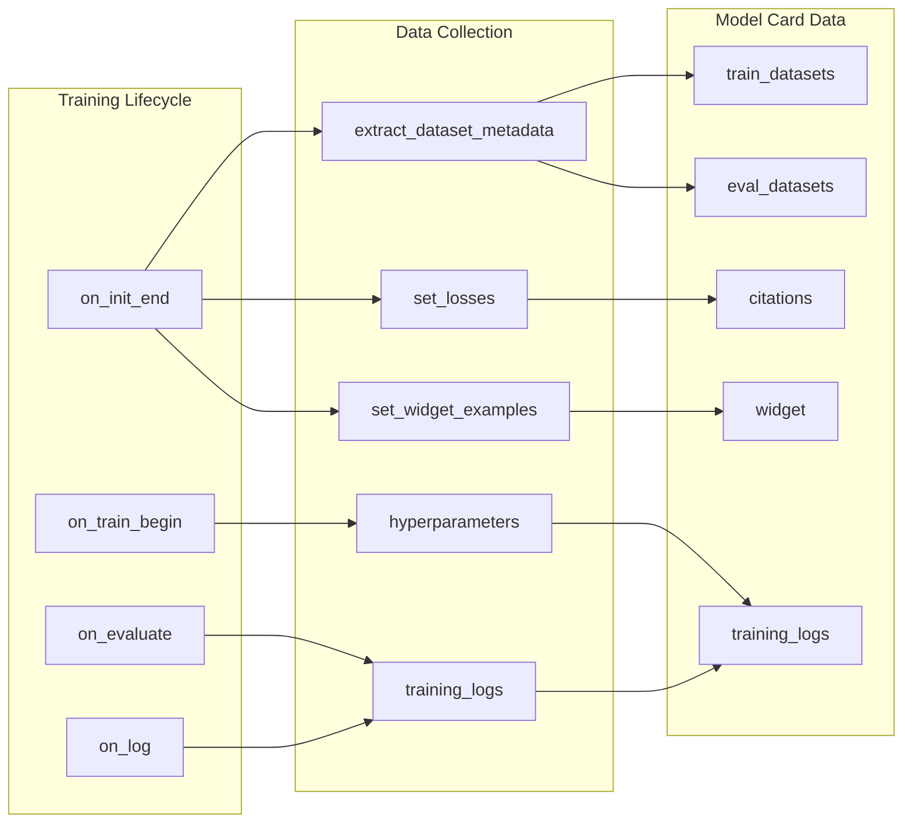

This section covers advanced features and development topics for power users and contributors working with the sentence-transformers library. It focuses on sophisticated functionality that extends beyond basic model usage, including automatic model documentation generation, performance optimization techniques, and development infrastructure.

For basic model training concepts, see [Training](#3). For standard evaluation procedures, see [Evaluation](#4). For application integration patterns, see [Applications](#6).

## Model Card Generation System

The sentence-transformers library includes a comprehensive automatic model card generation system that creates detailed documentation during training. This system captures training metadata, dataset information, evaluation metrics, and generates standardized model cards for sharing on the Hugging Face Hub.

### Model Card Data Architecture

The model card system is built around specialized data classes that automatically collect and organize model information:



Sources: [sentence_transformers/model_card.py:265-359](), [sentence_transformers/sparse_encoder/model_card.py:22-86](), [sentence_transformers/cross_encoder/model_card.py:27-89]()

### Automatic Data Collection During Training

The model card callback system integrates with the training process to automatically capture relevant information:



Sources: [sentence_transformers/model_card.py:47-199](), [sentence_transformers/model_card.py:445-570]()

### Dataset Metadata Extraction

The system automatically analyzes training and evaluation datasets to generate comprehensive statistics and examples:

| Metadata Type | Information Collected | Implementation |
|---------------|----------------------|----------------|
| **Size & Structure** | Dataset size, column names, data types | `compute_dataset_metrics` |
| **Content Statistics** | Token/character counts, value distributions | Statistical analysis per column |
| **Hub Integration** | Dataset ID, revision, download checksums | `extract_dataset_metadata` |
| **Sample Examples** | Representative examples for documentation | First 3 samples with formatting |
| **Loss Configuration** | Loss function details and parameters | `get_config_dict` introspection |

The dataset analysis includes automatic tokenization to provide meaningful statistics:

```python