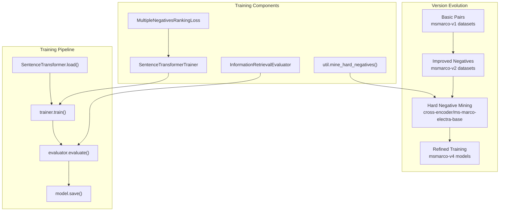
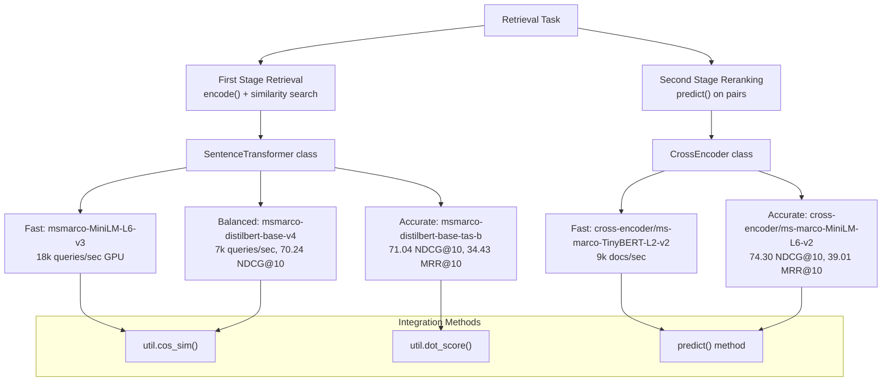
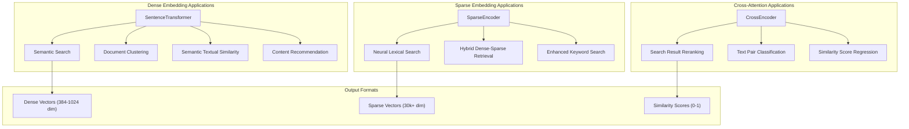
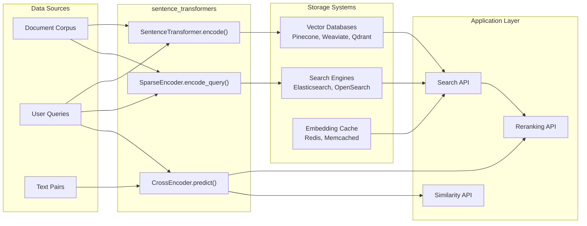
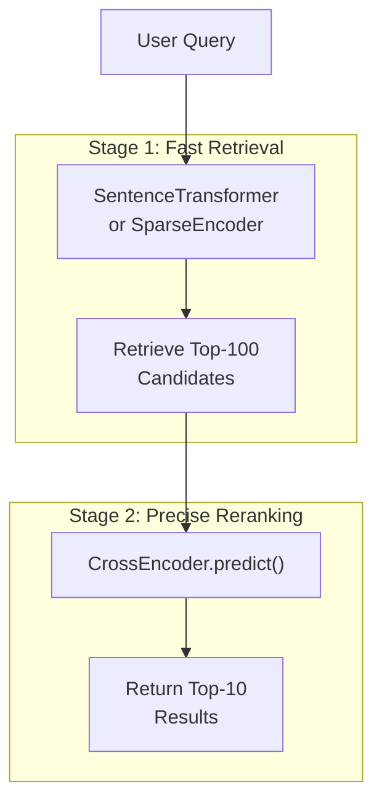

similarity_matrix = util.cos_sim(query_embeddings, passage_embeddings)
```

**Sources:** [docs/pretrained-models/msmarco-v3.md:7-16](), [docs/cross_encoder/pretrained_models.md:16-23]()

## Model Training Evolution

The MS MARCO models have evolved through multiple versions with different training methodologies:

### Training Code Flow



### Version 3 Hard Negative Mining Process

The v3 models used an automated hard negative mining pipeline implemented with sentence-transformers utilities:

1. **Initial Retrieval**: v2 `SentenceTransformer` models encoded queries and retrieved similar passages
2. **Cross-Encoder Scoring**: `CrossEncoder("cross-encoder/ms-marco-electra-base")` scored query-passage pairs
3. **Hard Negative Mining**: `util.mine_hard_negatives()` identified passages with high bi-encoder similarity but low cross-encoder relevance scores
4. **Retraining**: Models trained with `MultipleNegativesRankingLoss` using the mined hard negatives

### Training Loss Functions Used

| Model Version | Primary Loss | Secondary Loss | Evaluation |
|---------------|-------------|----------------|------------|
| v1-v2 | `MultipleNegativesRankingLoss` | - | `InformationRetrievalEvaluator` |
| v3 | `MultipleNegativesRankingLoss` | Hard negative augmentation | `InformationRetrievalEvaluator` |
| v4 | `MultipleNegativesRankingLoss` | Advanced hard negatives | `InformationRetrievalEvaluator` |

**Sources:** [docs/pretrained-models/msmarco-v3.md:53-58](), [docs/sentence_transformer/dataset_overview.md:78-89]()

## Model Selection Guidelines

### Choose Based on Similarity Method

- **Cosine Similarity Models**: Use when you need normalized similarity scores and prefer shorter, focused passages
- **Dot Product Models**: Use when longer, comprehensive passages are preferred and unnormalized scores are acceptable

### Choose Based on Architecture



### Performance vs Speed Trade-offs

- **Fastest**: `msmarco-MiniLM-L6-v3` (18,000 queries/sec GPU)
- **Best Balance**: `msmarco-distilbert-base-v4` (7,000 queries/sec GPU, highest accuracy)
- **Highest Quality**: `msmarco-distilbert-base-tas-b` (34.43 MRR@10)

**Sources:** [docs/pretrained-models/msmarco-v3.md:45-50]()

## Integration with Search Systems

MS MARCO models integrate with various search architectures for production deployment. For detailed integration patterns, see [Retrieve & Rerank Architecture](#6.3) and [Semantic Search](#6.1).

**Sources:** [docs/pretrained-models/msmarco-v3.md:19](), [docs/cross_encoder/pretrained_models.md:44]()

# Applications


This page provides an overview of real-world applications and integration patterns using sentence-transformers models. It covers how the three core model types (`SentenceTransformer`, `SparseEncoder`, and `CrossEncoder`) are deployed in production systems for semantic search, retrieval, reranking, and other natural language processing tasks.

For specific implementation details of individual applications, see [Semantic Search](#6.1), [Sparse Search Integration](#6.2), [Retrieve & Rerank Architecture](#6.3), [Semantic Textual Similarity](#6.4), and [Multimodal Applications](#6.5). For information about available pretrained models optimized for specific applications, see [Pretrained Models](#5).

## Core Application Categories

The sentence-transformers library enables three primary categories of applications, each leveraging different model architectures optimized for specific use cases:

### Application Architecture Overview



**Dense embedding applications** use `SentenceTransformer` models to convert text into fixed-size dense vectors that capture semantic meaning. These applications excel at finding semantically similar content even when lexical overlap is minimal.

**Sparse embedding applications** use `SparseEncoder` models to generate high-dimensional sparse vectors that preserve lexical information while adding semantic understanding. These applications bridge the gap between traditional keyword search and semantic search.

**Cross-attention applications** use `CrossEncoder` models that jointly process text pairs to produce precise similarity scores. These applications provide the highest accuracy for ranking and classification tasks but with higher computational cost.

Sources: [docs/pretrained-models/msmarco-v2.md:1-39]()

## Integration Patterns

Production systems typically integrate sentence-transformers models through several common patterns, each optimized for different scalability and accuracy requirements:

### System Integration Architecture



**Vector database integration** stores dense embeddings from `SentenceTransformer.encode()` in specialized vector databases optimized for similarity search. Common databases include Pinecone, Weaviate, and Qdrant, which provide approximate nearest neighbor search capabilities.

**Search engine integration** indexes sparse embeddings from `SparseEncoder.encode_query()` and `SparseEncoder.encode_document()` in traditional search engines like Elasticsearch or OpenSearch, enabling hybrid lexical-semantic search.

**API-based reranking** uses `CrossEncoder.predict()` to refine initial retrieval results, typically processing the top-k candidates from a faster first-stage retrieval system.

Sources: [docs/pretrained-models/msmarco-v2.md:7-16]()

## Production Deployment Patterns

### Two-Stage Retrieval Architecture

The most common production pattern combines fast retrieval with precise reranking:



This architecture balances computational efficiency with accuracy by using fast bi-encoder models for initial retrieval and slower but more accurate cross-encoder models for final ranking.

### Model Selection by Application Requirements

| Application Type | Model Architecture | Latency | Accuracy | Storage Requirements |
|------------------|-------------------|---------|----------|---------------------|
| Real-time search | `SentenceTransformer` | ~1ms | Good | Dense vectors (384-1024 dim) |
| Hybrid search | `SparseEncoder` | ~2ms | Better | Sparse vectors (30k+ dim) |
| Reranking | `CrossEncoder` | ~10ms | Best | No storage (computed on-demand) |
| Batch processing | Any | Variable | Highest | Depends on architecture |

### Memory and Scaling Considerations

Production deployments must consider memory requirements and scaling patterns:

- **Dense embeddings**: Require 4 bytes per dimension per document (e.g., 1.5KB for 384-dim embeddings)
- **Sparse embeddings**: Store only non-zero values, typically 50-200 active dimensions per document
- **Cross-encoders**: No storage overhead but higher compute cost per query

## Common Integration Libraries

The sentence-transformers library integrates with numerous downstream frameworks and applications:

| Integration Type | Libraries | Use Case |
|------------------|-----------|----------|
| RAG Frameworks | LangChain, LlamaIndex, Haystack | Document retrieval for LLMs |
| Topic Modeling | BERTopic, Top2Vec | Document clustering and topic discovery |
| Few-shot Learning | SetFit | Classification with minimal training data |
| Keyword Extraction | KeyBERT | Semantic keyword extraction |
| Search Applications | txtai | End-to-end search applications |

These integrations typically use the standard `encode()` and `predict()` methods provided by the core model classes, enabling drop-in replacement of embedding models without changing application code.

Sources: [docs/pretrained-models/msmarco-v2.md:19-38]()