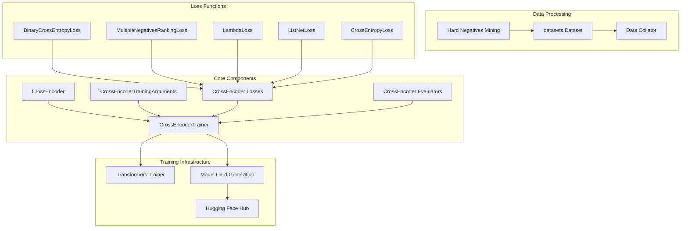
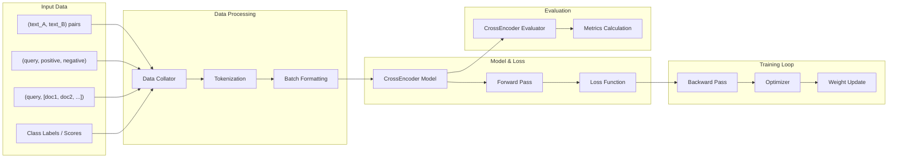

This document covers the training system for CrossEncoder models in sentence-transformers. CrossEncoders are designed for reranking and classification tasks where two texts are jointly encoded to produce similarity scores or class predictions.

For information about training SentenceTransformer models (bi-encoders), see [3.1](#3.1). For SparseEncoder training, see [3.2](#3.2). For loss function details specific to CrossEncoders, see [3.6](#3.6).

## CrossEncoder Training Architecture

CrossEncoder training follows a similar pattern to other model types in sentence-transformers but with specific adaptations for joint text encoding and ranking/classification tasks.

**CrossEncoder Training System Overview**


Sources: [docs/cross_encoder/training_overview.md:1-500](), [docs/cross_encoder/loss_overview.md:1-100]()

## Training Components

CrossEncoder training involves six main components that work together to fine-tune models for ranking and classification tasks.

**CrossEncoder Training Data Flow**


Sources: [docs/cross_encoder/training_overview.md:170-190](), [sentence_transformers/data_collator.py:35-120]()

### Model Initialization

CrossEncoder models are initialized by loading a pretrained transformers model with a sequence classification head. If the model doesn't have such a head, it's added automatically.

```python
from sentence_transformers import CrossEncoder