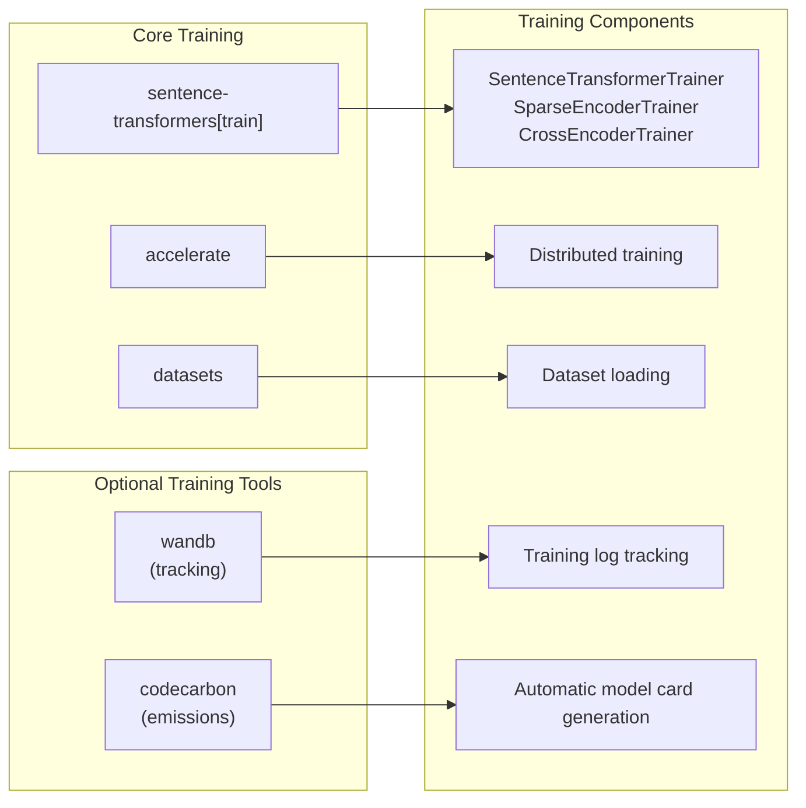
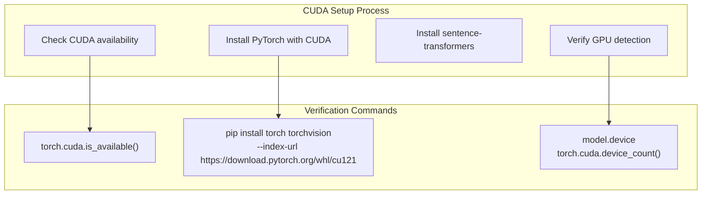

conda install -c conda-forge sentence-transformers accelerate datasets pre-commit pytest ruff
```

Note that ONNX and OpenVINO extras still require pip installation even when using conda for the base package.

**Sources:** [docs/installation.md:12-110]()

## Backend Dependencies

### Training Dependencies

For training workflows, additional dependencies provide enhanced functionality:



Install recommended training tools:
```bash
pip install wandb        # For experiment tracking
pip install codecarbon   # For carbon emissions tracking
```

### Optimization Backends

Different backends provide specific optimization capabilities:

| Backend | Installation | Optimization Focus |
|---------|-------------|-------------------|
| PyTorch | Default | Standard deep learning operations |
| ONNX Runtime | `[onnx]` or `[onnx-gpu]` | Cross-platform inference optimization |
| OpenVINO | `[openvino]` | Intel CPU/GPU/VPU optimization |

**Sources:** [docs/installation.md:46-52](), [docs/installation.md:96-102]()

## Source Installation

### Latest Development Version

Install directly from the GitHub repository to access the latest features:

```bash
# Default from source
pip install git+https://github.com/UKPLab/sentence-transformers.git

# Training from source
pip install -U "sentence-transformers[train] @ git+https://github.com/UKPLab/sentence-transformers.git"

# ONNX from source
pip install -U "sentence-transformers[onnx-gpu] @ git+https://github.com/UKPLab/sentence-transformers.git"
```

### Editable Development Install

For contributors and developers making changes to the library:

```bash
git clone https://github.com/UKPLab/sentence-transformers
cd sentence-transformers
pip install -e ".[train,dev]"
```

This creates a link between the cloned repository and your Python environment, enabling immediate testing of code changes.

**Sources:** [docs/installation.md:112-174]()

## GPU and CUDA Setup

### PyTorch CUDA Installation

For GPU acceleration, install PyTorch with CUDA support before installing sentence-transformers:



Follow the [PyTorch installation guide](https://pytorch.org/get-started/locally/) for your specific CUDA version and system configuration.

**Sources:** [docs/installation.md:175-177]()

## Installation Verification

### Basic Functionality Test

After installation, verify the setup works correctly:

```python