model = CrossEncoder("google-bert/bert-base-uncased")
```

Sources: [docs/cross_encoder/training_overview.md:42-72]()

### Dataset Format Requirements

CrossEncoder training datasets must match the chosen loss function requirements. The validation involves three steps:

1. **Input Columns**: All columns except "label", "labels", "score", or "scores" are treated as inputs
2. **Label Columns**: If the loss function requires labels, the dataset must have a column named "label", "labels", "score", or "scores"
3. **Model Output Compatibility**: The number of model output labels must match the loss function requirements

**Dataset Format Validation Flow**
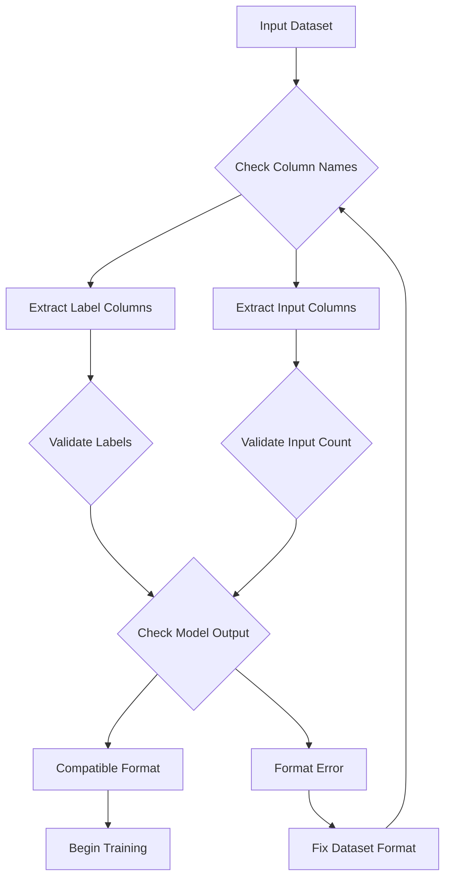

Sources: [docs/cross_encoder/training_overview.md:171-189]()

### Loss Functions

CrossEncoder loss functions are designed for ranking and classification tasks. The choice depends on your data format and task type:

| Input Format | Labels | Model Outputs | Common Loss Functions |
|--------------|--------|---------------|----------------------|
| `(sentence_A, sentence_B)` pairs | `class` | `num_classes` | `CrossEntropyLoss` |
| `(anchor, positive)` pairs | `none` | `1` | `MultipleNegativesRankingLoss` |
| `(anchor, positive/negative)` pairs | `1/0` | `1` | `BinaryCrossEntropyLoss` |
| `(query, [doc1, ..., docN])` | `[score1, ..., scoreN]` | `1` | `LambdaLoss`, `ListNetLoss` |

Sources: [docs/cross_encoder/loss_overview.md:20-28]()

### Hard Negatives Mining

CrossEncoder performance often depends on the quality of negative examples. The `mine_hard_negatives` function helps generate challenging negatives:

```python
from sentence_transformers.util import mine_hard_negatives

hard_train_dataset = mine_hard_negatives(
    train_dataset,
    embedding_model,
    num_negatives=5,
    range_min=10,
    range_max=100,
    max_score=0.8,
    output_format="labeled-pair"
)
```

Sources: [docs/cross_encoder/training_overview.md:204-242]()

## Training Process Integration

CrossEncoder training integrates with the broader sentence-transformers training infrastructure while maintaining its specialized functionality.

**CrossEncoder Training Infrastructure**
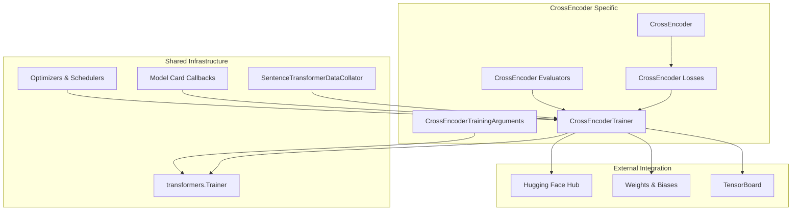

Sources: [sentence_transformers/trainer.py:59-128](), [docs/cross_encoder/training_overview.md:314-400]()

### Training Arguments

`CrossEncoderTrainingArguments` extends the standard transformers training arguments with CrossEncoder-specific parameters:

**Key Training Arguments:**
- **Performance**: `learning_rate`, `per_device_train_batch_size`, `num_train_epochs`, `gradient_accumulation_steps`
- **Optimization**: `fp16`, `bf16`, `optim`, `lr_scheduler_type`, `warmup_ratio`
- **Evaluation**: `eval_strategy`, `eval_steps`, `load_best_model_at_end`, `metric_for_best_model`
- **Tracking**: `report_to`, `run_name`, `logging_steps`, `push_to_hub`

Sources: [docs/cross_encoder/training_overview.md:320-344]()

### Evaluation System

CrossEncoder evaluators assess model performance during training with task-specific metrics:

- `BinaryClassificationEvaluator`: For binary classification tasks
- `CrossEncoderReranking`: For ranking performance evaluation  
- `EmbeddingSimilarityEvaluator`: For similarity scoring tasks
- `InformationRetrievalEvaluator`: For retrieval performance

Sources: [docs/cross_encoder/training_overview.md:365-400]()

## Relationship to Other Training Systems

CrossEncoder training shares infrastructure with other sentence-transformers training systems while maintaining its distinct characteristics.

**Training System Relationships**
```mermaid
graph TB
    subgraph "Base Training Infrastructure"
        BaseTrainer[SentenceTransformerTrainer]
        BaseArgs[SentenceTransformerTrainingArguments]
        BaseCollator[SentenceTransformerDataCollator]
        BaseCard[SentenceTransformerModelCardCallback]
    end
    
    subgraph "CrossEncoder Training"
        CETrainer[CrossEncoderTrainer]
        CEArgs[CrossEncoderTrainingArguments]
        CEModel[CrossEncoder]
        CELosses[CrossEncoder Losses]
        CEEvals[CrossEncoder Evaluators]
    end
    
    subgraph "SparseEncoder Training"
        SETrainer[SparseEncoderTrainer]
        SEArgs[SparseEncoderTrainingArguments]
        SEModel[SparseEncoder]
        SELosses[SparseEncoder Losses]
    end
    
    subgraph "SentenceTransformer Training"  
        STModel[SentenceTransformer]
        STLosses[SentenceTransformer Losses]
        STEvals[SentenceTransformer Evaluators]
    end
    
    BaseTrainer --> CETrainer
    BaseTrainer --> SETrainer
    BaseArgs --> CEArgs
    BaseArgs --> SEArgs
    BaseCollator --> CETrainer
    BaseCollator --> SETrainer
    BaseCard --> CETrainer
    
    STModel --> BaseTrainer
    CEModel --> CETrainer
    SEModel --> SETrainer
    
    STLosses --> BaseTrainer
    CELosses --> CETrainer
    SELosses --> SETrainer
    
    STEvals --> BaseTrainer
    CEEvals --> CETrainer
```

Sources: [sentence_transformers/trainer.py:59-128](), [sentence_transformers/sparse_encoder/trainer.py:31-98]()

The CrossEncoder training system leverages the shared infrastructure while providing specialized components for joint text encoding and ranking tasks, making it suitable for reranking applications and text pair classification scenarios.

# Loss Functions for SentenceTransformer


## Introduction

This page documents the loss functions available for training SentenceTransformer models. Loss functions are a critical component that defines the training objective and directly influences the quality and properties of the resulting sentence embeddings. 

For information about how to use these loss functions in training, see [SentenceTransformer Training](#3.1) and [CrossEncoder Training](#3.2).

The SentenceTransformer library offers a diverse set of loss functions, each designed for specific use cases and data formats:

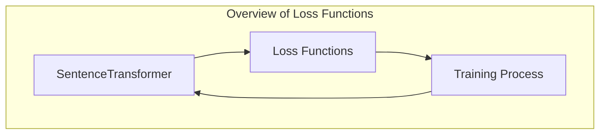

Sources: 
- [sentence_transformers/losses/__init__.py:1-67]()

## Loss Function Taxonomy

SentenceTransformer provides several categories of loss functions, each with different approaches to learning sentence embeddings:

Loss Function Taxonomy

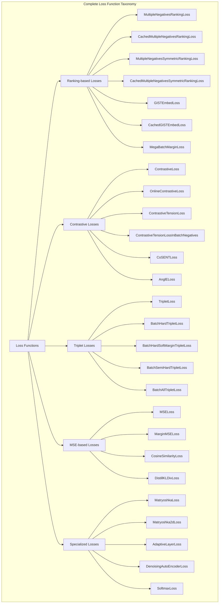

Sources:
- [sentence_transformers/losses/__init__.py:1-67]()

## Ranking-Based Loss Functions

Ranking-based loss functions are commonly used for training retrieval models. They focus on learning representations where relevant pairs have higher similarity than irrelevant pairs.

### MultipleNegativesRankingLoss

This is one of the most widely used loss functions for training sentence embeddings. It treats other samples in the batch as negatives, creating an effective training signal that improves with larger batch sizes.

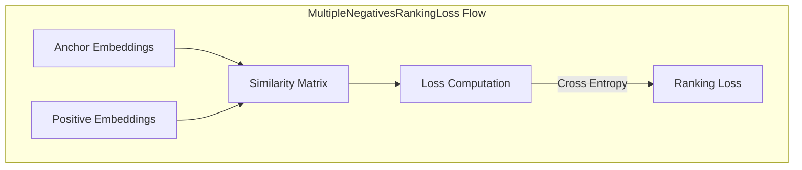

**Key Properties**:
- Also known as InfoNCE loss, SimCSE loss, or in-batch negatives loss
- Performance generally improves with increasing batch size
- Requires (anchor, positive) pairs or (anchor, positive, negative) triplets
- Each anchor should be most similar to its corresponding positive from all candidates in the batch

Sources:
- [sentence_transformers/losses/MultipleNegativesRankingLoss.py:13-132]()

### CachedMultipleNegativesRankingLoss

A memory-efficient version of MultipleNegativesRankingLoss based on the GradCache technique, allowing for extremely large batch sizes with constant memory usage.

**Key Properties**:
- Divides computation into embedding and loss calculation stages
- Allows training with much larger batch sizes on limited hardware
- Approximately 20-30% slower than non-cached version
- Technically superior for large batch sizes

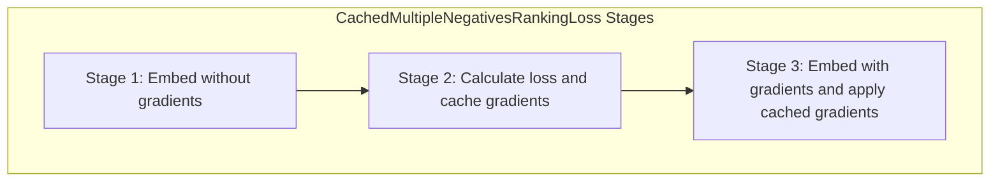

Sources:
- [sentence_transformers/losses/CachedMultipleNegativesRankingLoss.py:63-300]()

### GISTEmbedLoss

An improved ranking loss that uses a guide model to guide the in-batch negative sample selection, providing a stronger training signal.

**Key Properties**:
- Uses a teacher/guide model to identify and suppress false negatives
- Supports different margin strategies for negative filtering
- Better training signal than MultipleNegativesRankingLoss

Sources:
- [sentence_transformers/losses/GISTEmbedLoss.py:13-221]()
- [sentence_transformers/losses/CachedGISTEmbedLoss.py:63-382]()

## Contrastive Loss Functions

Contrastive losses optimize embeddings so that similar items are closer together and dissimilar items are farther apart in the embedding space.

### ContrastiveLoss

The standard contrastive loss function that minimizes distance between positive pairs and maximizes distance between negative pairs.

**Key Properties**:
- Expects pairs of texts with binary labels (1 for similar, 0 for dissimilar)
- Uses a specified distance metric (cosine, euclidean, manhattan)
- Includes a margin hyperparameter

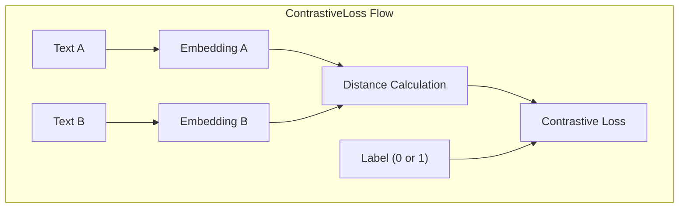

Sources:
- [sentence_transformers/losses/ContrastiveLoss.py:13-120]()

### CoSENTLoss

An improved contrastive loss that provides a stronger training signal than standard CosineSimilarityLoss.

**Key Properties**:
- Uses a logsum formulation comparing multiple pairs in the batch
- Faster convergence and better performance than CosineSimilarityLoss
- Requires sentence pairs with similarity scores

Sources:
- [sentence_transformers/losses/CoSENTLoss.py:13-115]()

### ContrastiveTensionLoss

Designed for unsupervised learning, this loss creates positive and negative pairs automatically.

**Key Properties**:
- Works without explicit labels
- Creates a copy of the encoder model to produce embeddings for the first sentence in each pair
- Requires using `ContrastiveTensionDataLoader` for proper pair generation

Sources:
- [sentence_transformers/losses/ContrastiveTensionLoss.py:17-204]()

## Triplet Loss Functions

Triplet losses use triplets of (anchor, positive, negative) to learn embeddings where the anchor is closer to the positive than to the negative by a certain margin.

### TripletLoss

The basic triplet loss function minimizes the distance between anchor and positive while maximizing the distance between anchor and negative.

**Key Properties**:
- Requires (anchor, positive, negative) triplets
- Uses a specified distance metric and margin
- Optimizes: max(||anchor - positive|| - ||anchor - negative|| + margin, 0)

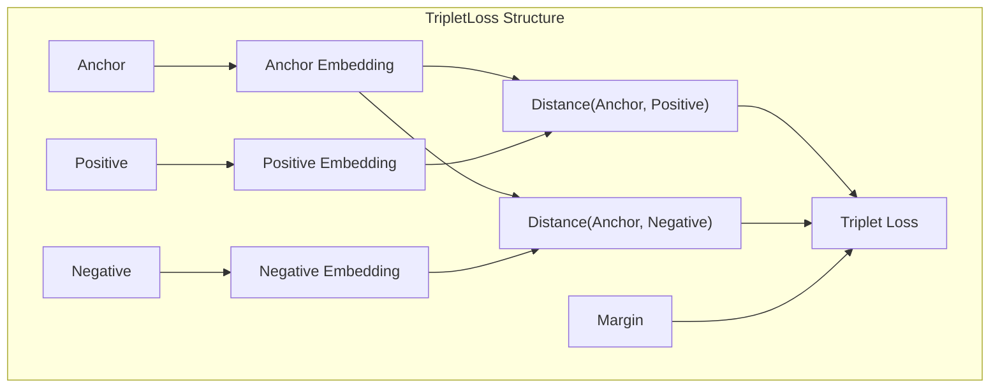

Sources:
- [sentence_transformers/losses/TripletLoss.py:13-112]()

### Batch Triplet Losses

These are more advanced variants of triplet loss that use different strategies for mining triplets within a batch:

1. **BatchHardTripletLoss**: Selects hardest positive and negative samples for each anchor.
2. **BatchSemiHardTripletLoss**: Focuses on semi-hard triplets (not too easy, not too hard).
3. **BatchAllTripletLoss**: Uses all valid triplets in the batch.
4. **BatchHardSoftMarginTripletLoss**: Similar to BatchHardTripletLoss but with a soft margin.

**Key Properties**:
- Require single sentences with class labels
- Create triplets on-the-fly from the batch
- Recommend using batches with multiple examples per class
- Different mining strategies for different training dynamics

Sources:
- [sentence_transformers/losses/BatchHardTripletLoss.py:12-267]()
- [sentence_transformers/losses/BatchSemiHardTripletLoss.py:13-188]()
- [sentence_transformers/losses/BatchAllTripletLoss.py:13-151]()
- [sentence_transformers/losses/BatchHardSoftMarginTripletLoss.py:13-153]()

## MSE-Based Loss Functions

These loss functions use Mean Squared Error (MSE) to optimize embeddings against a target.

### MSELoss

MSE Loss computes the squared error between computed sentence embeddings and target embeddings.

**Key Properties**:
- Often used for knowledge distillation and multilingual model extension
- Requires sentences with corresponding target embeddings
- Simple and effective for teacher-student learning

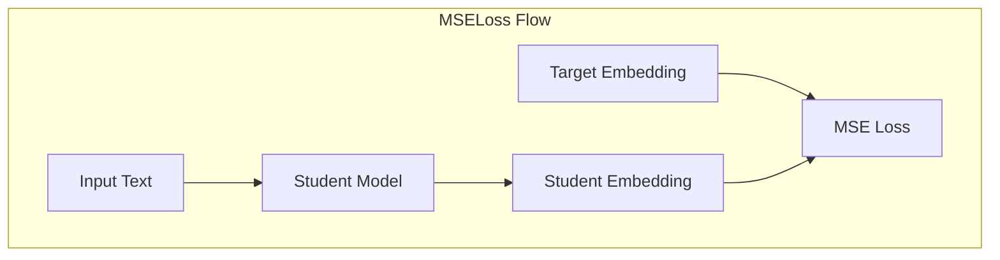

Sources:
- [sentence_transformers/losses/MSELoss.py:11-98]()

### MarginMSELoss

An extension of MSE loss that focuses on the margin between pairs of passages for a query.

**Key Properties**:
- Computes MSE between predicted margins and gold margins
- More suitable for ranking tasks
- Does not require strict positive/negative distinction
- Often used with a teacher model in knowledge distillation

Sources:
- [sentence_transformers/losses/MarginMSELoss.py:10-143]()

### CosineSimilarityLoss

Computes cosine similarity between sentence pairs and optimizes against a similarity score.

**Key Properties**:
- Expects text pairs with a similarity score
- Minimizes the difference between predicted and target similarity
- Used for Semantic Textual Similarity (STS) tasks

Sources:
- [sentence_transformers/losses/CosineSimilarityLoss.py:13-85]()

## Specialized Loss Functions

### MatryoshkaLoss

A loss function modifier that enables training models to produce effective embeddings at multiple dimensions. This allows users to reduce the embedding dimension at inference time without retraining.

**Key Properties**:
- Trains on multiple embedding dimensions simultaneously
- Allows flexible trade-off between quality and dimensionality at inference time
- Compatible with other base losses (wraps another loss function)

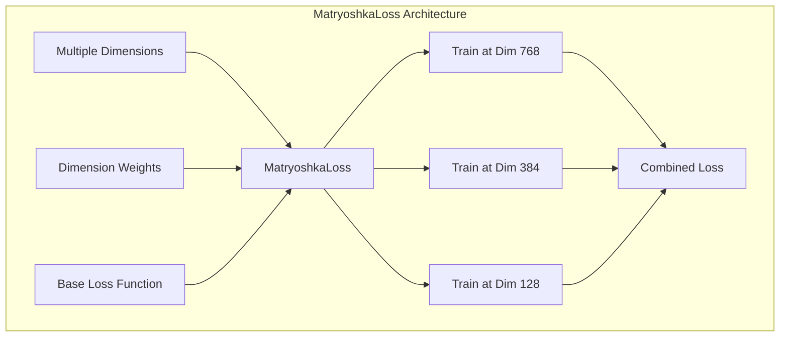

Sources:
- [sentence_transformers/losses/MatryoshkaLoss.py:113-253]()

### AdaptiveLayerLoss

Trains model to produce good embeddings with fewer transformer layers, enabling faster inference.

**Key Properties**:
- Applies loss to intermediate transformer layers
- Allows layer reduction at inference time
- KL divergence regularization between layer outputs

Sources:
- [sentence_transformers/losses/AdaptiveLayerLoss.py:106-274]()

### Matryoshka2dLoss

Combines MatryoshkaLoss and AdaptiveLayerLoss to enable both dimension and layer reduction.

**Key Properties**:
- 2D flexibility in both dimensions and layers
- Allows for different performance vs. efficiency trade-offs

Sources:
- [sentence_transformers/losses/Matryoshka2dLoss.py:13-152]()

### DenoisingAutoEncoderLoss

Trains a model to reconstruct original sentences from damaged versions, useful for unsupervised learning.

**Key Properties**:
- Requires pairs of damaged and original sentences
- Creates a decoder component to reconstruct from embeddings
- Used in TSDAE (Transformer-based Sequential Denoising Auto-Encoder)

Sources:
- [sentence_transformers/losses/DenoisingAutoEncoderLoss.py:15-203]()

### SoftmaxLoss

Used for classification with text pairs, adds a softmax classifier on top of the embedding outputs.

**Key Properties**:
- Original loss from the SBERT paper
- Uses sentence pairs with class labels
- Multiple ways to combine embeddings (concatenation, difference, multiplication)

Sources:
- [sentence_transformers/losses/SoftmaxLoss.py:17-156]()

## Loss Function Selection Guide

The table below provides guidance on which loss function to use based on your data and task:

| Loss Function | Best For | Input Format | Special Requirements |
|---------------|----------|--------------|---------------------|
| MultipleNegativesRankingLoss | Retrieval, general purpose | (anchor, positive) pairs | Large batch size beneficial |
| CoSENTLoss | Semantic similarity | Text pairs with scores | - |
| TripletLoss | Clustering, similarity | (anchor, positive, negative) triplets | - |
| BatchHardTripletLoss | Classification | Single texts with labels | Multiple examples per class |
| MSELoss | Distillation, transfer | Texts with target embeddings | Teacher model |
| MatryoshkaLoss | Size-efficient models | Depends on base loss | - |
| AdaptiveLayerLoss | Speed-efficient models | Depends on base loss | - |
| ContrastiveTensionLoss | Unsupervised learning | Single sentences | Special dataloader |
| GISTEmbedLoss | Better negative sampling | Same as MNRL | Guide model |

## Memory-Efficient Variants

For training with large batch sizes on limited hardware, consider the cached variants:

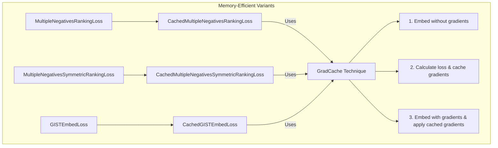

**Key Properties**:
- Allow for much larger batch sizes with constant memory usage
- Approximately 20-30% slower than non-cached versions
- Recommended when batch size is a limiting factor

Sources:
- [sentence_transformers/losses/CachedMultipleNegativesRankingLoss.py:63-300]()
- [sentence_transformers/losses/CachedGISTEmbedLoss.py:63-382]()
- [sentence_transformers/losses/CachedMultipleNegativesSymmetricRankingLoss.py:40-256]()

## Implementation Details

All loss functions in SentenceTransformer follow a common pattern:

1. They are subclasses of `torch.nn.Module`
2. They implement a `forward` method that:
   - Takes sentence features and optional labels as input
   - Computes sentence embeddings using the model
   - Calculates and returns the loss value

Many loss functions also provide:
- `get_config_dict` method for configuration serialization
- `citation` property for academic references
- Documentation about input requirements and recommendations

The loss function is typically passed to a `SentenceTransformerTrainer` along with the model and dataset, as shown in this example pattern:

```python
from sentence_transformers import SentenceTransformer, SentenceTransformerTrainer, losses
from datasets import Dataset

model = SentenceTransformer("model_name")
train_dataset = Dataset.from_dict({
    "anchor": ["Text A", "Text B"],  
    "positive": ["Similar to A", "Similar to B"],
})
loss = losses.MultipleNegativesRankingLoss(model)

trainer = SentenceTransformerTrainer(
    model=model,
    train_dataset=train_dataset,
    loss=loss,
)
trainer.train()
```

Sources:
- [sentence_transformers/losses/MultipleNegativesRankingLoss.py:13-132]()
- [sentence_transformers/losses/__init__.py:1-67]()

# Loss Functions for SparseEncoder


This document covers the specialized loss functions designed for training `SparseEncoder` models. These losses are specifically tailored for sparse neural information retrieval models like SPLADE and CSR architectures that require both effectiveness and efficiency through sparsity regularization.

For dense embedding loss functions, see [Loss Functions for SentenceTransformer](#3.4). For reranking model loss functions, see [Loss Functions for CrossEncoder](#3.6).

## Overview

SparseEncoder loss functions follow a hierarchical architecture where wrapper losses combine base contrastive/similarity losses with regularization terms to control sparsity. The two main wrapper losses are:

- **`SpladeLoss`**: For SPLADE-style models that use MLM heads with pooling
- **`CSRLoss`**: For CSR (Contrastive Sparse Representation) models with autoencoder components

These wrapper losses are required for training `SparseEncoder` models, as they provide the necessary sparsity regularization on top of standard contrastive learning objectives.

## Loss Function Architecture

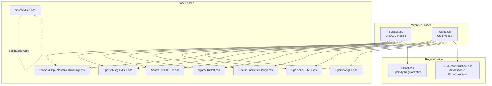

Sources: [sentence_transformers/sparse_encoder/losses/__init__.py:1-29](), [sentence_transformers/sparse_encoder/losses/SpladeLoss.py:15-136](), [sentence_transformers/sparse_encoder/losses/CSRLoss.py:129-188]()

## Wrapper Losses

### SpladeLoss

`SpladeLoss` is the primary wrapper loss for SPLADE-style models. It combines a base contrastive loss with regularization terms to encourage sparsity in both query and document representations.

**Key Components:**
- **Base Loss**: Any SparseEncoder loss except CSR-related and FLOPS losses
- **Document Regularizer**: Typically `FlopsLoss` applied to positive documents and negatives
- **Query Regularizer**: Typically `FlopsLoss` applied to query embeddings

**Configuration Parameters:**
- `document_regularizer_weight`: Weight for document sparsity regularization (λ_d)
- `query_regularizer_weight`: Weight for query sparsity regularization (λ_q)
- `document_regularizer_threshold`: Optional threshold for document regularization
- `query_regularizer_threshold`: Optional threshold for query regularization
- `use_document_regularizer_only`: Treat all inputs as documents (for symmetric training)

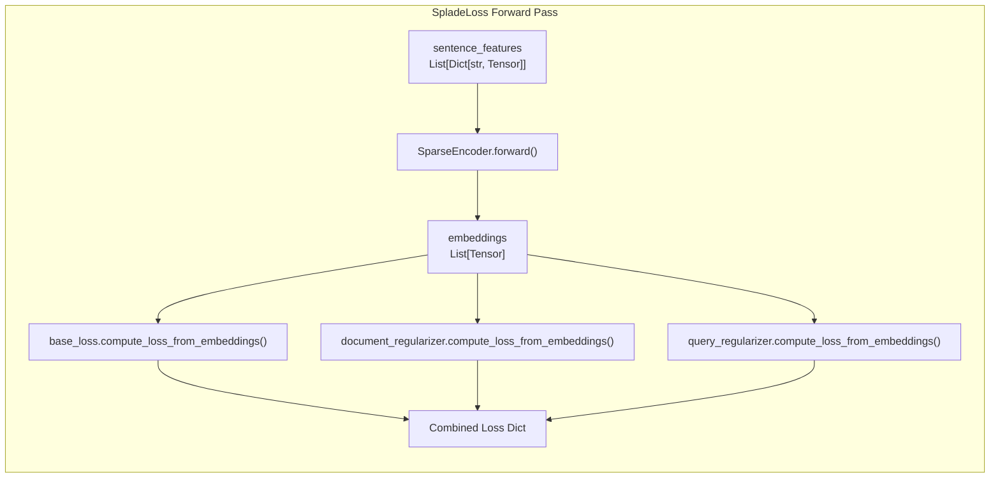

Sources: [sentence_transformers/sparse_encoder/losses/SpladeLoss.py:15-163]()

### CSRLoss

`CSRLoss` is designed for CSR (Contrastive Sparse Representation) models that use autoencoder components for reconstruction-based training.

**Key Components:**
- **Base Loss**: Typically `SparseMultipleNegativesRankingLoss` for contrastive learning
- **Reconstruction Loss**: `CSRReconstructionLoss` with three components:
  - L_k: Reconstruction loss using top-k sparse components
  - L_4k: Reconstruction loss using top-4k sparse components  
  - L_aux: Auxiliary loss for residual information

**Configuration Parameters:**
- `beta`: Weight for L_aux component in reconstruction loss
- `gamma`: Weight for the main contrastive loss component

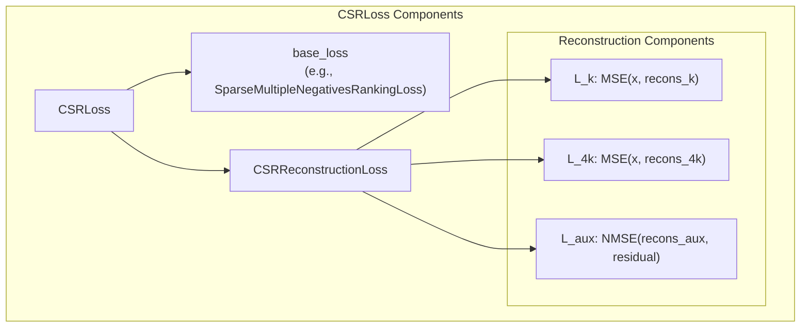

Sources: [sentence_transformers/sparse_encoder/losses/CSRLoss.py:129-215](), [sentence_transformers/sparse_encoder/losses/CSRLoss.py:28-127]()

## Regularization Losses

### FlopsLoss

`FlopsLoss` implements sparsity regularization by calculating the squared L2 norm of the mean embedding vector. This encourages more zero values in embeddings, reducing floating-point operations during inference.

**Formula**: `torch.sum(torch.mean(embeddings, dim=0) ** 2)`

**Key Features:**
- Optional threshold parameter to ignore overly sparse embeddings
- Used as a component within `SpladeLoss` rather than standalone
- Supports L0 masking when threshold is specified

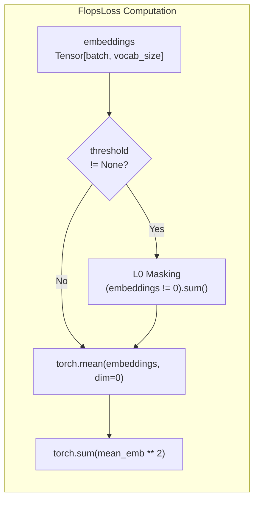

Sources: [sentence_transformers/sparse_encoder/losses/FlopsLoss.py:11-54]()

## Base Losses

The following base losses can be used within the wrapper losses to provide the main learning signal:

| Loss Function | Purpose | Key Features |
|---------------|---------|--------------|
| `SparseMultipleNegativesRankingLoss` | Contrastive learning with in-batch negatives | Most common base loss, InfoNCE-style |
| `SparseMarginMSELoss` | Knowledge distillation with margin | Used with teacher models |
| `SparseDistillKLDivLoss` | KL divergence distillation | Probability distribution matching |
| `SparseTripletLoss` | Triplet-based contrastive learning | Anchor-positive-negative relationships |
| `SparseCosineSimilarityLoss` | Cosine similarity regression | Direct similarity score prediction |
| `SparseCoSENTLoss` | Cosine sentence embeddings | Variant of cosine similarity |
| `SparseAnglELoss` | Angle-based similarity | Complex number representation |
| `SparseMSELoss` | Direct embedding distillation | **Standalone only** - no wrapper needed |

**Important Note**: `SparseMSELoss` is the only loss that can be used independently without a wrapper, as it performs direct embedding-level distillation from a teacher model.

Sources: [sentence_transformers/sparse_encoder/losses/__init__.py:15-28](), [docs/package_reference/sparse_encoder/losses.md:8-10]()

## Usage Patterns

### Training with SpladeLoss

```python
# Typical SPLADE training setup
student_model = SparseEncoder("distilbert/distilbert-base-uncased")
teacher_model = SparseEncoder("naver/splade-cocondenser-ensembledistil")

loss = SpladeLoss(
    model=student_model,
    loss=SparseMarginMSELoss(student_model),
    document_regularizer_weight=3e-5,
    query_regularizer_weight=5e-5,
)
```

### Training with CSRLoss

```python