This document covers the NanoBEIR evaluation system in sentence-transformers, which provides rapid multi-dataset information retrieval evaluation using a collection of smaller BEIR-based datasets. For comprehensive single-dataset IR evaluation, see [SentenceTransformer Evaluators](#4.1). For sparse encoder specific evaluations, see [SparseEncoder Evaluators](#4.2).

## Overview

The NanoBEIR evaluation system enables quick assessment of model performance across multiple information retrieval tasks using significantly smaller datasets compared to the full BEIR benchmark. The system supports both dense embedding models (`SentenceTransformer`) and sparse embedding models (`SparseEncoder`), providing the same metrics as standard IR evaluation but aggregated across multiple datasets.

The core evaluators are `NanoBEIREvaluator` for dense models and `SparseNanoBEIREvaluator` for sparse models, both extending the functionality of `InformationRetrievalEvaluator` to handle multiple datasets efficiently.

Sources: [sentence_transformers/evaluation/NanoBEIREvaluator.py:72-79](), [sentence_transformers/sparse_encoder/evaluation/SparseNanoBEIREvaluator.py:26-35]()

## Architecture

### Evaluator Class Hierarchy


Sources: [sentence_transformers/evaluation/NanoBEIREvaluator.py:191](), [sentence_transformers/sparse_encoder/evaluation/SparseNanoBEIREvaluator.py:157](), [sentence_transformers/evaluation/InformationRetrievalEvaluator.py:23](), [sentence_transformers/sparse_encoder/evaluation/SparseInformationRetrievalEvaluator.py:23]()

### Dataset Collection and Evaluation Flow

```mermaid
graph LR
    subgraph "Dataset Loading"
        DatasetNameType["DatasetNameType<br/>(13 supported datasets)"]
        dataset_name_to_id["dataset_name_to_id<br/>mapping dictionary"]
        HuggingFaceHub["🤗 Hub<br/>zeta-alpha-ai/Nano*"]
    end
    
    subgraph "Per-Dataset Evaluation"
        _load_dataset["_load_dataset()<br/>creates IR evaluator"]
        InformationRetrievalEvaluator["InformationRetrievalEvaluator<br/>or SparseInformationRetrievalEvaluator"]
        compute_metrics["compute_metrics()<br/>MRR, NDCG, MAP, etc."]
    end
    
    subgraph "Aggregation"
        aggregate_fn["aggregate_fn<br/>(default: np.mean)"]
        per_metric_results["per_metric_results<br/>dict[metric, list[values]]"]
        agg_results["aggregated results<br/>dict[metric, float]"]
    end
    
    DatasetNameType --> dataset_name_to_id
    dataset_name_to_id --> HuggingFaceHub
    HuggingFaceHub --> _load_dataset
    _load_dataset --> InformationRetrievalEvaluator
    InformationRetrievalEvaluator --> compute_metrics
    compute_metrics --> per_metric_results
    per_metric_results --> aggregate_fn
    aggregate_fn --> agg_results
```



Sources: [sentence_transformers/evaluation/NanoBEIREvaluator.py:404-434](), [sentence_transformers/evaluation/NanoBEIREvaluator.py:310-325]()

## Dataset Collection

The NanoBEIR collection consists of 13 datasets, each significantly smaller than their full BEIR counterparts:

| Dataset | Full Name | Hub Path |
|---------|-----------|----------|
| `climatefever` | ClimateFEVER | `zeta-alpha-ai/NanoClimateFEVER` |
| `dbpedia` | DBPedia | `zeta-alpha-ai/NanoDBPedia` |
| `fever` | FEVER | `zeta-alpha-ai/NanoFEVER` |
| `fiqa2018` | FiQA2018 | `zeta-alpha-ai/NanoFiQA2018` |
| `hotpotqa` | HotpotQA | `zeta-alpha-ai/NanoHotpotQA` |
| `msmarco` | MSMARCO | `zeta-alpha-ai/NanoMSMARCO` |
| `nfcorpus` | NFCorpus | `zeta-alpha-ai/NanoNFCorpus` |
| `nq` | NQ | `zeta-alpha-ai/NanoNQ` |
| `quoraretrieval` | QuoraRetrieval | `zeta-alpha-ai/NanoQuoraRetrieval` |
| `scidocs` | SCIDOCS | `zeta-alpha-ai/NanoSCIDOCS` |
| `arguana` | ArguAna | `zeta-alpha-ai/NanoArguAna` |
| `scifact` | SciFact | `zeta-alpha-ai/NanoSciFact` |
| `touche2020` | Touche2020 | `zeta-alpha-ai/NanoTouche2020` |

Each dataset contains three splits: `corpus`, `queries`, and `qrels` (query relevance judgments).

Sources: [sentence_transformers/evaluation/NanoBEIREvaluator.py:39-69]()

## Usage Patterns

### Dense Model Evaluation

```python
from sentence_transformers import SentenceTransformer
from sentence_transformers.evaluation import NanoBEIREvaluator