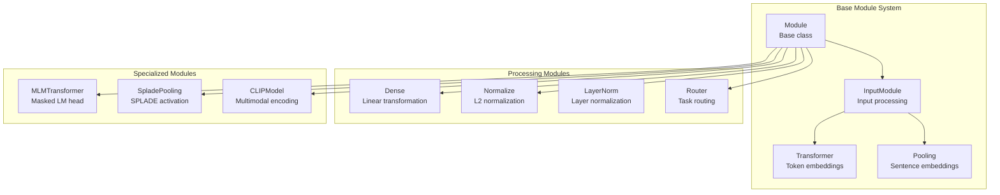
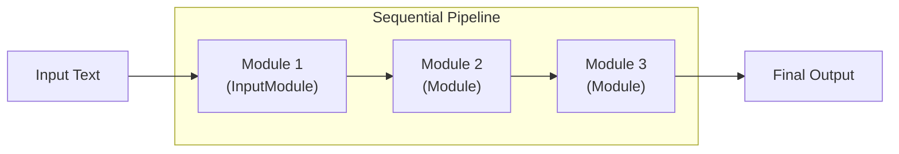
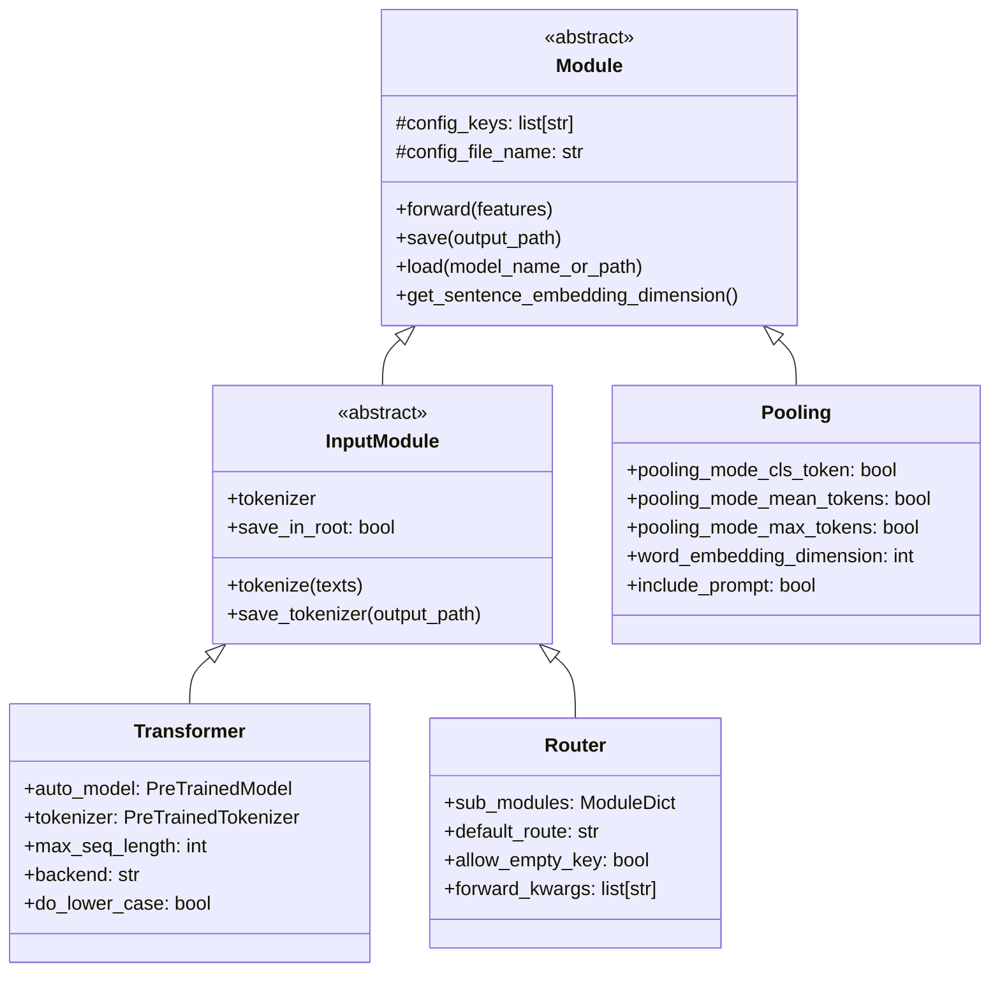
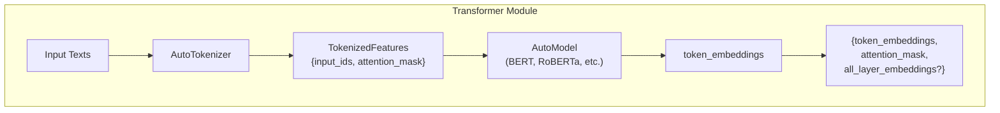
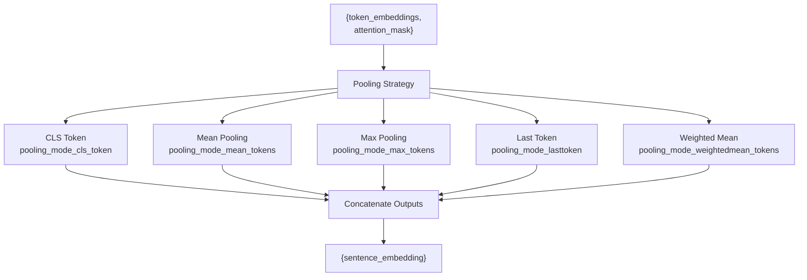
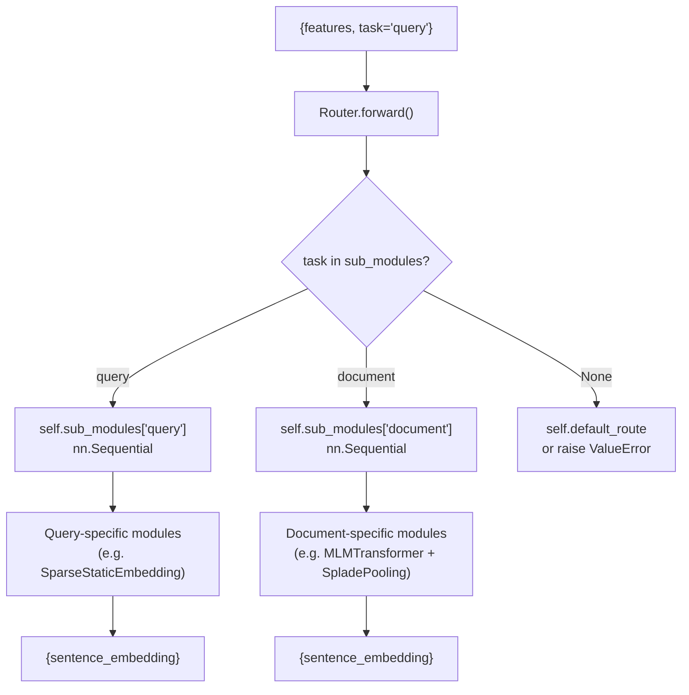

ranked_results = cross_encoder.rank(query, candidates, return_documents=True)
```

**Sources:** [sentence_transformers/cross_encoder/CrossEncoder.py:48-226](), [sentence_transformers/cross_encoder/CrossEncoder.py:394-486](), [sentence_transformers/cross_encoder/CrossEncoder.py:488-586](), [tests/cross_encoder/test_cross_encoder.py:71-96]()

## Module Architecture

All model types in sentence-transformers use a modular architecture where functionality is composed of discrete, reusable modules.

### Core Module Hierarchy



### Router Module for Asymmetric Architectures

The `Router` module enables asymmetric architectures where queries and documents follow different processing paths:

```mermaid
graph TB
    subgraph "Router Architecture"
        Input["Input + Task"]
        Router["Router Module"]
        QueryPath["Query Submodules"]
        DocumentPath["Document Submodules"]
        Output["Task-specific Output"]
    end
    
    Input --> Router
    Router -->|task="query"| QueryPath
    Router -->|task="document"| DocumentPath
    QueryPath --> Output
    DocumentPath --> Output
```

This enables models like the inference-free SPLADE variants where queries use only necessary tokens while documents use expanded representations.

**Sources:** [sentence_transformers/models/Transformer.py:36-58](), [sentence_transformers/models/Pooling.py:9-41](), [sentence_transformers/models/Router.py](), [tests/sparse_encoder/test_sparse_encoder.py:171-196]()

## Model Comparison and Selection

| Model Type | Input Format | Output Format | Use Case | Computational Cost |
|------------|--------------|---------------|----------|-------------------|
| `SentenceTransformer` | Single texts | Dense vectors | Semantic similarity, clustering | Moderate |
| `SparseEncoder` | Single texts | Sparse vectors | Lexical search, hybrid retrieval | Moderate |
| `CrossEncoder` | Text pairs | Similarity scores | Reranking, pairwise classification | High |

### When to Use Each Type

- **SentenceTransformer**: General-purpose semantic tasks, when you need individual text embeddings
- **SparseEncoder**: When interpretability matters, hybrid search scenarios, or working with search engines
- **CrossEncoder**: When highest accuracy is needed for pairwise decisions, reranking scenarios

### Backend Support

All three model types support multiple inference backends:
- **PyTorch**: Full functionality, training support
- **ONNX**: Optimized inference, 2-3x speedup
- **OpenVINO**: Intel hardware optimization

**Sources:** [sentence_transformers/SentenceTransformer.py:408-414](), [sentence_transformers/cross_encoder/CrossEncoder.py:259-265](), [README.md:89-167](), [index.rst:12-13]()

# Module Architecture


This page details the modular building blocks that compose sentence transformer models. The sentence-transformers library uses a sequential pipeline architecture where modules are chained together to transform input text into final embeddings or representations.

## Overview of Modular Design

The sentence-transformers library implements a modular architecture where models are composed of sequential modules. Each module performs a specific transformation on input features, passing the result to the next module in the pipeline.

#### Core Model Architecture



The core models inherit from `nn.Sequential` and store modules in an ordered collection:

- **`SentenceTransformer`**: Inherits from `nn.Sequential`, produces dense embeddings
- **`SparseEncoder`**: Inherits from `SentenceTransformer`, produces sparse embeddings  
- **`CrossEncoder`**: Separate architecture (`nn.Module`), scores text pairs directly

Sources: [sentence_transformers/SentenceTransformer.py:61](), [sentence_transformers/sparse_encoder/SparseEncoder.py:27](), [sentence_transformers/cross_encoder/CrossEncoder.py:48]()

## Module Type Hierarchy

The library defines two main types of modules that form the building blocks of all models:

#### Module Class Hierarchy



#### Module Types

- **`Module`**: Base class defining `forward()`, `save()`, `load()` interface
- **`InputModule`**: Subclass adding `tokenize()` capability (must be first in pipeline)
- **Dense modules**: `Transformer`, `Pooling`, `Normalize`, `Dense` 
- **Sparse modules**: `MLMTransformer`, `SpladePooling`, `SparseStaticEmbedding`
- **Routing modules**: `Router` for asymmetric architectures

Sources: [sentence_transformers/models/Module.py:33-89](), [sentence_transformers/models/InputModule.py:13-93](), [sentence_transformers/models/Transformer.py:36](), [sentence_transformers/models/Pooling.py:9](), [sentence_transformers/models/Router.py:22]()

## Core Module Types

### Transformer Module

The `Transformer` module is the most common input module, wrapping Hugging Face transformer models:



Key attributes:
- `auto_model`: The wrapped Hugging Face model
- `tokenizer`: The associated tokenizer
- `max_seq_length`: Maximum sequence length
- `backend`: Inference backend (`torch`, `onnx`, `openvino`)

Sources: [sentence_transformers/models/Transformer.py:37-646]()

### Pooling Module

The `Pooling` module aggregates token embeddings into sentence embeddings:



Pooling strategies can be combined by setting multiple `pooling_mode_*` flags to `True`.

Sources: [sentence_transformers/models/Pooling.py:9-248]()

### Router Module

The `Router` module enables asymmetric architectures with different processing paths based on task type:

#### Router Architecture



#### Router Configuration

```python