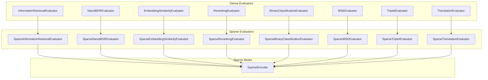
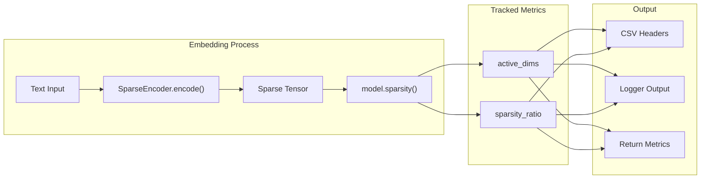

This document covers the evaluation framework specifically designed for sparse encoder models in the sentence-transformers library. These evaluators extend the standard dense evaluators to handle sparse embeddings and provide additional sparsity-related metrics.

For general evaluation concepts and dense model evaluators, see [SentenceTransformer Evaluators](#4.1). For information about sparse encoder models themselves, see [SparseEncoder Training](#3.2).

## Architecture Overview

SparseEncoder evaluators follow an inheritance-based architecture where each sparse evaluator extends its corresponding dense evaluator while adding sparse-specific functionality.

### Class Hierarchy



Sources: [sentence_transformers/sparse_encoder/evaluation/SparseInformationRetrievalEvaluator.py:23-281](), [sentence_transformers/sparse_encoder/evaluation/SparseNanoBEIREvaluator.py:26-263](), [sentence_transformers/sparse_encoder/evaluation/SparseEmbeddingSimilarityEvaluator.py:22-169]()

## Core Functionality Differences

### Sparse Embedding Generation

All sparse evaluators override the `embed_inputs` method to generate sparse embeddings instead of dense ones:

| Component | Dense Evaluators | Sparse Evaluators |
|-----------|------------------|-------------------|
| Embedding Format | Dense tensors | Sparse tensors via `convert_to_sparse_tensor=True` |
| Memory Management | Standard tensor operations | `save_to_cpu=True` for memory efficiency |
| Dimension Control | `truncate_dim` for reducing dimensions | `max_active_dims` for sparsity control |
| Similarity Functions | Cosine, dot product, euclidean, manhattan | Same functions but optimized for sparse tensors |

### Sparsity Statistics Tracking

Each sparse evaluator tracks and reports sparsity statistics:



Sources: [sentence_transformers/sparse_encoder/evaluation/SparseInformationRetrievalEvaluator.py:263-269](), [sentence_transformers/sparse_encoder/evaluation/SparseEmbeddingSimilarityEvaluator.py:154-157]()

## Sparsity Statistics

### Active Dimensions and Sparsity Ratio

All sparse evaluators compute two key sparsity metrics:

- **Active Dimensions**: Average number of non-zero dimensions per embedding
- **Sparsity Ratio**: Proportion of zero values in the embedding (closer to 1.0 means more sparse)

These statistics are computed using [sentence_transformers/sparse_encoder/SparseEncoder.py]() model's `sparsity()` method and are:
- Added to CSV output headers via `_append_csv_headers()`
- Logged to console during evaluation
- Included in returned metrics dictionary
- Stored in model card data

### Context-Specific Statistics

Some evaluators track sparsity statistics for different contexts:

| Evaluator | Sparsity Context | Statistics Tracked |
|-----------|------------------|-------------------|
| `SparseInformationRetrievalEvaluator` | Query vs Corpus embeddings | `query_active_dims`, `query_sparsity_ratio`, `corpus_active_dims`, `corpus_sparsity_ratio` |
| `SparseRerankingEvaluator` | Query vs Document embeddings | Same as above |
| `SparseTripletEvaluator` | Anchor, Positive, Negative | `anchor_*`, `positive_*`, `negative_*` for each statistic |
| Other evaluators | Single context | `active_dims`, `sparsity_ratio` |

Sources: [sentence_transformers/sparse_encoder/evaluation/SparseInformationRetrievalEvaluator.py:190-194](), [sentence_transformers/sparse_encoder/evaluation/SparseTripletEvaluator.py:129-133]()

## Individual Evaluators

### SparseInformationRetrievalEvaluator

Extends `InformationRetrievalEvaluator` for information retrieval tasks with sparse embeddings.

**Key Features:**
- Computes standard IR metrics (MRR, NDCG, MAP, Precision, Recall)
- Tracks separate sparsity statistics for queries and corpus
- Supports `max_active_dims` parameter for controlling sparsity during evaluation
- Handles corpus chunking for memory efficiency

**Usage Pattern:**
```python
from sentence_transformers.sparse_encoder.evaluation import SparseInformationRetrievalEvaluator

evaluator = SparseInformationRetrievalEvaluator(
    queries=query_dict,
    corpus=corpus_dict, 
    relevant_docs=qrels_dict,
    max_active_dims=1000,
    batch_size=16
)
```

Sources: [sentence_transformers/sparse_encoder/evaluation/SparseInformationRetrievalEvaluator.py:23-281]()

### SparseNanoBEIREvaluator  

Extends `NanoBEIREvaluator` to evaluate sparse models on multiple NanoBEIR datasets simultaneously.

**Key Features:**
- Evaluates across 13 NanoBEIR datasets
- Aggregates sparsity statistics across all datasets using weighted averages
- Supports dataset-specific prompts via `query_prompts` and `corpus_prompts`
- Uses `SparseInformationRetrievalEvaluator` as the underlying evaluator class

**Aggregation Logic:**
- Query statistics: Simple average across datasets
- Corpus statistics: Weighted average by corpus size
- Final metrics: Aggregated using `aggregate_fn` (default: `np.mean`)

Sources: [sentence_transformers/sparse_encoder/evaluation/SparseNanoBEIREvaluator.py:26-263]()

### SparseEmbeddingSimilarityEvaluator

Extends `EmbeddingSimilarityEvaluator` for semantic similarity tasks using sparse embeddings.

**Key Features:**
- Computes Pearson and Spearman correlations
- Single sparsity context (combined statistics for both sentence sets)
- Supports multiple similarity functions (cosine, dot, euclidean, manhattan)
- Memory-efficient sparse tensor operations

Sources: [sentence_transformers/sparse_encoder/evaluation/SparseEmbeddingSimilarityEvaluator.py:22-169]()

### Other Sparse Evaluators

| Evaluator | Purpose | Key Difference |
|-----------|---------|----------------|
| `SparseRerankingEvaluator` | Re-ranking evaluation | Tracks query/corpus sparsity separately |
| `SparseBinaryClassificationEvaluator` | Binary classification | Single sparsity context |
| `SparseMSEEvaluator` | Knowledge distillation | Handles sparse-to-sparse MSE computation |
| `SparseTripletEvaluator` | Triplet accuracy | Tracks sparsity for anchor/positive/negative separately |
| `SparseTranslationEvaluator` | Translation matching | Single sparsity context for both languages |

## Common Usage Patterns

### Memory Management

Sparse evaluators include several memory optimization strategies:

```python
# Common parameters across sparse evaluators
embeddings = model.encode(
    sentences,
    convert_to_sparse_tensor=True,  # Generate sparse tensors
    save_to_cpu=True,              # Move to CPU to free GPU memory
    max_active_dims=max_active_dims # Control sparsity level
)
```

### CSV Output Enhancement

All sparse evaluators extend CSV headers to include sparsity statistics:

```python