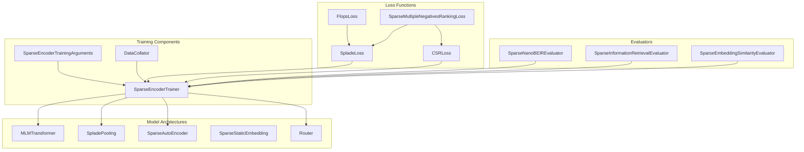
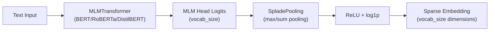
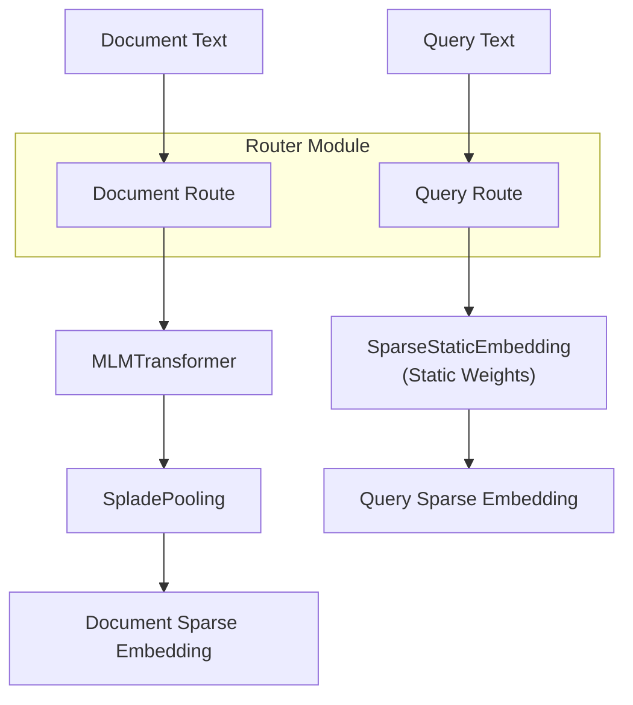
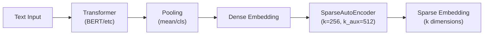
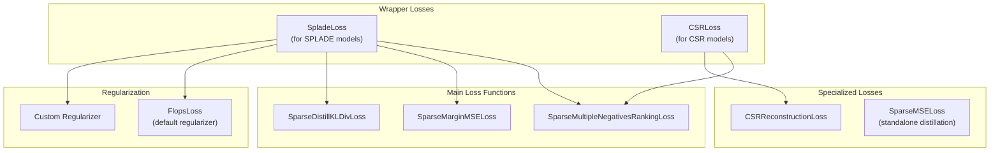
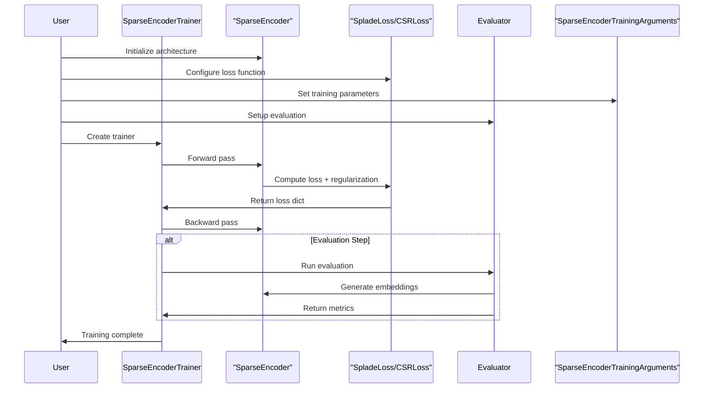

This document covers the comprehensive training system for `SparseEncoder` models in the sentence-transformers library. It explains the specialized components, architectures, and workflows required to train sparse representation models such as SPLADE and CSR (Contrastive Sparse Representation) models.

For information about general training concepts that apply across all model types, see [Training](#3). For specific loss function details, see [Loss Functions for SparseEncoder](#3.5). For evaluation during training, see [SparseEncoder Evaluators](#4.2).

## Training System Architecture

The `SparseEncoder` training system consists of specialized components that handle the unique requirements of sparse representation learning, including sparsity regularization and architecture-specific optimizations.



**Sources:** [docs/sparse_encoder/training_overview.md:17-46](), [sentence_transformers/sparse_encoder/__init__.py:1-14](), [sentence_transformers/sparse_encoder/losses/__init__.py:1-29]()

## Sparse Encoder Architectures

The training system supports three primary sparse encoder architectures, each requiring different components and training strategies.

### SPLADE Architecture

SPLADE models use `MLMTransformer` followed by `SpladePooling` to create sparse lexical representations from masked language model logits.



**Sources:** [docs/sparse_encoder/training_overview.md:59-98](), [sentence_transformers/sparse_encoder/models/MLMTransformer.py:26-55](), [sentence_transformers/sparse_encoder/models/SpladePooling.py:13-40]()

### Inference-Free SPLADE Architecture

This architecture uses `Router` to process queries and documents differently, with lightweight `SparseStaticEmbedding` for queries and full SPLADE processing for documents.



**Sources:** [docs/sparse_encoder/training_overview.md:99-168](), [sentence_transformers/sparse_encoder/models/SparseStaticEmbedding.py:24-62]()

### CSR (Contrastive Sparse Representation) Architecture

CSR models apply `SparseAutoEncoder` on top of dense sentence transformer embeddings to create sparse representations.



**Sources:** [docs/sparse_encoder/training_overview.md:169-228](), [sentence_transformers/sparse_encoder/models/__init__.py:1-9]()

## Training Components

### Model Initialization

Models are initialized differently based on the target architecture:

| Architecture | Initialization Method | Key Components |
|-------------|----------------------|----------------|
| SPLADE | `SparseEncoder("bert-base-uncased")` | `MLMTransformer` + `SpladePooling` |
| Inference-Free SPLADE | `Router.for_query_document()` | `SparseStaticEmbedding` + `MLMTransformer` + `SpladePooling` |
| CSR | `SparseEncoder("sentence-transformer-model")` | `Transformer` + `Pooling` + `SparseAutoEncoder` |

**Sources:** [docs/sparse_encoder/training_overview.md:48-229]()

### Loss Function Requirements

Sparse encoder training requires specialized loss functions that incorporate sparsity regularization:



**Sources:** [docs/sparse_encoder/training_overview.md:346-393](), [docs/sparse_encoder/loss_overview.md:4-28](), [sentence_transformers/sparse_encoder/losses/CSRLoss.py:129-187]()

### Training Arguments

`SparseEncoderTrainingArguments` extends standard training arguments with sparse-specific parameters:

| Parameter | Purpose | Example |
|-----------|---------|---------|
| `router_mapping` | Maps dataset columns to Router tasks | `{"question": "query", "answer": "document"}` |
| `learning_rate_mapping` | Sets different learning rates per component | `{"SparseStaticEmbedding.*": 1e-3}` |
| `batch_sampler` | Controls batch composition | `BatchSamplers.NO_DUPLICATES` |
| `prompts` | Task-specific prompts | `{"query": "Represent this query:"}` |

**Sources:** [docs/sparse_encoder/training_overview.md:394-473](), [docs/sparse_encoder/training_overview.md:149-168]()

## Training Workflow

The complete training workflow integrates all components through the `SparseEncoderTrainer`:



**Sources:** [docs/sparse_encoder/training_overview.md:475-552]()

### Dataset Format Requirements

Training datasets must match the loss function requirements:

| Loss Function | Input Columns | Label Column | Example |
|---------------|---------------|--------------|---------|
| `SparseMultipleNegativesRankingLoss` | `(anchor, positive)` or `(anchor, positive, negative)` | None | `["query", "answer"]` |
| `SparseCoSENTLoss` | `(sentence_A, sentence_B)` | `score` (0-1) | `["text1", "text2", "score"]` |
| `SparseMarginMSELoss` | `(query, positive, negative)` | `margin_scores` | `["query", "pos", "neg", "margins"]` |

**Sources:** [docs/sparse_encoder/training_overview.md:328-344](), [docs/sparse_encoder/loss_overview.md:29-62]()

## Advanced Training Features

### Router-Based Training

When using `Router` modules, special configuration is required to map dataset columns to routing paths:

```python