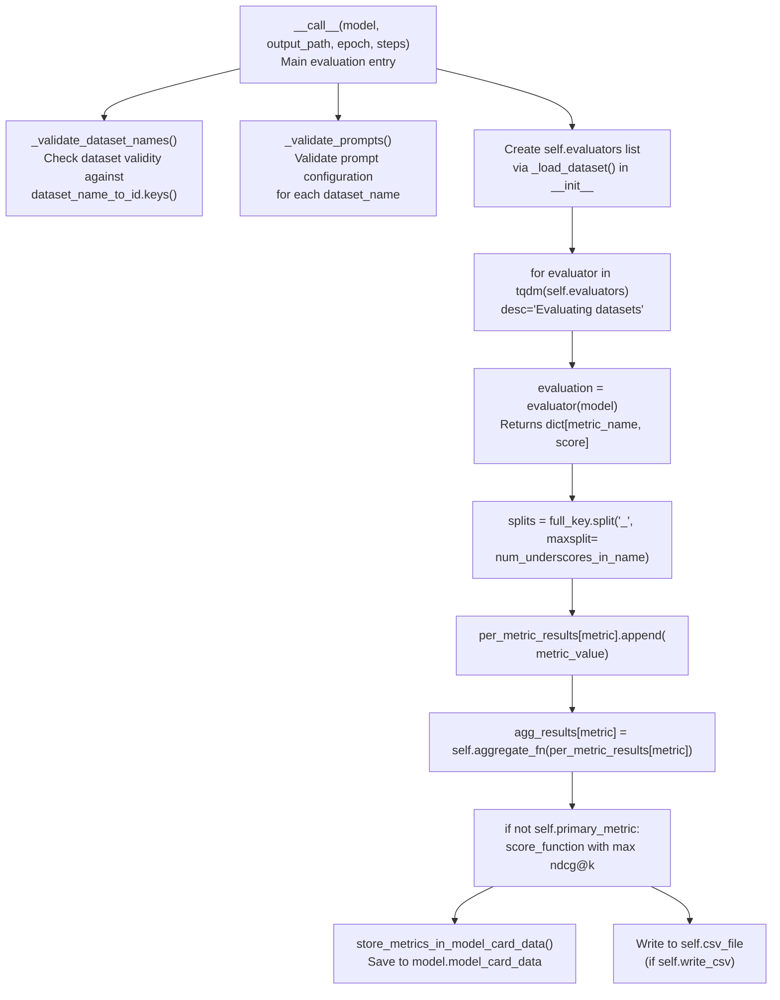
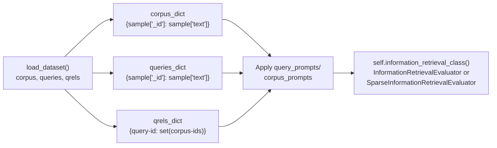
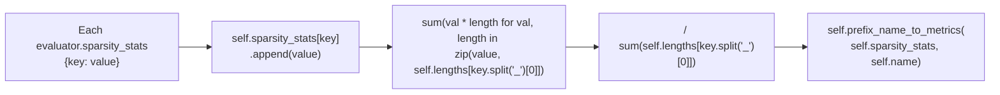
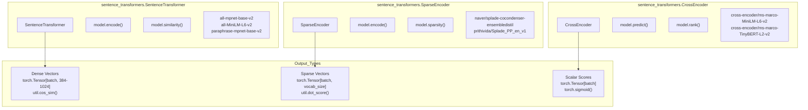
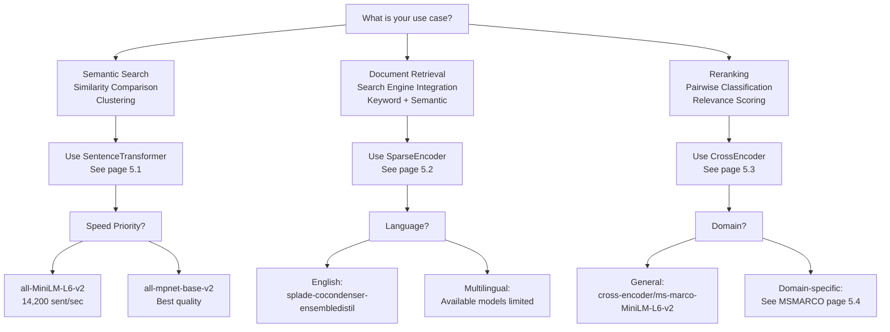
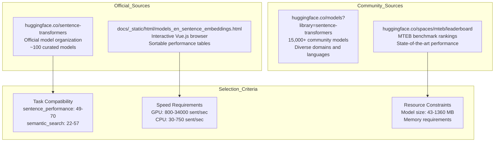
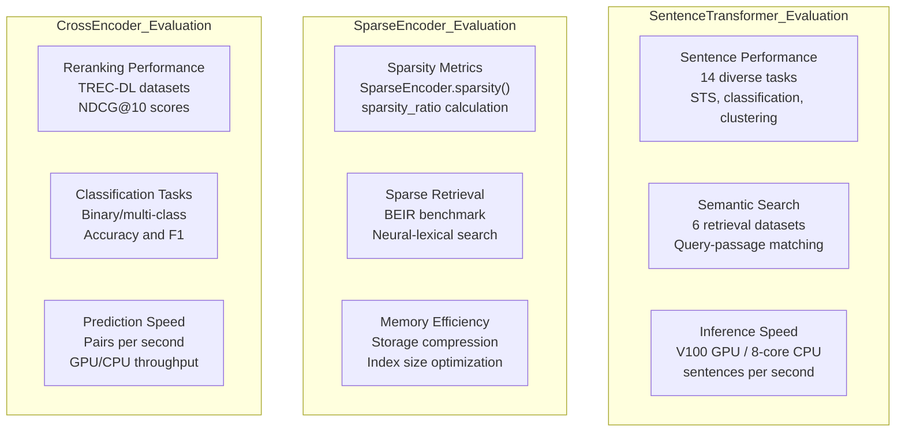

evaluator = NanoBEIREvaluator(
    dataset_names=["msmarco", "nfcorpus"],
    query_prompts={
        "msmarco": "Retrieve relevant passages: ",
        "nfcorpus": "Find related documents: "
    }
)
```

### Sparse Model Evaluation  

```python
from sentence_transformers import SparseEncoder
from sentence_transformers.sparse_encoder.evaluation import SparseNanoBEIREvaluator

# Evaluation with sparsity constraints
evaluator = SparseNanoBEIREvaluator(
    dataset_names=["msmarco", "scifact"],
    max_active_dims=100,
    show_progress_bar=True
)
results = evaluator(sparse_model)
```

Sources: [sentence_transformers/evaluation/NanoBEIREvaluator.py:101-120](), [sentence_transformers/sparse_encoder/evaluation/SparseNanoBEIREvaluator.py:58-77]()

## Configuration Options

### Core Parameters

| Parameter | Type | Description | Default |
|-----------|------|-------------|---------|
| `dataset_names` | `List[DatasetNameType]` | Datasets to evaluate on | All 13 datasets |
| `aggregate_fn` | `Callable` | Function to aggregate scores | `np.mean` |
| `aggregate_key` | `str` | Key for aggregated results | `"mean"` |
| `batch_size` | `int` | Batch size for encoding | `32` |
| `show_progress_bar` | `bool` | Show evaluation progress | `False` |

### Metric Configuration

| Parameter | Type | Description | Default |
|-----------|------|-------------|---------|
| `mrr_at_k` | `List[int]` | MRR calculation values | `[10]` |
| `ndcg_at_k` | `List[int]` | NDCG calculation values | `[10]` |
| `accuracy_at_k` | `List[int]` | Accuracy calculation values | `[1, 3, 5, 10]` |
| `precision_recall_at_k` | `List[int]` | P/R calculation values | `[1, 3, 5, 10]` |
| `map_at_k` | `List[int]` | MAP calculation values | `[100]` |

### Prompt Configuration

Both `query_prompts` and `corpus_prompts` can be:
- `str`: Same prompt for all datasets
- `Dict[str, str]`: Dataset-specific prompts
- `None`: No prompts used

Sources: [sentence_transformers/evaluation/NanoBEIREvaluator.py:193-211](), [sentence_transformers/evaluation/NanoBEIREvaluator.py:447-466]()

## Key Methods and Data Flow

### Evaluation Process



Sources: [sentence_transformers/evaluation/NanoBEIREvaluator.py:283-396](), [sentence_transformers/evaluation/NanoBEIREvaluator.py:314-325](), [sentence_transformers/evaluation/NanoBEIREvaluator.py:358-366]()

### Dataset Loading Process

The `_load_dataset` method handles the conversion from Hugging Face dataset format to the format expected by `InformationRetrievalEvaluator`:



1. **Load dataset splits**: `corpus`, `queries`, `qrels` from Hub using `datasets.load_dataset`
2. **Convert to dictionaries**: Transform to `{sample["_id"]: sample["text"]}` format
3. **Build relevance mapping**: Create `{sample["query-id"]: set(sample["corpus-id"])}` from qrels
4. **Apply prompts**: Add dataset-specific `query_prompt`/`corpus_prompt` if configured
5. **Create evaluator**: Instantiate via `self.information_retrieval_class` attribute

Sources: [sentence_transformers/evaluation/NanoBEIREvaluator.py:404-434](), [sentence_transformers/evaluation/NanoBEIREvaluator.py:415-421]()

## Output Format and Metrics

### Individual Dataset Results

Each dataset evaluation produces metrics with the pattern: `{dataset_name}_{score_function}_{metric}@{k}`:
- `NanoMSMARCO_cosine_ndcg@10`
- `NanoSciFact_dot_mrr@10`
- `NanoQuoraRetrieval_cosine_map@100`

### Aggregated Results

Aggregated metrics follow the pattern: `NanoBEIR_{aggregate_key}_{score_function}_{metric}@{k}`:
- `NanoBEIR_mean_cosine_ndcg@10`
- `NanoBEIR_mean_dot_mrr@10`

### Sparse Model Additional Metrics

`SparseNanoBEIREvaluator` extends the base functionality with sparsity tracking via `defaultdict(list)` collections:

| Metric | Calculation | Description |
|--------|-------------|-------------|
| `{name}_query_active_dims` | Weighted average by query count | Average active dimensions across all queries |
| `{name}_query_sparsity_ratio` | Weighted average by query count | Sparsity ratio (1 - active/total) for queries |
| `{name}_corpus_active_dims` | Weighted average by corpus size | Average active dimensions across all documents |
| `{name}_corpus_sparsity_ratio` | Weighted average by corpus size | Sparsity ratio for corpus documents |

The sparsity calculation process:



Sources: [sentence_transformers/sparse_encoder/evaluation/SparseNanoBEIREvaluator.py:222-231](), [sentence_transformers/sparse_encoder/evaluation/SparseInformationRetrievalEvaluator.py:202-212]()

## Primary Metric Selection

The primary metric is determined by:
1. **Explicit main_score_function**: Use `{main_score_function}_ndcg@{max(ndcg_at_k)}`
2. **Automatic selection**: Choose score function with highest NDCG@k score
3. **Format**: `NanoBEIR_{aggregate_key}_{score_function}_ndcg@{k}`

The primary metric is used for model selection and optimization during training.

Sources: [sentence_transformers/evaluation/NanoBEIREvaluator.py:358-366]()

# Pretrained Models


This page provides an overview of the extensive collection of pretrained models available in the sentence-transformers library and guidance on selecting the right model for your task. With over 15,000 models available on the Hugging Face Hub, this overview helps you navigate the three main model architectures and understand when to use each type.

The library offers three distinct model architectures, each optimized for different use cases:
- **SentenceTransformer**: Dense vector embeddings for semantic similarity and clustering
- **SparseEncoder**: Sparse vector embeddings for efficient retrieval and search engine integration  
- **CrossEncoder**: Pairwise scoring models for reranking and classification

For detailed model catalogs and specific recommendations, see [SentenceTransformer Models](#5.1), [SparseEncoder Models](#5.2), [CrossEncoder Models](#5.3), and [MSMARCO Models](#5.4).

## Model Architecture Overview

Model Architecture Comparison


Model Selection Decision Tree


**Sources:** [README.md:19](), [docs/sentence_transformer/pretrained_models.md:16-27](), [index.rst:37-132]()

## Model Discovery and Selection

Model Discovery Pathways


Selection Criteria and Properties
| Property | Code Reference | Typical Values | Impact |
|---|---|---|---|
| Dimensions | `model.get_sentence_embedding_dimension()` | 384, 768, 1024 | Memory usage, similarity computation speed |
| Normalized Embeddings | `normalized_embeddings: true/false` | Boolean | Score function compatibility |
| Score Functions | `score_functions: ["cos", "dot", "eucl"]` | Array of strings | Similarity computation method |
| Max Sequence Length | `max_seq_length` | 128, 256, 512 | Input text limitations |
| Model Size | File size in MB | 43-1360 MB | Storage and loading time |

**Sources:** [README.md:2](), [docs/_static/html/models_en_sentence_embeddings.html:236-550](), [docs/sentence_transformer/pretrained_models.md:4-7]()

## Benchmark Evaluation Framework

Evaluation Metrics and Datasets


Performance Ranges by Model Type
| Model Type | Performance Metric | Range | Best Models |
|---|---|---|---|
| SentenceTransformer | Sentence Performance | 49-70 | `all-mpnet-base-v2` (69.57) |
| SentenceTransformer | Semantic Search | 22-57 | `all-mpnet-base-v2` (57.02) |
| SparseEncoder | Sparsity Ratio | 99.5-99.9% | `splade-cocondenser-ensembledistil` |
| CrossEncoder | NDCG@10 | 60-75 | `ms-marco-MiniLM-L6-v2` (74.30) |
| All Types | Inference Speed | 800-34000 sent/sec | GPU performance varies by size |

**Sources:** [docs/_static/html/models_en_sentence_embeddings.html:113-151](), [README.md:164-166](), [docs/pretrained-models/msmarco-v5.md:29-44]()

## Quick Start Recommendations

The following table provides starting points for common use cases, with links to detailed model catalogs:

| Use Case | Recommended Model | Performance | Speed | Documentation |
|---|---|---|---|---|
| **General Embeddings** | `all-mpnet-base-v2` | Best quality (69.57) | 2800 sent/sec | [Page 5.1](#5.1) |
| **Fast Embeddings** | `all-MiniLM-L6-v2` | Good quality (68.06) | 14200 sent/sec | [Page 5.1](#5.1) |
| **Semantic Search** | `multi-qa-mpnet-base-cos-v1` | High search (57.46) | 4000 sent/sec | [Page 5.1](#5.1) |
| **Sparse Retrieval** | `naver/splade-cocondenser-ensembledistil` | SPLADE architecture | Memory efficient | [Page 5.2](#5.2) |
| **Reranking** | `cross-encoder/ms-marco-MiniLM-L6-v2` | NDCG@10: 74.30 | 39.01 MRR@10 | [Page 5.3](#5.3) |
| **MSMARCO Tasks** | `msmarco-distilbert-dot-v5` | MRR@10: 37.25 | 7000 sent/sec | [Page 5.4](#5.4) |

### Model Series Overview

**General Purpose (`all-*` series)**
- Trained on 1B+ training pairs from diverse sources
- Best for general semantic understanding tasks
- Available in multiple sizes: MiniLM (fast), DistilRoBERTa (balanced), MPNet (quality)

**Search-Optimized (`multi-qa-*` and `msmarco-*` series)**  
- Fine-tuned for question-answering and information retrieval
- Optimized for query-passage similarity measurement
- Available in dot-product and cosine similarity variants

**Sparse Models (SPLADE variants)**
- Neural sparse representations for efficient retrieval
- Compatible with inverted index search engines
- High sparsity (99%+) while maintaining semantic understanding

**Cross-Encoder Rerankers**
- Highest accuracy for pairwise relevance scoring
- Computationally intensive but precise
- Ideal for reranking small candidate sets

### Navigation to Detailed Catalogs

- **[SentenceTransformer Models](#5.1)**: Complete catalog of dense embedding models with performance comparisons and specialized variants
- **[SparseEncoder Models](#5.2)**: Sparse model architectures, SPLADE variants, and search engine integration guides  
- **[CrossEncoder Models](#5.3)**: Reranking and classification models across different domains and tasks
- **[MSMARCO Models](#5.4)**: Specialized documentation for MSMARCO-trained models with version histories and performance evolution

**Sources:** [docs/sentence_transformer/pretrained_models.md:45-124](), [README.md:169-176](), [docs/_static/html/models_en_sentence_embeddings.html:470-550]()

## Loading and Usage Patterns

### Basic Loading Patterns

All pretrained models follow consistent loading and usage patterns through their respective classes from the `sentence_transformers` package:

```python
# SentenceTransformer - Dense vector embeddings
from sentence_transformers import SentenceTransformer

# Official models (no prefix needed)
model = SentenceTransformer("all-mpnet-base-v2")
# Community models (full path required)  
model = SentenceTransformer("BAAI/bge-large-en")

sentences = ["The weather is lovely today.", "It's sunny outside!"]
embeddings = model.encode(sentences)
similarities = model.similarity(embeddings, embeddings)
```

```python