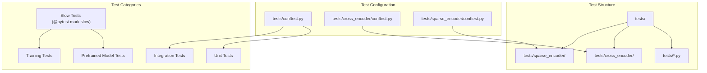
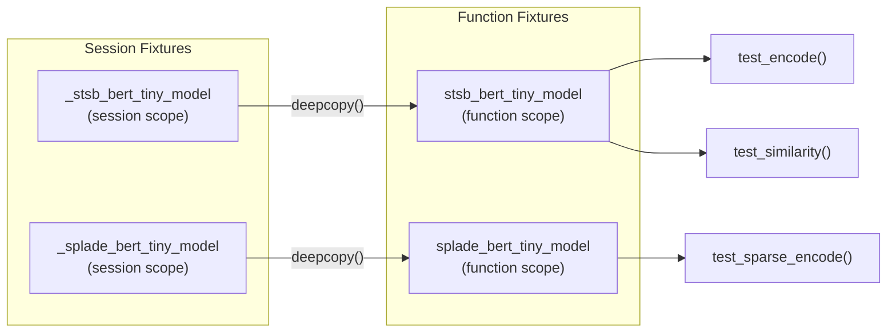

This page covers the testing framework, development environment setup, and contribution guidelines for the sentence-transformers library. It provides information about running tests, building documentation, and maintaining code quality standards.

For information about training models, see [Training](#3). For details about evaluation methods, see [Evaluation](#4).

## Test Framework Overview

The sentence-transformers library uses a comprehensive pytest-based testing framework that validates functionality across all three core model types: SentenceTransformer, SparseEncoder, and CrossEncoder.



Sources: [tests/conftest.py:1-115](), [tests/cross_encoder/conftest.py:1-23](), [tests/sparse_encoder/conftest.py:1-46]()

## Test Configuration and Fixtures

The testing framework uses pytest fixtures to manage test dependencies and ensure proper isolation between tests.

### Core Test Fixtures

| Fixture | Scope | Purpose | Location |
|---------|-------|---------|----------|
| `stsb_bert_tiny_model` | Function | SentenceTransformer model for testing | [tests/conftest.py:26-28]() |
| `splade_bert_tiny_model` | Function | SparseEncoder model for testing | [tests/sparse_encoder/conftest.py:17-19]() |
| `reranker_bert_tiny_model` | Function | CrossEncoder model for testing | [tests/cross_encoder/conftest.py:20-22]() |
| `cache_dir` | Function | Temporary directory for CI environments | [tests/conftest.py:102-114]() |

### Model Loading Strategy



The testing framework uses session-scoped fixtures to load models once per test session, then creates function-scoped copies using `deepcopy()` to ensure test isolation without the overhead of repeatedly loading models.

Sources: [tests/conftest.py:19-40](), [tests/sparse_encoder/conftest.py:10-31](), [tests/cross_encoder/conftest.py:15-22]()

## Test Categories

### Performance Validation Tests

The `test_pretrained_stsb.py` module validates that pretrained models maintain expected performance on the STSbenchmark dataset:

```python