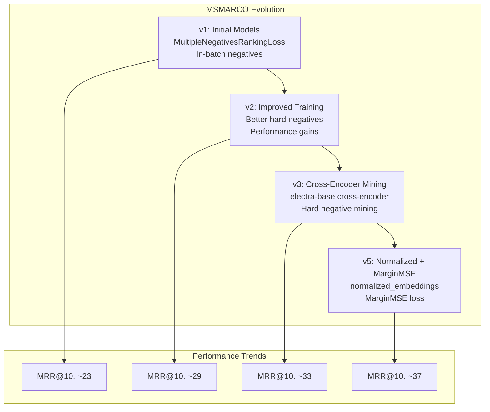
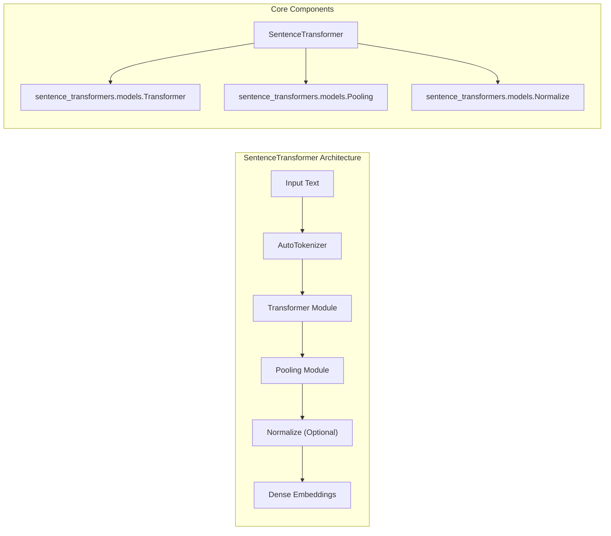
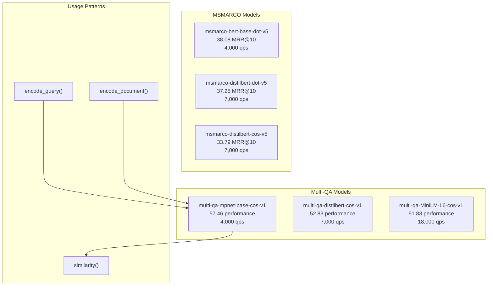
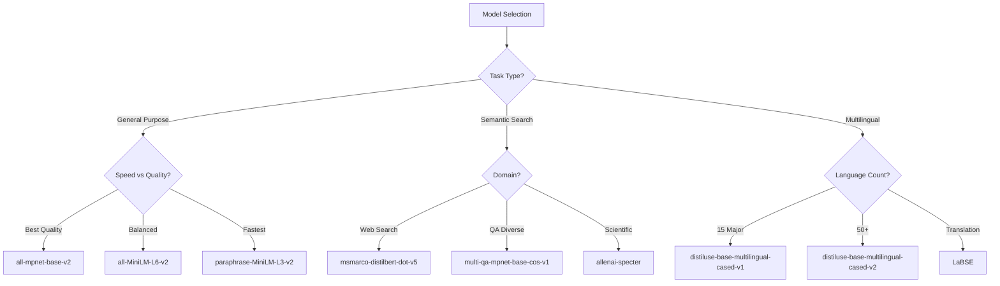

stats = SparseEncoder.sparsity(sparse_embeddings)
print(f"Sparsity: {stats['sparsity_ratio']:.2%}")
```

```python
# CrossEncoder - Pairwise scoring and ranking
from sentence_transformers import CrossEncoder

model = CrossEncoder("cross-encoder/ms-marco-MiniLM-L6-v2")

# Predict similarity scores
query = "What is machine learning?"
passages = ["ML is a subset of AI", "Weather prediction models"]
scores = model.predict([(query, passage) for passage in passages])

# Rank passages by relevance
ranked_results = model.rank(query, passages, return_documents=True)
```

### Model Organization and Naming

| Model Source | Loading Pattern | Example |
|---|---|---|
| Official sentence-transformers | Direct name | `SentenceTransformer("all-mpnet-base-v2")` |
| Community models | Full path | `SentenceTransformer("BAAI/bge-large-en")` |
| Organization-specific | Org/model format | `SparseEncoder("naver/splade-cocondenser-ensembledistil")` |

**Sources:** [README.md:58-167](), [index.rst:37-132](), [docs/sentence_transformer/pretrained_models.md:16-27]()

## Model Versioning and Evolution

The library maintains version histories for major model series to track improvements over time:



**Sources:** [docs/pretrained-models/msmarco-v1.md:10-11](), [docs/pretrained-models/msmarco-v3.md:53-58](), [docs/pretrained-models/msmarco-v5.md:53-65]()

Each version incorporates training improvements, better negative sampling strategies, and architectural refinements that progressively enhance model performance on downstream tasks.

# SentenceTransformer Models


This page provides a comprehensive guide to pretrained SentenceTransformer models for dense text embeddings. SentenceTransformer models encode text into fixed-size vector representations that capture semantic meaning, enabling applications like semantic search, clustering, and similarity comparison.

For sparse embedding models, see [SparseEncoder Models](#5.2). For pairwise scoring models, see [CrossEncoder Models](#5.3). For MSMARCO-specific models, see [MSMARCO Models](#5.4).

## Model Architecture Overview

SentenceTransformer models generate dense embeddings by combining transformer layers with pooling mechanisms:



The `SentenceTransformer` class in [sentence_transformers/SentenceTransformer.py:61-163]() serves as the main interface, orchestrating sequential modules to transform text into embeddings.

Sources: [sentence_transformers/SentenceTransformer.py:61-163](), [sentence_transformers/models/Transformer.py](), [sentence_transformers/models/Pooling.py]()

## Model Categories

### General Purpose Models

**All-series Models**: Trained on diverse datasets (1B+ training pairs) for broad applicability.

| Model | Dimensions | Speed (GPU/CPU) | Performance | Use Case |
|-------|------------|-----------------|-------------|----------|
| `all-mpnet-base-v2` | 768 | 2,800 / 170 | 67.97 | Best quality |
| `all-MiniLM-L6-v2` | 384 | 14,200 / 750 | 64.82 | Balanced speed/quality |
| `all-MiniLM-L12-v2` | 384 | 7,500 / 400 | 66.01 | Higher quality MiniLM |

**Paraphrase Models**: Optimized for sentence similarity and paraphrase detection.

| Model | Base Architecture | Training Data | Performance |
|-------|------------------|---------------|-------------|
| `paraphrase-mpnet-base-v2` | MPNet | Multi-domain paraphrases | 67.97 |
| `paraphrase-MiniLM-L6-v2` | MiniLM | Efficient paraphrase model | 64.82 |
| `paraphrase-distilroberta-base-v2` | DistilRoBERTa | RoBERTa-based paraphrase | 66.27 |

Sources: [docs/_static/html/models_en_sentence_embeddings.html:342-355](), [docs/sentence_transformer/pretrained_models.md:41-49]()

### Semantic Search Models

Specialized for query-document retrieval tasks:



**Multi-QA Models** are trained on 215M+ question-answer pairs from diverse sources. **MSMARCO Models** are trained on Bing search queries with web passages.

Sources: [docs/sentence_transformer/pretrained_models.md:84-124](), [docs/pretrained-models/msmarco-v5.md:29-44]()

### Multilingual Models

Support 50+ languages with aligned vector spaces:

| Model | Languages | Architecture | Use Case |
|-------|-----------|--------------|----------|
| `distiluse-base-multilingual-cased-v2` | 50+ | DistilUSE | General multilingual |
| `paraphrase-multilingual-mpnet-base-v2` | 50+ | MPNet | High-quality multilingual |
| `LaBSE` | 109 | BERT | Bitext mining/translation |

Sources: [docs/sentence_transformer/pretrained_models.md:128-144]()

## Model Selection Guide



### Performance Considerations

**Embedding Dimensions**: Higher dimensions generally provide better quality but require more storage and compute:
- 384-dim: Efficient for most applications
- 768-dim: Better quality for complex tasks
- 1024-dim: Highest quality for specialized domains

**Normalization**: Models with normalized embeddings enable efficient dot-product similarity:
- Normalized: Use `util.dot_score()` for fastest similarity
- Non-normalized: Use `util.cos_sim()` for cosine similarity

Sources: [docs/_static/html/models_en_sentence_embeddings.html:184-202](), [sentence_transformers/SentenceTransformer.py:139-163]()

## Loading and Usage Patterns

### Basic Model Loading

```python
from sentence_transformers import SentenceTransformer