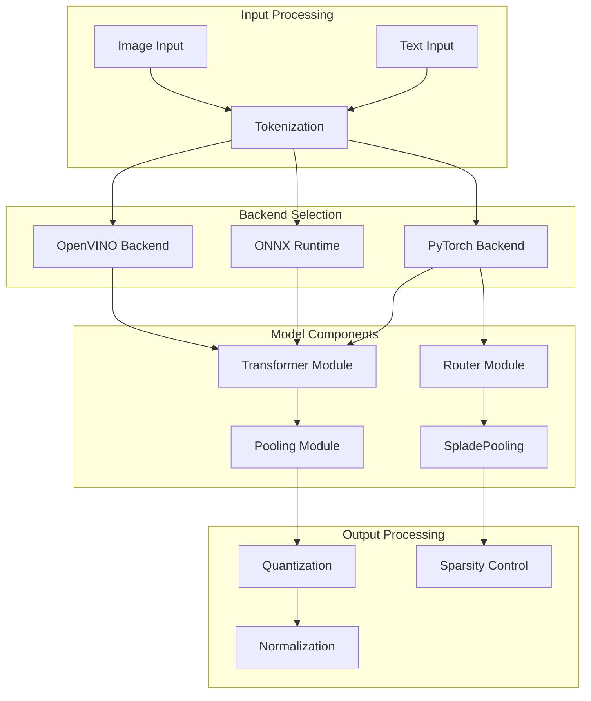
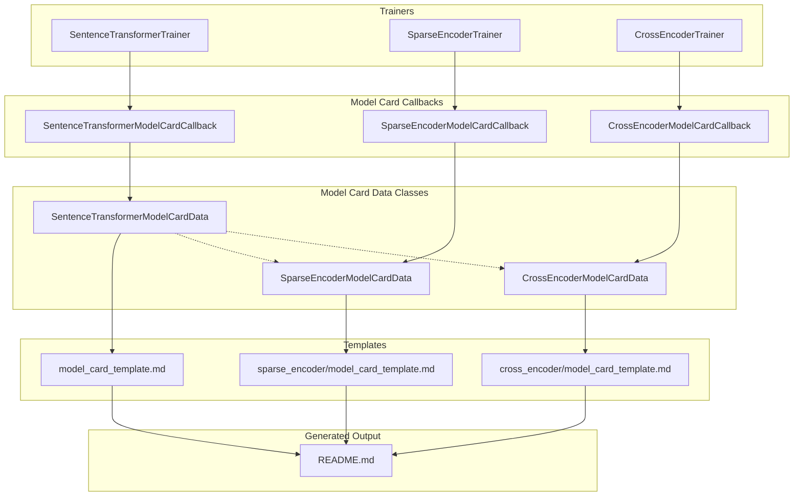
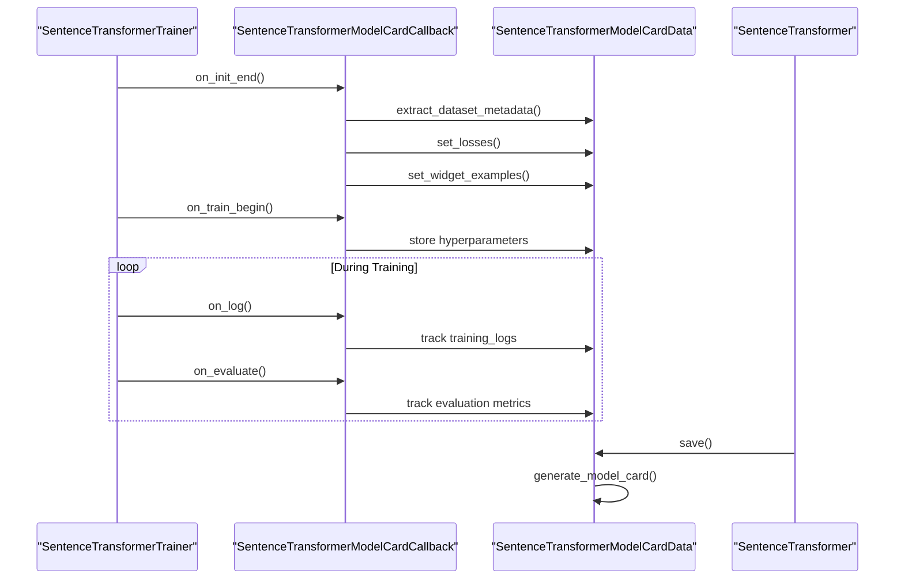

def compute_dataset_metrics(self, dataset, dataset_info, loss):
    # String columns: token/character length analysis
    if isinstance(first, str):
        tokenized = self.tokenize(subsection, task="document")
        if isinstance(tokenized, dict) and "attention_mask" in tokenized:
            lengths = tokenized["attention_mask"].sum(dim=1).tolist()
            suffix = "tokens"
        else:
            lengths = [len(sentence) for sentence in subsection]
            suffix = "characters"
```

Sources: [sentence_transformers/model_card.py:609-756]()

### Template-Based Generation

Model cards are generated using Jinja2 templates that create standardized documentation:

| Template Section | Content Generated | Data Source |
|------------------|-------------------|-------------|
| **Model Description** | Base model, architecture, dimensions | `base_model`, `output_dimensionality` |
| **Usage Examples** | Code snippets with actual model ID | `predict_example`, `model_id` |
| **Training Details** | Dataset information, hyperparameters | `train_datasets`, `all_hyperparameters` |
| **Evaluation Metrics** | Performance tables and charts | `eval_results_dict`, `training_logs` |
| **Citations** | Automatic BibTeX generation | `citations` from loss functions |

Templates automatically adapt based on model type:
- Information Retrieval models get separate `encode_query`/`encode_document` examples
- Sparse encoders include sparsity and dimensionality information  
- Cross encoders focus on reranking and classification use cases

Sources: [sentence_transformers/model_card_template.md:76-126](), [sentence_transformers/sparse_encoder/model_card_template.md:99-126]()

## Backend Architecture and Optimization

The library supports multiple backend implementations for optimized inference across different deployment scenarios.

### Multi-Backend Support



Sources: Based on architecture patterns seen in [sentence_transformers/model_card.py:602-607]() and backend references

### Performance Optimization Techniques

The library implements several optimization strategies for production deployment:

| Optimization | Implementation | Use Case |
|-------------|----------------|----------|
| **Multi-Processing** | Process pools for batch encoding | Large-scale text processing |
| **ONNX Conversion** | Model quantization and optimization | CPU inference optimization |
| **Backend Selection** | Runtime backend switching | Hardware-specific optimization |
| **Memory Management** | Gradient caching, efficient batching | Memory-constrained training |
| **Sparse Operations** | Optimized sparse tensor operations | Sparse encoder efficiency |

## Development and Extension Points

### Custom Model Card Integration

Developers can extend the model card system for custom model types:

```python
@dataclass
class CustomModelCardData(SentenceTransformerModelCardData):
    custom_field: str = "default_value"
    custom_metrics: dict = field(default_factory=dict)
    
    def get_model_specific_metadata(self) -> dict[str, Any]:
        return {
            "custom_dimension": self.model.get_custom_dimension(),
            "special_config": self.model.get_special_config(),
        }
```

### Callback Extension

The callback system can be extended to capture custom training information:

```python
class CustomModelCardCallback(SentenceTransformerModelCardCallback):
    def on_custom_event(self, args, state, control, model, **kwargs):
        # Custom data collection logic
        model.model_card_data.custom_metrics.update(kwargs.get('metrics', {}))
```

Sources: [sentence_transformers/model_card.py:47-199](), [sentence_transformers/sparse_encoder/model_card.py:18-20]()

### Version and Dependency Management

The system automatically tracks framework versions and dependencies for reproducibility:

```python
def get_versions() -> dict[str, Any]:
    versions = {
        "python": python_version(),
        "sentence_transformers": sentence_transformers_version,
        "transformers": transformers.__version__,
        "torch": torch.__version__,
    }
    # Conditional imports for optional dependencies
    if is_accelerate_available():
        versions["accelerate"] = accelerate_version
```

This ensures model cards include complete environment information for reproducible results.

Sources: [sentence_transformers/model_card.py:217-236]()

# Model Card Generation


This document covers the automatic model card generation system in sentence-transformers, which creates comprehensive documentation and metadata for trained models. The system automatically tracks training data, hyperparameters, evaluation metrics, and generates standardized model cards during the training process.

For information about manual model configuration, see other training documentation pages. For details about evaluation metrics collection, see [4](#4).

## Model Card Architecture Overview

The model card generation system consists of three main components working together to automatically document models during training:



**Model Card Data Collection Flow**

Sources: [sentence_transformers/model_card.py:265-355](), [sentence_transformers/sparse_encoder/model_card.py:22-132](), [sentence_transformers/cross_encoder/model_card.py:27-161]()

## Data Collection Process

The model card system automatically collects training metadata through callback integration with the trainer lifecycle:



**Automatic Data Collection Timeline**

Note: The legacy `ModelCardCallback` class has been deprecated in favor of `SentenceTransformerModelCardCallback` ([sentence_transformers/model_card.py:193-199]()).

Sources: [sentence_transformers/model_card.py:47-192](), [sentence_transformers/trainer.py:315-333]()

## Model Card Types and Features

The system supports three model card types with specialized features for each model architecture:

| Model Type | Data Class | Callback Class | Key Features |
|------------|------------|----------------|--------------|
| `SentenceTransformer` | `SentenceTransformerModelCardData` | `SentenceTransformerModelCardCallback` | Dense embeddings, similarity functions, widget examples |
| `SparseEncoder` | `SparseEncoderModelCardData` | `SparseEncoderModelCardCallback` | Sparse embeddings, sparsity metrics, active dimensions |
| `CrossEncoder` | `CrossEncoderModelCardData` | `CrossEncoderModelCardCallback` | Pairwise scoring, ranking metrics, text classification |

Sources: [sentence_transformers/model_card.py:266-355](), [sentence_transformers/sparse_encoder/model_card.py:23-132](), [sentence_transformers/cross_encoder/model_card.py:28-161]()

## Automatic Data Tracking

### Training Metadata Collection

The `SentenceTransformerModelCardCallback` automatically captures training information through trainer hooks:

**Initialization Phase** ([sentence_transformers/model_card.py:52-88]()):
- Dataset metadata extraction via `extract_dataset_metadata()`
- Loss function registration via `set_losses()`
- Widget example generation via `set_widget_examples()`
- CodeCarbon integration for emissions tracking

**Training Phase** ([sentence_transformers/model_card.py:89-130]()):
- Hyperparameter tracking (default vs. non-default values)
- Training and validation loss logging
- Information retrieval model detection

**Evaluation Phase** ([sentence_transformers/model_card.py:131-191]()):
- Evaluation metrics collection
- Primary metric identification for model selection
- Training log consolidation

### Dataset Information Extraction

The system automatically infers dataset metadata from Hugging Face Hub information:

```python
# From extract_dataset_metadata method
def extract_dataset_metadata(self, dataset, existing_datasets, loss, dataset_type):
    # Automatically detects:
    # - Dataset ID and revision from download checksums
    # - Dataset size and column statistics  
    # - Language information from dataset cards
    # - Loss function configuration
```

Sources: [sentence_transformers/model_card.py:758-809]()

### Widget Example Generation

The `set_widget_examples()` method automatically creates interactive examples from training or evaluation datasets:

**Example Selection Process** ([sentence_transformers/model_card.py:445-522]()):
1. Sample 1000 examples from random datasets
2. Sort by text length to find representative examples  
3. Generate 4-text combinations for similarity demonstrations
4. Handle Router module compatibility for asymmetric models

**CrossEncoder Widget Handling** ([sentence_transformers/cross_encoder/model_card.py:90-136]()):
CrossEncoder models have specialized widget handling that only generates prediction examples rather than interactive widgets, since HuggingFace Hub doesn't support pairwise text ranking widgets.

## Template System

### Template Structure

Model cards are generated using Jinja2 templates with conditional sections:

**Base Template Features** ([sentence_transformers/model_card_template.md:1-277]()):
- YAML metadata header with HuggingFace Hub integration
- Model description with training dataset links
- Usage examples with code snippets
- Architecture documentation
- Evaluation metrics tables
- Training details and hyperparameters
- Framework version tracking
- Citation generation

**Sparse Encoder Specializations** ([sentence_transformers/sparse_encoder/model_card_template.md:1-276]()):
- Sparsity statistics and active dimension reporting
- Asymmetric model detection (Router/Asym modules)
- SPLADE and CSR model type identification
- Sparse retrieval usage examples

### Model Type Detection

The system automatically detects model characteristics for specialized documentation:

```python