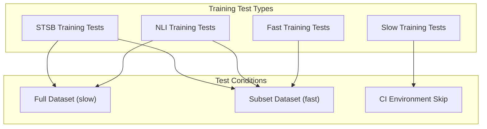

def pretrained_model_score(model_name, expected_score: float, max_test_samples: int = 100):
    model = SentenceTransformer(model_name, cache_folder=cache_dir)
    # Download and load STS benchmark data
    # Evaluate model performance
    # Assert performance meets threshold
```

**Key Test Parameters:**
- `max_test_samples`: Limits test data size (100 for fast tests, -1 for complete evaluation)
- `expected_score`: Minimum performance threshold for each model
- Similarity functions tested: cosine, euclidean, manhattan, dot product

Sources: [tests/test_pretrained_stsb.py:18-49]()

### Training Validation Tests

The `test_train_stsb.py` module validates training functionality across different scenarios:



Sources: [tests/test_train_stsb.py:82-187]()

### Test Execution Control

Tests use pytest markers to control execution:
- `@pytest.mark.slow`: Comprehensive tests with full datasets
- `@pytest.mark.skipif("CI" in os.environ)`: Skip resource-intensive tests in CI
- `@pytest.mark.parametrize`: Run same test with multiple parameter sets

## Running Tests

### Local Development

```bash