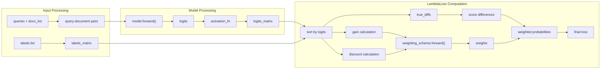

This document covers the loss functions available for training CrossEncoder models in the sentence-transformers library. CrossEncoder loss functions are specialized for tasks that require joint encoding of text pairs, such as reranking, classification, and learning-to-rank applications.

For information about SentenceTransformer loss functions, see [Loss Functions for SentenceTransformer](#3.4). For SparseEncoder loss functions, see [Loss Functions for SparseEncoder](#3.5).

## Overview

CrossEncoder loss functions are designed to train models that process text pairs jointly through a single transformer encoder. These loss functions fall into three main categories:

- **Learning-to-Rank Losses**: Optimize ranking metrics like NDCG for information retrieval tasks
- **Classification Losses**: Handle binary or multi-class classification scenarios  
- **Regression Losses**: Predict continuous similarity scores between text pairs

## Loss Function Hierarchy

The following diagram shows the inheritance and relationship structure of CrossEncoder loss functions:

```mermaid
graph TD
    Module["nn.Module"]
    
    subgraph "Learning-to-Rank Losses"
        LambdaLoss["LambdaLoss"]
        ListNetLoss["ListNetLoss"] 
        PListMLELoss["PListMLELoss"]
        ListMLELoss["ListMLELoss"]
        RankNetLoss["RankNetLoss"]
    end
    
    subgraph "Classification Losses"
        BinaryCrossEntropyLoss["BinaryCrossEntropyLoss"]
        CrossEntropyLoss["CrossEntropyLoss"]
        MultipleNegativesRankingLoss["MultipleNegativesRankingLoss"]
        CachedMultipleNegativesRankingLoss["CachedMultipleNegativesRankingLoss"]
    end
    
    subgraph "Regression Losses"
        MSELoss["MSELoss"]
        MarginMSELoss["MarginMSELoss"]
    end
    
    subgraph "Weighting Schemes"
        BaseWeightingScheme["BaseWeightingScheme"]
        NoWeightingScheme["NoWeightingScheme"]
        NDCGLoss1Scheme["NDCGLoss1Scheme"]
        NDCGLoss2Scheme["NDCGLoss2Scheme"]
        LambdaRankScheme["LambdaRankScheme"]
        NDCGLoss2PPScheme["NDCGLoss2PPScheme"]
        PListMLELambdaWeight["PListMLELambdaWeight"]
    end
    
    Module --> LambdaLoss
    Module --> ListNetLoss
    Module --> PListMLELoss
    Module --> BinaryCrossEntropyLoss
    Module --> CrossEntropyLoss
    Module --> MultipleNegativesRankingLoss
    Module --> CachedMultipleNegativesRankingLoss
    Module --> MSELoss
    Module --> MarginMSELoss
    Module --> BaseWeightingScheme
    
    ListMLELoss --> PListMLELoss
    LambdaLoss --> RankNetLoss
    BaseWeightingScheme --> NoWeightingScheme
    BaseWeightingScheme --> NDCGLoss1Scheme
    BaseWeightingScheme --> NDCGLoss2Scheme
    BaseWeightingScheme --> LambdaRankScheme
    BaseWeightingScheme --> NDCGLoss2PPScheme
    Module --> PListMLELambdaWeight
    
    LambdaLoss -.-> BaseWeightingScheme
    PListMLELoss -.-> PListMLELambdaWeight
```



Sources: [sentence_transformers/cross_encoder/losses/LambdaLoss.py:103-361](), [sentence_transformers/cross_encoder/losses/ListNetLoss.py:10-198](), [sentence_transformers/cross_encoder/losses/PListMLELoss.py:45-295](), [sentence_transformers/cross_encoder/losses/ListMLELoss.py:9-127](), [sentence_transformers/cross_encoder/losses/RankNetLoss.py:11-124](), [docs/package_reference/cross_encoder/losses.md:1-68]()

## Learning-to-Rank Loss Functions

Learning-to-rank losses are designed for information retrieval tasks where the goal is to rank documents by relevance for a given query. These losses work with listwise data formats.

### Data Format Requirements

All learning-to-rank losses expect the following input format:

| Component | Format | Description |
|-----------|--------|-------------|
| Inputs | `(queries, documents_list)` | List of query strings and list of document lists |
| Labels | `[score1, score2, ..., scoreN]` | List of relevance scores per query |
| Model Output | 1 label | Single relevance score per query-document pair |

### LambdaLoss Framework

The `LambdaLoss` class implements a comprehensive framework for ranking metric optimization with multiple weighting schemes:



The `LambdaLoss` supports five weighting schemes:

| Scheme | Class | Purpose |
|--------|-------|---------|
| No Weighting | `NoWeightingScheme` | Uniform weights (RankNet equivalent) |
| NDCG Loss1 | `NDCGLoss1Scheme` | Basic NDCG optimization |
| NDCG Loss2 | `NDCGLoss2Scheme` | Improved NDCG with tighter bounds |
| LambdaRank | `LambdaRankScheme` | Coarse upper bound optimization |
| NDCG Loss2++ | `NDCGLoss2PPScheme` | Hybrid scheme (recommended) |

Sources: [sentence_transformers/cross_encoder/losses/LambdaLoss.py:103-361](), [sentence_transformers/cross_encoder/losses/LambdaLoss.py:12-101]()

### ListNet Loss

The `ListNetLoss` implements the ListNet ranking algorithm using cross-entropy between predicted and ground truth ranking distributions:

```python