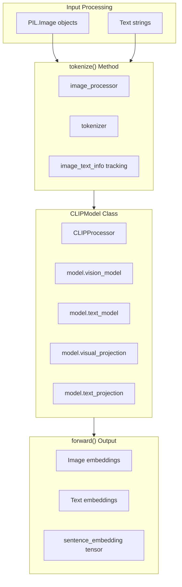
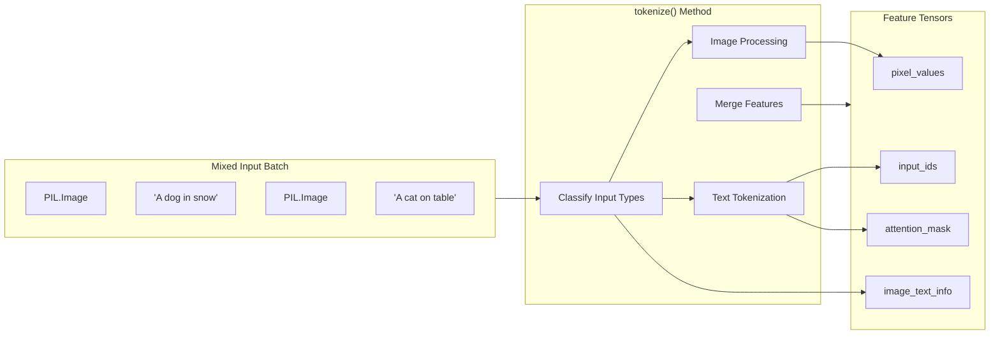

Multimodal applications in sentence-transformers enable processing and encoding of multiple input modalities (text, images) within unified embedding spaces. The primary implementation uses CLIP (Contrastive Language-Image Pre-training) models through the `CLIPModel` class, which supports image-text similarity, cross-modal retrieval, and multimodal semantic search.

The multimodal functionality integrates with the broader sentence-transformers ecosystem including multi-processing, evaluation frameworks, and deployment optimizations.

For text-only dense embeddings, see [SentenceTransformer Models](#5.1). For sparse embeddings, see [SparseEncoder Models](#5.2). For retrieval applications, see [Semantic Search](#6.1).

## CLIPModel Architecture

The `CLIPModel` class provides the core functionality for multimodal applications by implementing the CLIP architecture within the sentence-transformers framework.

**CLIPModel Component Architecture**


The `CLIPModel` class inherits from `InputModule` and wraps `transformers.CLIPModel` and `transformers.CLIPProcessor` components. It implements the `tokenize()` and `forward()` methods required by the sentence-transformers module system.

Sources: [sentence_transformers/models/CLIPModel.py:15-26](), [sentence_transformers/models/CLIPModel.py:70-92]()

## Input Processing and Tokenization

The CLIP model handles mixed input types through its `tokenize` method, which can process both PIL Images and text strings in the same batch.



The `image_text_info` list tracks which inputs are images (0) versus text (1), enabling proper routing during the forward pass.

Sources: [sentence_transformers/models/CLIPModel.py:70-92]()

## Forward Pass and Embedding Generation

The forward method processes mixed inputs and generates embeddings in a unified vector space:

| Processing Step | Image Inputs | Text Inputs |
|----------------|--------------|-------------|
| Feature Extraction | `vision_model(pixel_values)` | `text_model(input_ids, attention_mask)` |
| Projection | `visual_projection()` | `text_projection()` |
| Output Format | `image_embeds` | `text_embeds` |

```mermaid
graph TB
    subgraph Forward["forward() Method"]
        CHECK["Check Input Types"]
        VISION["Process Images"]
        TEXT["Process Text"]
        REORDER["Reorder by image_text_info"]
    end
    
    subgraph VisionPath["Vision Processing"]
        VFORWARD["vision_model()"]
        VPROJECTION["visual_projection()"]
    end
    
    subgraph TextPath["Text Processing"] 
        TFORWARD["text_model()"]
        TPROJECTION["text_projection()"]
    end
    
    CHECK --> VISION
    CHECK --> TEXT
    VISION --> VisionPath
    TEXT --> TextPath
    VisionPath --> REORDER
    TextPath --> REORDER
    REORDER --> UNIFIED["sentence_embedding tensor"]
```

The method maintains input order by using the `image_text_info` list to correctly sequence embeddings in the output tensor.

Sources: [sentence_transformers/models/CLIPModel.py:38-68]()

## Usage Patterns

### Basic Image-Text Similarity

```python
from sentence_transformers import SentenceTransformer
from PIL import Image

model = SentenceTransformer('clip-ViT-B-32')

# Encode image
image = Image.open('path/to/image.jpg')
img_embedding = model.encode(image)

# Encode text descriptions  
texts = ["A dog in the snow", "A cat on a table"]
text_embeddings = model.encode(texts)

# Compute similarities
similarities = model.similarity(img_embedding, text_embeddings)
```

### Mixed Batch Processing

The CLIP model can process images and text in the same batch call:

```python