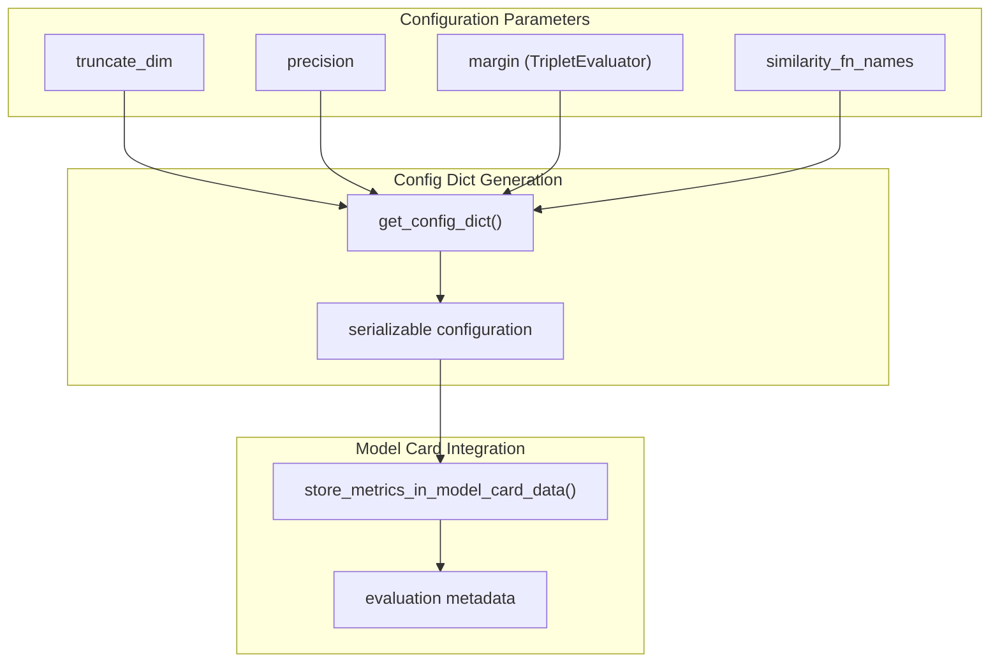

similarity_fn_names = ["cosine", "euclidean", "manhattan", "dot"]
evaluator = EmbeddingSimilarityEvaluator(
    sentences1=sentences1,
    sentences2=sentences2, 
    scores=scores,
    similarity_fn_names=similarity_fn_names
)
```

**Sources:** [sentence_transformers/evaluation/EmbeddingSimilarityEvaluator.py:223-238]()

### Configuration and Extensibility

Each evaluator implements a `get_config_dict()` method for serializing evaluation configuration:



**Sources:** [sentence_transformers/evaluation/EmbeddingSimilarityEvaluator.py:265-271](), [sentence_transformers/evaluation/BinaryClassificationEvaluator.py:374-378](), [sentence_transformers/evaluation/TripletEvaluator.py:264-270]()