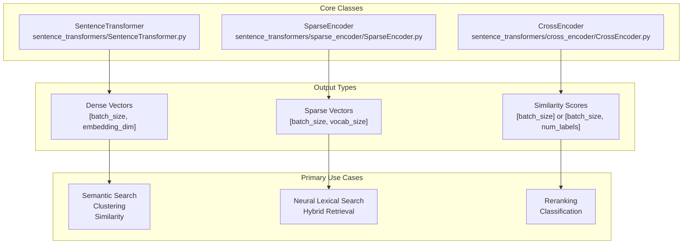

This guide provides essential examples for getting started with the three core model types in sentence-transformers: **SentenceTransformer** for dense embeddings, **SparseEncoder** for sparse embeddings, and **CrossEncoder** for reranking. Each model type serves different use cases in natural language processing and information retrieval systems.

For installation instructions, see [Installation & Setup](#2). For detailed training information, see [Training](#3). For comprehensive usage documentation, see the specific model sections: [SentenceTransformer Models](#5.1), [SparseEncoder Models](#5.2), and [CrossEncoder Models](#5.3).

## Core Model Types Overview

The sentence-transformers library provides three main model architectures that complement each other in modern NLP workflows:



**Sources:** [sentence_transformers/SentenceTransformer.py:61](), [sentence_transformers/sparse_encoder/SparseEncoder.py:27](), [sentence_transformers/cross_encoder/CrossEncoder.py:48](), [README.md:15-17]()

## SentenceTransformer: Dense Embeddings

`SentenceTransformer` models encode text into fixed-size dense vector representations, ideal for semantic similarity tasks and vector databases.

### Basic Usage

```python
from sentence_transformers import SentenceTransformer

# Load a pre-trained model
model = SentenceTransformer("all-MiniLM-L6-v2")

# Encode sentences into dense vectors
sentences = [
    "The weather is lovely today.",
    "It's so sunny outside!",
    "He drove to the stadium.",
]
embeddings = model.encode(sentences)
print(embeddings.shape)
# (3, 384)

# Calculate similarity scores
similarities = model.similarity(embeddings, embeddings)
print(similarities)
# tensor([[1.0000, 0.6660, 0.1046],
#         [0.6660, 1.0000, 0.1411],
#         [0.1046, 0.1411, 1.0000]])
```

### Specialized Encoding Methods

For information retrieval tasks, use task-specific encoding methods:

```python