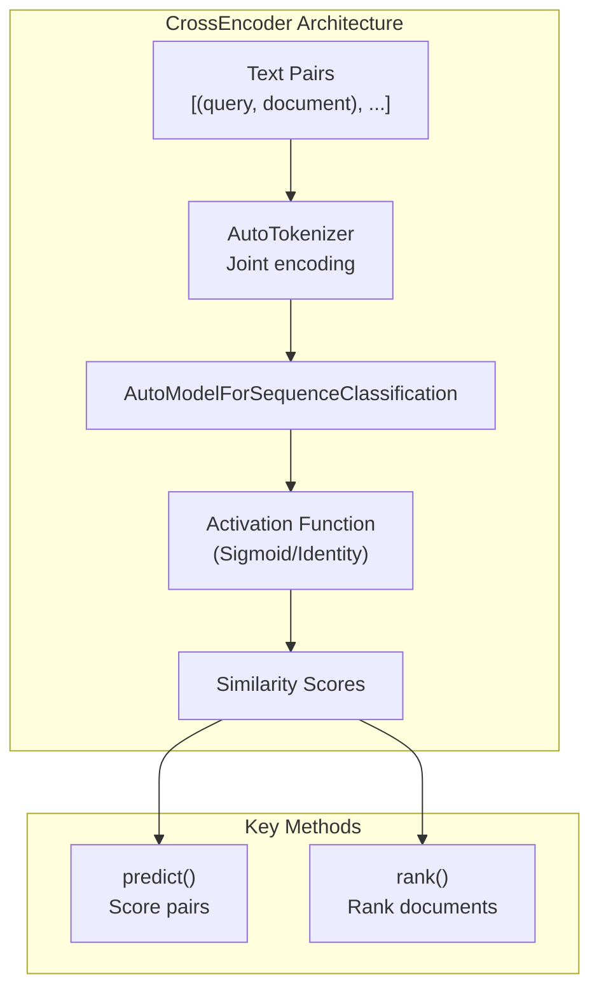

```

**Sources:** [sentence_transformers/sparse_encoder/SparseEncoder.py:27-180](), [sentence_transformers/sparse_encoder/models/MLMTransformer.py](), [sentence_transformers/sparse_encoder/models/SpladePooling.py](), [tests/sparse_encoder/test_sparse_encoder.py:15-169]()

## CrossEncoder

The `CrossEncoder` architecture differs fundamentally from the other two by taking pairs of texts as input and producing similarity scores rather than individual embeddings.

### CrossEncoder Pipeline



### Architecture Characteristics

- **No Individual Embeddings**: Cannot encode single texts independently
- **Joint Processing**: Both texts processed together through transformer layers
- **Classification Head**: Uses sequence classification architecture
- **Configurable Labels**: Supports regression (`num_labels=1`) or multi-class classification
- **Higher Accuracy**: Generally more accurate than bi-encoder approaches for pairwise tasks

### Usage in Retrieve-Rerank Pipeline

```python