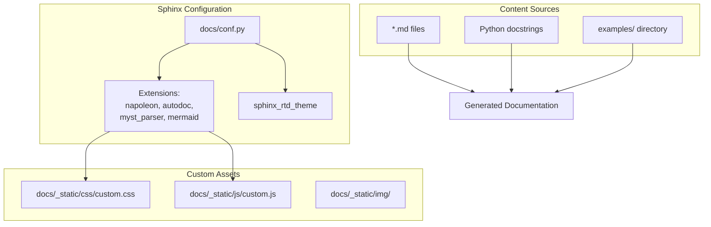
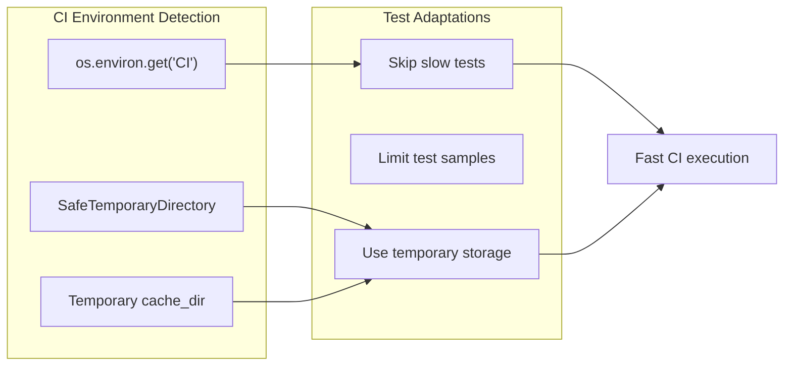

pytest tests/ --cov=sentence_transformers
```

### Test Environment Variables

| Variable | Purpose | Default |
|----------|---------|---------|
| `CI` | Indicates CI environment, skips slow tests | `None` |
| Cache directories | Managed by `cache_dir` fixture | Temporary in CI |

Sources: [tests/conftest.py:108-114](), [tests/test_train_stsb.py:106-110]()

## Documentation Development

The documentation system uses Sphinx with custom extensions and styling.

### Documentation Build Configuration



### Key Documentation Extensions

| Extension | Purpose |
|-----------|---------|
| `sphinx.ext.napoleon` | Google/NumPy docstring parsing |
| `sphinx.ext.autodoc` | Automatic API documentation |
| `myst_parser` | Markdown support |
| `sphinxcontrib.mermaid` | Diagram rendering |
| `sphinx.ext.linkcode` | Source code linking |

Sources: [docs/conf.py:38-49]()

### Custom Documentation Features

The documentation includes custom JavaScript for GitHub integration and enhanced styling:

**GitHub Integration:**
```javascript
// From custom.js - adds GitHub star button
function addGithubButton() {
    // Inserts GitHub star button and Hugging Face link
}
```

**Custom Styling:**
- Responsive layout with max-width 1280px
- Component boxes with gradient headers
- Training arguments grid layout
- Enhanced navigation styling

Sources: [docs/_static/js/custom.js:1-39](), [docs/_static/css/custom.css:1-124]()

## Development Environment Setup

### Prerequisites

```bash
# Install development dependencies
pip install -e ".[dev,train]"

# For documentation building
pip install sphinx sphinx-rtd-theme myst-parser sphinxcontrib-mermaid
```

### Code Quality Tools

The project maintains code quality through:
- **Type Hints**: Extensive use of type annotations with `from __future__ import annotations`
- **Import Organization**: Consistent import ordering and structure
- **Documentation Standards**: Comprehensive docstrings and examples

### Testing Best Practices

1. **Fixture Usage**: Use appropriate fixture scopes to minimize resource usage
2. **Test Isolation**: Each test should be independent and reproducible
3. **Performance Thresholds**: Set realistic but strict performance expectations
4. **Resource Management**: Use temporary directories and cleanup in CI environments

Sources: [tests/conftest.py:1-115](), [tests/test_pretrained_stsb.py:1-145]()

## Continuous Integration Considerations

The testing framework is designed to work efficiently in CI environments:

### CI Optimizations



### Memory and Storage Management

- **Temporary Directories**: CI tests use temporary directories that are automatically cleaned up
- **Model Caching**: Session-scoped fixtures prevent redundant model loading
- **Sample Limiting**: Tests can run with reduced datasets in CI environments

Sources: [tests/conftest.py:108-114](), [tests/test_train_stsb.py:106-163]()