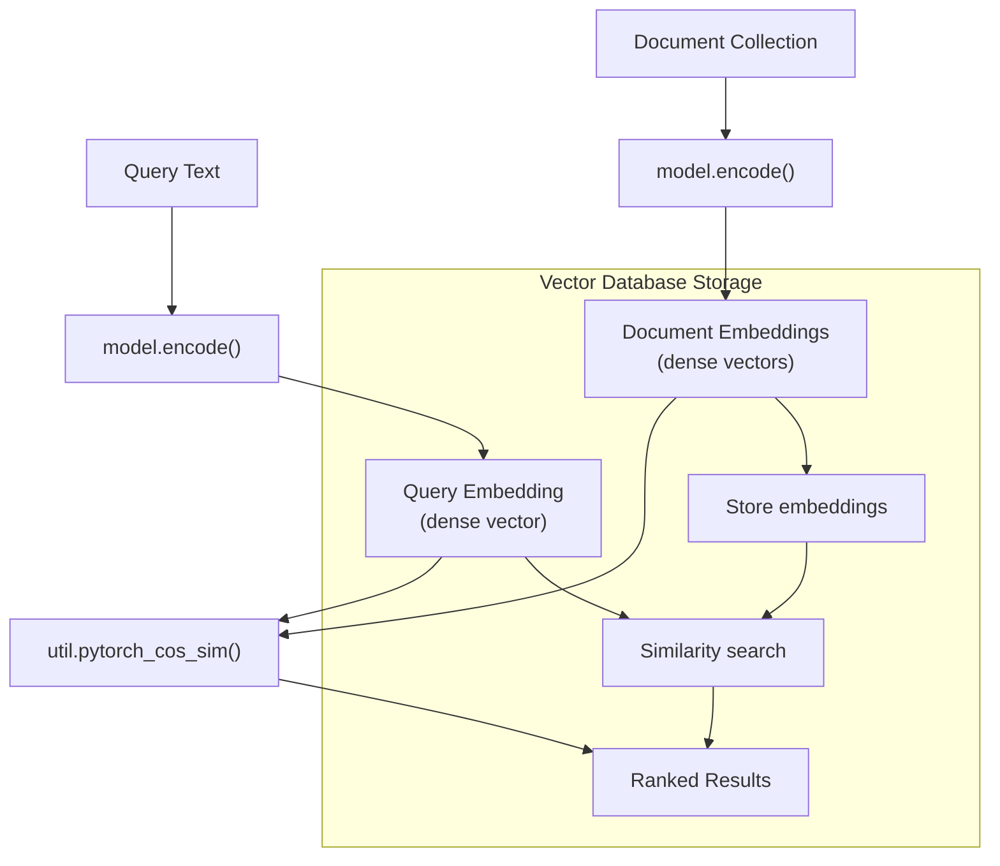
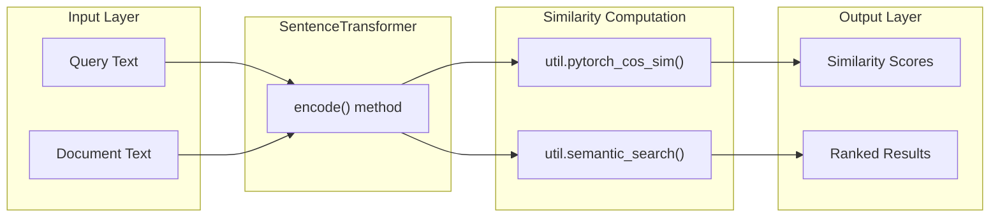
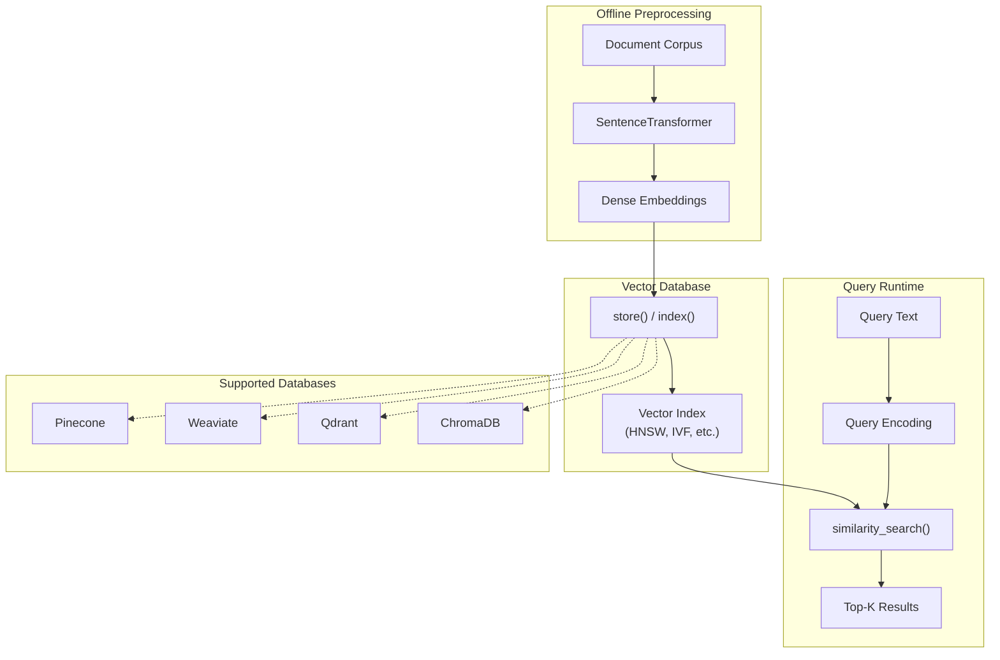

This document covers implementing semantic search using dense embeddings generated by `SentenceTransformer` models. Semantic search enables finding relevant documents based on meaning rather than exact keyword matching, using vector similarity in high-dimensional embedding spaces.

For sparse retrieval approaches using search engines, see [Sparse Search Integration](#6.2). For two-stage systems combining retrieval and reranking, see [Retrieve & Rerank Architecture](#6.3). For measuring text similarity in general, see [Semantic Textual Similarity](#6.4).

## Overview

Semantic search with sentence-transformers uses dense vector embeddings to represent both queries and documents in a shared semantic space. Unlike traditional keyword-based search, this approach captures semantic meaning and can find relevant results even when exact terms don't match.

### Semantic Search Flow



Sources: [docs/pretrained-models/msmarco-v2.md:8-15]()

## Basic Implementation Pattern

The fundamental pattern for semantic search involves three steps: encoding the query, encoding the document collection, and computing similarity scores.

### Core Components



Sources: [docs/pretrained-models/msmarco-v2.md:8-15]()

### Model Selection

The choice of `SentenceTransformer` model significantly impacts search quality. Models trained on information retrieval datasets like MS MARCO provide better performance for search tasks compared to general-purpose models.

| Model Type | Use Case | Example |
|------------|----------|---------|
| MSMARCO-trained | Information retrieval | `msmarco-distilroberta-base-v2` |
| General-purpose | Broad semantic similarity | `all-MiniLM-L6-v2` |
| Domain-specific | Specialized fields | BioBERT variants |

Sources: [docs/pretrained-models/msmarco-v2.md:10](), [docs/pretrained-models/msmarco-v2.md:27-32]()

## Vector Database Integration

For large-scale semantic search, vector databases provide efficient storage and retrieval of dense embeddings. The integration pattern involves pre-computing document embeddings and storing them for fast similarity search.

### Vector Database Architecture



Sources: Based on integration patterns mentioned in the repository overview

## Performance Considerations

Semantic search performance depends on both model quality and computational efficiency. The choice of model affects both retrieval quality and inference speed.

### Model Performance Comparison

Based on evaluation against traditional keyword search (BM25), dense embedding models show significant improvements in retrieval quality:

| Approach | NDCG@10 (TREC DL 19) | MRR@10 (MS Marco) |
|----------|---------------------|-------------------|
| BM25 (Elasticsearch) | 45.46 | 17.29 |
| `msmarco-distilroberta-base-v2` | 65.65 | 28.55 |
| `msmarco-roberta-base-v2` | 67.18 | 29.17 |
| `msmarco-distilbert-base-v2` | 68.35 | 30.77 |

The substantial improvement over BM25 demonstrates the effectiveness of semantic search for information retrieval tasks.

Sources: [docs/pretrained-models/msmarco-v2.md:25-32]()

### Optimization Strategies

For production semantic search systems, several optimization techniques apply:

1. **Model Selection**: Choose appropriately sized models balancing quality and speed
2. **Batch Processing**: Encode multiple documents simultaneously for better throughput  
3. **Caching**: Cache frequently accessed embeddings to reduce computation
4. **Quantization**: Use reduced precision embeddings to decrease memory usage
5. **Approximate Search**: Leverage vector database indexing for sub-linear search time

## Implementation Patterns

### Single-Query Search

The basic pattern for single-query semantic search involves encoding the query and computing similarity against a collection of pre-computed document embeddings.

```python
# Referenced pattern from file
model = SentenceTransformer("msmarco-distilroberta-base-v2")
query_embedding = model.encode("How big is London")
passage_embedding = model.encode("London has 9,787,426 inhabitants at the 2011 census")
similarity = util.pytorch_cos_sim(query_embedding, passage_embedding)
```

Sources: [docs/pretrained-models/msmarco-v2.md:10-15]()

### Batch Processing

For processing multiple queries or documents, batch encoding provides better performance through parallelization within the model.

### Cross-Lingual Search

`SentenceTransformer` models trained on multilingual data enable semantic search across language boundaries, where queries in one language can retrieve relevant documents in another language.

## Integration Examples

The MS MARCO models demonstrate effective semantic search for information retrieval tasks. These models are specifically trained on search query-passage pairs, making them well-suited for question-answering and document retrieval applications.

Training data characteristics:
- Over 500,000 query-passage examples  
- Complete corpus of 8.8 million passages
- Real user search queries from Bing search engine

Sources: [docs/pretrained-models/msmarco-v2.md:2-4]()