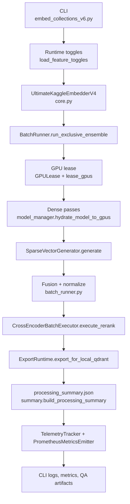

# Ensemble Execution Flow

This document captures the live ensemble pipeline that powers
`embed_collections_v6.py`. It mirrors the production path so future work can
reason about toggles, leasing, telemetry, and export behavior without
reverse-engineering the codebase.

## Pipeline Overview

- CLI entry (`scripts/embed_collections_v6.py`) resolves feature toggles via
  `runtime_config.load_feature_toggles` before instantiating the embedder.
- `UltimateKaggleEmbedderV4` (`processor/ultimate_embedder/core.py`) wires the
  ensemble config, GPU leasing, sparse models, telemetry, and export runtime.
- `BatchRunner.run_exclusive_ensemble` executes dense passes model-by-model,
  acquiring leases with `gpu_lease.lease_gpus` and adapting batches per device
  feedback.
- Sparse vectors are generated through `SparseVectorGenerator.generate` and are
  fused with dense outputs ahead of rerank.
- CrossEncoder rerank (`CrossEncoderBatchExecutor.execute_rerank`) consumes the
  fused candidates and publishes telemetry plus fallback state.
- Export runtime writes embeddings, sparse vectors, manifests, and summaries via
  `ExportRuntime.export_for_local_qdrant` and `write_processing_summary`.
- Telemetry and metrics fan out through `TelemetryTracker` and
  `PrometheusMetricsEmitter`, informing manifests, CLI summaries, and alerts.

## Stage Details

### CLI, Toggles, and Runtime Configuration

- The CLI (`scripts/embed_collections_v6.py`) builds the argument parser, loads
  defaults (Kaggle vs local), and records toggle provenance.
- Feature resolution follows `defaults → config files → env → CLI`. The
  resulting `FeatureToggleConfig` is serialized into `processing_summary.json`
  and surfaced in CLI completion logs.
- Toggle sources are stored in `args.toggle_sources` and re-used by telemetry to
  annotate rerank and sparse execution state.

### Embedder Initialization

- `UltimateKaggleEmbedderV4` injects ensemble, sparse, and rerank configs,
  instantiates `ModelManager`, `BatchRunner`, `TelemetryTracker`, and exporters.
- `ModelManager.initialize_primary_model` stages the primary model to CPU when
  exclusive mode is on, and `initialize_sparse_models` hydrates SPLADE onto CPU.
- `load_feature_toggles` output is preserved on the embedder for later summary
  generation.

### Exclusive Ensemble Passes

- `BatchRunner.run_exclusive_ensemble` loops through the ordered model list and
  acquires an exclusive lease per pass. GPU snapshots and lease events are stored
  via `TelemetryTracker.record_gpu_lease_event`.
- `AdaptiveBatchController` dynamically shrinks batches when VRAM snapshots exceed
  soft limits, recording mitigations inside telemetry.
- After each pass, embeddings are staged, normalised, and aggregated using model
  weights before sparse and rerank stages execute.

### Sparse Generation and Fusion

- When `enable_sparse=True`, `SparseVectorGenerator.generate` creates sparse
  vectors per chunk, logging coverage, latency, and fallback counts.
- Sparse outputs populate `embedder.sparse_vectors` and the `sparse_run`
  section in the processing summary for downstream ingestion.

### Rerank Execution

- `_assemble_fused_candidates` constructs the candidate payload that flows into
  `CrossEncoderBatchExecutor.execute_rerank` (`cross_encoder_executor.py`).
- The executor hydrates the CrossEncoder through GPU leasing, sizes rerank
  batches under the 12 GB ceiling, and returns `CrossEncoderRerankRun` for
  telemetry, exports, and CLI summaries.
- Fallbacks (feature disabled, empty candidates, execution failures) set
  `rerank_fallback_reason` and increment counters surfaced to Prometheus.

### Export, Summaries, and Telemetry

- Dense, sparse, and rerank artifacts are exported by
  `ExportRuntime.export_for_local_qdrant`, reusing per-collection working dirs
  configured by the CLI.
- `write_processing_summary` composes the manifest using
  `build_processing_summary`, which in turn reuses helpers for rerank, sparse,
  baseline, and telemetry sections.
- `TelemetryTracker` accumulates mitigation, lease, batch-progress, and span
  events, while `PrometheusMetricsEmitter` emits latency, GPU peak, and fallback
  metrics when metrics are enabled.

## Safeguards and Fallback Paths

- GPU leasing (`gpu_lease.GPULease`) enforces the 12 GB VRAM ceiling by staging
  unused models to CPU, clearing caches, and sampling VRAM before/after each pass.
- Adaptive batching records mitigations when OOMs are detected, retrying with a
  reduced batch size instead of aborting the run.
- Rerank gracefully degrades by persisting dense fusion results and annotating
  summaries with `fallback_reason` and provenance so operators can audit.
- Sparse inference tracks fallback coverage, ensuring export consumers can
  distinguish metadata-only vectors from live sparse outputs.

## Observability Touchpoints

- CLI completion logs highlight rerank/sparse enablement, GPU device routing,
  latency, and fallback data pulled from the manifest.
- `processing_summary.json` houses `feature_toggles`, `rerank_run`, `sparse_run`,
  telemetry spans (`rag.*`), and metrics status for QA sign-off.
- Prometheus metrics (`rag_rerank_latency_seconds`, `rag_gpu_peak_bytes`,
  `rerank_fallback_total`, `rag_sparse_latency_seconds`, etc.) feed the
  Grafana dashboards described in `docs/telemetry/rerank_sparse_signals.md`.
- Telemetry smoke tests assert that rerank spans, fallback counters, and metrics
  remain aligned with the documented flow.

## Reference Coverage

- Source modules: `scripts/embed_collections_v6.py`,
  `processor/ultimate_embedder/batch_runner.py`,
  `processor/ultimate_embedder/gpu_lease.py`,
  `processor/ultimate_embedder/model_manager.py`,
  `processor/ultimate_embedder/cross_encoder_executor.py`,
  `processor/ultimate_embedder/sparse_generator.py`,
  `processor/ultimate_embedder/telemetry.py`,
  `processor/ultimate_embedder/summary.py`.
- Runtime configuration: `processor/ultimate_embedder/runtime_config.py` for
  toggle precedence and provenance logging.
- Tests: `tests/test_processing_summary.py`,
  `tests/test_telemetry_smoke.py`, and `tests/test_prometheus_validation.py`
  validate manifest content, span emission, and metrics wiring.

## Related Documentation

- `docs/telemetry/rerank_sparse_signals.md` for metrics, alerts, and dashboards.
- `docs/architecture/v6_gpu_lease_architecture.md` for deeper lease internals.
- `docs/architecture/v6_feature_toggles.md` for CLI/environment precedence.
- `docs/prd/epic-4-export-schema-regression-hardening-and-ensemble-documentation.md`
  references this document for Story 4.1 deliverables.
