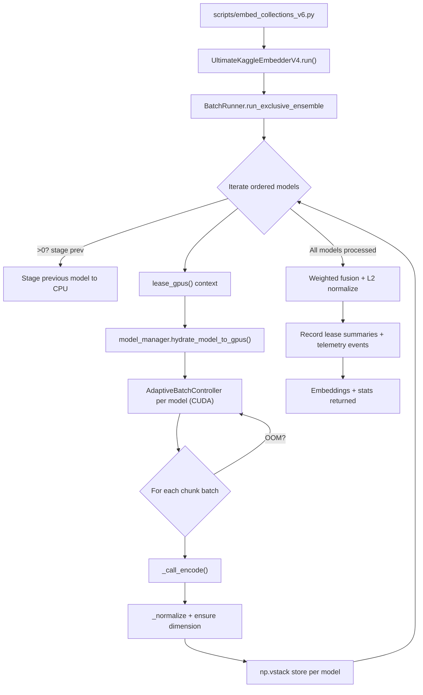

# RAG_CLEAN Product Requirements Document (PRD)

## Goals and Background Context

### Goals
- Deliver a production-ready CrossEncoder rerank stage that slots into the Ultimate Embedder without regressing the current dense-only flow.
- Upgrade sparse helper execution to generate live sparse vectors with graceful fallbacks and aligned export artifacts.
- Extend CLI configuration, telemetry, and export schemas so rerank and sparse stages run by default and surface as first-class signals while staying overrideable when needed.
- Maintain the 12 GB-per-GPU ceiling across Kaggle dual-T4 runs through adaptive batching and leasing safeguards.

### Background Context
RAG_CLEAN already processes heterogeneous document batches into dense embeddings and knowledge surfaces using the exclusive ensemble pipeline defined in the architecture plan. The brownfield enhancement initiative reactivates previously scaffolded CrossEncoder rerank and sparse pipelines so retrieval quality improves without rewriting the mature orchestration, telemetry, or export layers. This work must fit within the existing GPU-leasing constraints and keep the CLI/operator experience familiar while delivering richer ranking metadata.

Key constraints include the hard 12 GB VRAM ceiling on Kaggle GPUs, additive-only schema changes for downstream consumers, and preservation of privacy controls around telemetry. Success requires harmonizing dense, sparse, and rerank stages inside the Ultimate Embedder so operators can toggle them per run and still rely on the established deployment scripts and dashboards.

### Change Log

| Date | Version | Description | Author |
| --- | --- | --- | --- |
| 2025-10-23 | 0.1 | Initial draft capturing goals, context, and constraints for the rerank and sparse enhancement PRD. | John (PM) |

## Requirements

### Functional
1. FR1: System must load CrossEncoder and sparse models automatically on every execution while still honoring explicit opt-out switches in config or environment.
2. FR2: Batch Runner must orchestrate live sparse inference before export, capturing per-chunk vectors and falling back to metadata when inference fails.
3. FR3: CrossEncoder rerank stage must execute after dense+sparse fusion, producing ranked candidate lists plus rerank telemetry/export payloads.
4. FR4: CLI/config defaults must ship with rerank and sparse execution enabled, with documented parameters to disable for exceptional runs.
5. FR5: Export runtime must append rerank and sparse sections to manifests and JSONL artifacts without breaking legacy consumers or changing existing keys.
6. FR6: Telemetry subsystem must record spans and metrics for dense, sparse, and rerank stages, including GPU peak usage, latency, and fallback indicators.
7. FR7: System must enforce the 12 GB-per-GPU ceiling via adaptive batch sizing and leasing safeguards across dense, sparse, and rerank executions.
8. FR8: Rerank and sparse stages must reuse the existing `lease_gpus` manager to distribute work across leased devices when more than one GPU is available, retaining the exclusive ensemble flow while providing intra-stage data parallelism.

### Non Functional
1. NFR1: Enhancements must maintain backward-compatible outputs, keeping embedding-only runs identical when overrides turn off rerank and sparse stages.
2. NFR2: GPU memory usage must stay under 12 GB per device with automatic recovery steps (e.g., retry with smaller batches) when nearing the cap.
3. NFR3: Telemetry and exports must continue anonymizing sensitive text; no new fields may expose raw queries or PII.
4. NFR4: Rerank and sparse stages must keep total batch latency within +10% of the current exclusive ensemble SLA on Kaggle dual-T4 pipelines.
5. NFR5: Automated tests must cover enabled-default, fallback, and opt-out scenarios to guard against regressions in the dense-only path.

#### Rationale & Assumptions
These requirements mirror the architecture constraints (12 GB GPU limit, additive schemas, telemetry privacy) and your mandate that rerank/sparse run by default every execution. Leveraging the existing leasing and adaptive batching avoids inventing new orchestration while ensuring multi-GPU leases still provide throughput gains. Regression protections stay critical because defaults now enable new stages.

## Technical Assumptions

- Retain `rag_clean` as a monorepo housing orchestration, scripts, and documentation; multi-repo splits would complicate tightly coupled batch tooling for no benefit in a solo-operator setup.
- Preserve the modular monolith embedder architecture: Ultimate Embedder orchestrates dense, sparse, and rerank stages via shared GPU leasing/telemetry rather than introducing microservices or external workers.
- Expand automated coverage with unit tests for new executors plus integration tests that run CPU-friendly rerank/sparse passes, verifying dense-only parity when overrides disable new stages.
- Thoroughly document the current exclusive ensemble implementation before modifying it, capturing real control flow for future maintainers.

- Planned rerank and sparse integrations must slot into this established sequence: sparse inference runs after dense aggregation and before exports, while rerank consumes fused embeddings, all while reusing leasing and telemetry hooks shown above.
- CLI defaults enable rerank and sparse stages; operators can still opt out via documented environment variables or config keys for troubleshooting runs without code changes.
- Telemetry schema version increments (e.g., `processing_summary.json` v4.1) and accompanying docs must explain new signals tied to rerank/sparse execution for observability teams.
- Privacy guardrails remain: query text in telemetry/export payloads must stay truncated or anonymized, matching existing compliance rules.

## Epic List

- Epic 1: Default Rerank & Sparse Activation Backbone – Ship default-on toggles, CLI/config updates, and control-plane plumbing so rerank and sparse run every execution without breaking dense-only parity when explicitly disabled.
- Epic 2: Sparse Generator & Fusion Upgrade – Implement live sparse inference inside the batch runner, fusing results and handling fallbacks while honoring GPU leasing across devices.
- Epic 3: CrossEncoder Rerank Execution & Telemetry – Execute rerank after dense+sparse fusion, persist ranked outputs, and expose telemetry covering latency, GPU peaks, and fallback states.
- Epic 4: Export Schema, Regression Hardening, and Ensemble Documentation – Version exports, expand regression coverage, and publish the observed ensemble flow documentation to anchor future maintainers.

## Epic 1: Default Rerank & Sparse Activation Backbone

Expanded Goal: Establish configuration, CLI, and runtime defaults that activate rerank and sparse stages on every run while preserving dense-only compatibility through explicit opt-outs, ensuring the control plane and monitoring surfaces recognize the new baseline.

### Story 1.1 Default-On Configuration Wiring
As a deployment operator,
I want rerank and sparse stages enabled automatically through configuration defaults,
so that every execution benefits from the enhanced retrieval stack without manual flag work.

#### Acceptance Criteria
1: Configuration loaders default to enabling rerank and sparse stages while honoring override switches (env vars, config files).
2: Unit tests cover default-on behavior and explicit opt-out paths.
3: Documentation highlights default settings and how to disable stages.

### Story 1.2 CLI and Runtime Toggle Integration
As a CLI operator,
I want the command-line interface and runtime logging to reflect the default-on rerank/sparse behavior,
so that executions surface clear status and allow opt-outs for exceptional runs.

#### Acceptance Criteria
1: `embed_collections_v6.py` exposes parameters that document default-on behavior and allow disabling rerank/sparse.
2: Run summaries/logs show rerank and sparse activation states and devices used.
3: Telemetry control-plane entries confirm defaults were applied, with regression tests verifying dense-only parity when disabled.

### Story 1.3 Telemetry & Monitoring Baseline Updates
As a telemetry consumer,
I want monitoring dashboards and runtime metrics to treat rerank and sparse as first-class stages,
so that default executions emit expected spans and operators can trace failures quickly.

#### Acceptance Criteria
1: Telemetry emits stage indicators when rerank/sparse are active, capturing GPU leasing metadata per stage.
2: Dashboards or runbooks document new metrics and default expectations.
3: Smoke test run verifies telemetry coverage with rerank/sparse enabled and disabled.

#### QA Consolidation Status (2025-10-25)

- **Identified Issue Summary**: QA reopened Stories 1.1–1.3 because staging telemetry baselines, GPU alert automation, sparse fallback coverage, CLI documentation updates, and end-to-end smoke evidence never landed; Epic 1 cannot close without them.
- **Epic Impact Summary**: Epic 1 remains intact, but Story 1.4 must inherit and deliver every improvement checklist item from Stories 1.1–1.3 before the epic can complete.
- **Artifact Adjustment Needs**:
  - Update `docs/stories/1.4.story.md` to list inherited tasks, acceptance criteria, and QA evidence requirements.
  - Amend Stories 1.1–1.3 QA sections and gate files to reference Story 1.4 as the closure path with explicit acceptance proof expectations.
  - Expand `docs/telemetry/rerank_sparse_signals.md` and `docs/architecture/observability.md` with staging latency/VRAM baselines, alert thresholds, smoke matrix results, and operator playbooks.
  - Introduce QA evidence files under `docs/qa/assessments/` capturing staging runs, alert wiring validation, and smoke outputs.
- **Recommended Path Forward**: Execute Story 1.4 as the consolidation vehicle, capturing staging evidence, wiring alerts, broadening sparse fallback tests, updating CLI docs, running telemetry smoke tests across toggle states, and refreshing QA artifacts.
- **PRD MVP Impact**: No change to core MVP scope; optionally annotate the observability section once baselines are documented.
- **High-Level Action Plan**:
  - Schedule staging runs with rerank/sparse enabled and disabled; archive latency/VRAM metrics and screenshots.
  - Implement GPU peak alert automation plus regression tests, integrate with monitoring dashboards, and document alert response steps.
  - Extend sparse fallback regression matrix and add CLI help/doc synonyms for enable/disable flows.
  - Execute the telemetry smoke suite across toggle combinations; publish results to QA assessments and story logs.
  - Update the reopened story QA sections and gate files to reflect completion once evidence is attached.
- **Agent Handoff Plan**: Story 1.4 is owned by the observability lead (developer). Coordinate with QA for evidence review and wrap the remaining gates once alerting validation is complete.

## Epic 2: Sparse Generator & Fusion Upgrade

Expanded Goal: Replace metadata echo with live sparse inference, integrate it into the exclusive ensemble flow using existing GPU leasing, and ensure fallbacks plus fusion logic preserve export correctness.

### Story 2.1 Implement Sparse Generator Module
As a pipeline developer,
I want a dedicated sparse generator that produces live vectors with fallback handling,
so that sparse retrieval data matches dense quality without manual workarounds.

#### Acceptance Criteria
1: New module executes sparse inference, returning vectors per chunk with metadata on fallback usage.
2: Unit tests cover happy path, inference failure, and fallback recovery.
3: GPU leasing support mirrors existing dense passes, including telemetry of device usage.

### Story 2.2 Integrate Sparse Stage into Batch Runner
As an orchestration engineer,
I want the batch runner to invoke live sparse inference before exports,
so that fused outputs include sparse vectors without disrupting the ensemble sequence.

#### Acceptance Criteria
1: Batch runner calls sparse generator after dense aggregation and before fusion/export.
2: Flow respects adaptive batch controller decisions and handles OOM mitigation via leasing.
3: Regression tests compare exports with sparse enabled vs. disabled, ensuring additive schema only.

### Story 2.3 Update Fusion and Export Consumers
As an export maintainer,
I want sparse vectors merged into downstream artifacts cleanly,
so that consumers receive additive sparse data with clear version signaling.

#### Acceptance Criteria
1: Fusion layer combines dense and sparse outputs without altering existing keys.
2: Export manifests/JSONL include sparse sections with version bump and documentation.
3: Legacy parsers ingest updated artifacts without errors when sparse data present.

## Epic 3: CrossEncoder Rerank Execution & Telemetry

Expanded Goal: Activate the CrossEncoder rerank pipeline, ensuring it consumes fused candidates, records ranked outputs, and emits telemetry for latency, GPU usage, and fallback scenarios while respecting the 12 GB ceiling.

### Story 3.1 Build CrossEncoder Executor
As a rerank pipeline developer,
I want an executor that hydrates CrossEncoder models using GPU leasing,
so that rerank batches stay within memory limits while providing candidate scores.

#### Acceptance Criteria
1: Executor dynamically sizes batches to avoid 12 GB OOM and logs leasing events.
2: Unit tests simulate multi-GPU leases and OOM recovery paths.
3: Executor returns ranked results plus telemetry payload for downstream use.

### Story 3.2 Integrate Rerank Stage into Orchestration
As an orchestration engineer,
I want the rerank stage to run after dense+sparse fusion in the batch runner,
so that ranked candidates accompany export and telemetry surfaces without breaking flow.

#### Acceptance Criteria
1: Batch runner invokes rerank executor with fused candidates and records outcomes.
2: Fallback pathways capture when rerank disabled or fails, maintaining exports and logs.
3: End-to-end run demonstrates rerank-enabled exports and telemetry across default settings.

### Story 3.3 Telemetry and Observability Enhancements
As a telemetry consumer,
I want rerank-specific metrics (latency, GPU peak, fallback counts),
so that monitoring can detect issues with the new stage quickly.

#### Acceptance Criteria
1: Telemetry/metrics emit rerank-specific spans and Prometheus counters.
2: Runbook entries document interpreting rerank metrics and thresholds.
3: Alert thresholds or dashboards updated to include rerank performance indicators.

## Epic 4: Export Schema, Regression Hardening, and Ensemble Documentation

Expanded Goal: Solidify durability by versioning exports, expanding regression coverage, and publishing the observed ensemble flow so future enhancements begin with accurate implementation knowledge.

### Story 4.1 Document Current Ensemble Flow
As a future maintainer,
I want a canonical document describing the actual ensemble execution path,
so that upcoming modifications reference real behavior rather than assumptions.

#### Acceptance Criteria
1: Documentation outlines end-to-end flow (CLI → embedder → leasing → adaptive control → fusion) with diagrams mirroring code.
2: Cross-references include `batch_runner.py`, `gpu_lease.py`, and related controllers.
3: Document lives in repo docs (e.g., `docs/architecture/ensemble-flow.md`) and links from PRD or runbooks.

### Story 4.2 Export Schema Versioning and Validation
As an export maintainer,
I want manifest and JSONL schemas versioned to include rerank/sparse payloads,
so that downstream tools parse enriched data safely.

#### Acceptance Criteria
1: Manifest bumped to v4.1 with optional rerank/sparse sections and documented schema changes.
2: Validation scripts/tests confirm legacy (v4.0) and new (v4.1) artifacts both parse.
3: Tooling emits warnings when rerank/sparse expected but absent, without breaking runs.

### Story 4.3 Regression Harness and Test Coverage Expansion
As a quality owner,
I want automated tests spanning default-on, fallback, and opt-out scenarios,
so that rerank/sparse changes do not regress dense-only behavior.

#### Acceptance Criteria
1: CI includes end-to-end sample corpus exercising rerank and sparse on CPU-friendly models.
2: Tests verify default-on outputs match expectations and opt-out paths match legacy results.
3: Performance baseline recorded for default-on runs to guard against >10% latency regression.
