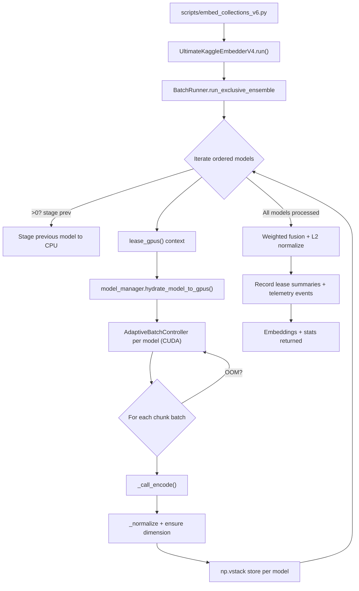

# Technical Assumptions

- Retain `rag_clean` as a monorepo housing orchestration, scripts, and documentation; multi-repo splits would complicate tightly coupled batch tooling for no benefit in a solo-operator setup.
- Preserve the modular monolith embedder architecture: Ultimate Embedder orchestrates dense, sparse, and rerank stages via shared GPU leasing/telemetry rather than introducing microservices or external workers.
- Expand automated coverage with unit tests for new executors plus integration tests that run CPU-friendly rerank/sparse passes, verifying dense-only parity when overrides disable new stages.
- Thoroughly document the current exclusive ensemble implementation before modifying it, capturing real control flow for future maintainers.

- Planned rerank and sparse integrations must slot into this established sequence: sparse inference runs after dense aggregation and before exports, while rerank consumes fused embeddings, all while reusing leasing and telemetry hooks shown above.
- CLI defaults enable rerank and sparse stages; operators can still opt out via documented environment variables or config keys for troubleshooting runs without code changes.
- Telemetry schema version increments (e.g., `processing_summary.json` v4.1) and accompanying docs must explain new signals tied to rerank/sparse execution for observability teams.
- Privacy guardrails remain: query text in telemetry/export payloads must stay truncated or anonymized, matching existing compliance rules.

