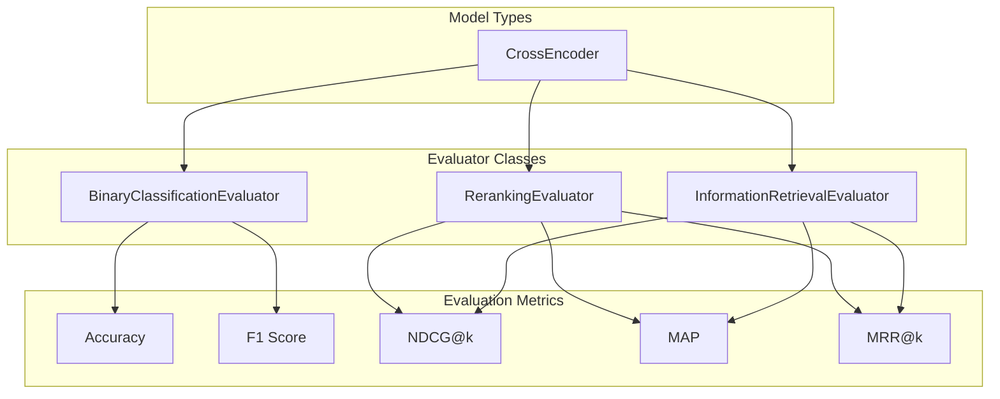
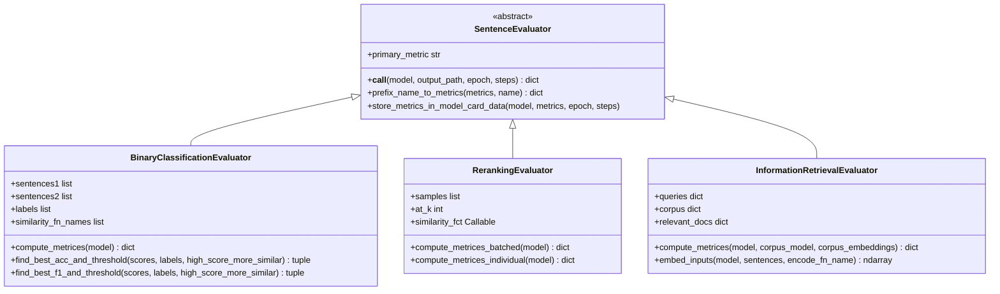
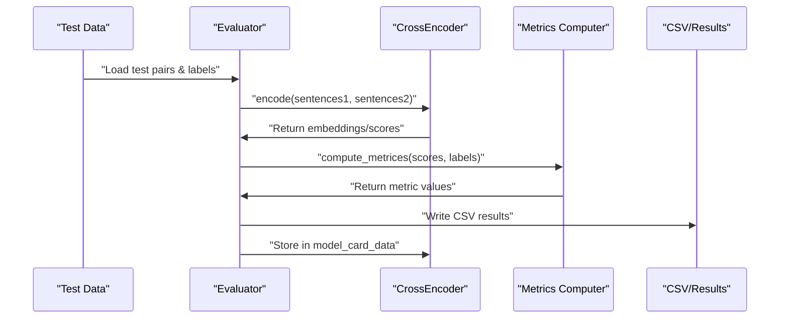

CrossEncoder evaluators assess CrossEncoder models that take pairs of texts as input and output classification or ranking scores. While SentenceTransformer evaluators focus on embedding quality, CrossEncoder evaluators measure pairwise scoring accuracy for classification, ranking, and retrieval tasks.

## Overview

CrossEncoder models are evaluated using specialized evaluator classes that measure their ability to correctly score text pairs. The main evaluators applicable to CrossEncoder models include `BinaryClassificationEvaluator` for classification tasks, `RerankingEvaluator` for ranking tasks, and `InformationRetrievalEvaluator` for retrieval tasks.

**CrossEncoder Evaluation Architecture**


Sources: [sentence_transformers/evaluation/BinaryClassificationEvaluator.py:27](), [sentence_transformers/evaluation/RerankingEvaluator.py:25](), [sentence_transformers/evaluation/InformationRetrievalEvaluator.py:23]()

## Core Evaluator Classes

### BinaryClassificationEvaluator

The `BinaryClassificationEvaluator` class evaluates models on binary classification tasks where pairs of texts are classified as similar (1) or dissimilar (0). It computes accuracy, F1 score, precision, and recall metrics.

**Key Methods:**
- `__call__(model, output_path, epoch, steps)` - Main evaluation method
- `compute_metrices(model)` - Computes classification metrics  
- `find_best_acc_and_threshold()` - Finds optimal classification threshold
- `find_best_f1_and_threshold()` - Finds optimal F1 threshold

**Supported Similarity Functions:**
- Cosine similarity (`SimilarityFunction.COSINE`)
- Dot product (`SimilarityFunction.DOT_PRODUCT`) 
- Manhattan distance (`SimilarityFunction.MANHATTAN`)
- Euclidean distance (`SimilarityFunction.EUCLIDEAN`)

Sources: [sentence_transformers/evaluation/BinaryClassificationEvaluator.py:27-83](), [sentence_transformers/evaluation/BinaryClassificationEvaluator.py:223-294]()

### RerankingEvaluator

The `RerankingEvaluator` class evaluates models on reranking tasks by computing similarity scores between queries and documents, then measuring ranking quality.

**Key Methods:**
- `__call__(model, output_path, epoch, steps)` - Main evaluation method
- `compute_metrices(model)` - Computes ranking metrics
- `compute_metrices_batched(model)` - Batched computation for efficiency
- `compute_metrices_individual(model)` - Individual computation for memory efficiency

**Metrics Computed:**
- Mean Average Precision (MAP)
- Mean Reciprocal Rank (MRR@k)  
- Normalized Discounted Cumulative Gain (NDCG@k)

Sources: [sentence_transformers/evaluation/RerankingEvaluator.py:25-87](), [sentence_transformers/evaluation/RerankingEvaluator.py:200-342]()

### InformationRetrievalEvaluator

The `InformationRetrievalEvaluator` class evaluates models on information retrieval tasks using query-document pairs and relevance judgments.

**Key Methods:**
- `__call__(model, output_path, epoch, steps)` - Main evaluation method
- `compute_metrices(model, corpus_model, corpus_embeddings)` - Computes IR metrics
- `embed_inputs(model, sentences, encode_fn_name)` - Handles encoding for queries/documents

**Metrics Computed:**
- Accuracy@k, Precision@k, Recall@k
- Mean Reciprocal Rank (MRR@k)
- Normalized Discounted Cumulative Gain (NDCG@k) 
- Mean Average Precision (MAP@k)

Sources: [sentence_transformers/evaluation/InformationRetrievalEvaluator.py:23-123](), [sentence_transformers/evaluation/InformationRetrievalEvaluator.py:292-408]()

**Evaluator Class Hierarchy**


Sources: [sentence_transformers/evaluation/SentenceEvaluator.py](), [sentence_transformers/evaluation/BinaryClassificationEvaluator.py:27](), [sentence_transformers/evaluation/RerankingEvaluator.py:25](), [sentence_transformers/evaluation/InformationRetrievalEvaluator.py:23]()

## Evaluation Workflow

CrossEncoder evaluators follow a standard evaluation process that involves data preparation, model scoring, metric computation, and result reporting.

**Evaluation Process Flow**


### Standard Evaluation Steps

1. **Data Loading**: Load sentence pairs and ground truth labels
2. **Model Encoding**: Generate embeddings or scores for text pairs
3. **Score Computation**: Apply similarity functions or classification
4. **Metric Calculation**: Compute task-specific evaluation metrics
5. **Result Storage**: Write results to CSV files and model metadata

### Primary Metric Selection

Each evaluator defines a `primary_metric` property that identifies the main performance measure:

| Evaluator | Primary Metric | Description |
|-----------|----------------|-------------|
| `BinaryClassificationEvaluator` | `{name}_cosine_ap` or `{name}_max_ap` | Average Precision |
| `RerankingEvaluator` | `{name}_ndcg@{k}` | NDCG at rank k |
| `InformationRetrievalEvaluator` | `{name}_{score_fn}_ndcg@{k}` | NDCG with score function |

Sources: [sentence_transformers/evaluation/BinaryClassificationEvaluator.py:215-218](), [sentence_transformers/evaluation/RerankingEvaluator.py:135](), [sentence_transformers/evaluation/InformationRetrievalEvaluator.py:272-280]()

## Usage Examples

### Binary Classification Evaluation

```python
from sentence_transformers.evaluation import BinaryClassificationEvaluator

# Initialize with sentence pairs and binary labels
evaluator = BinaryClassificationEvaluator(
    sentences1=["The cat sat on the mat", "Hello world"],
    sentences2=["A cat was sitting on a rug", "Goodbye earth"], 
    labels=[1, 0],  # 1 for similar, 0 for dissimilar
    name="similarity_test"
)

# Evaluate model and get metrics
results = evaluator(model)
print(f"Accuracy: {results['similarity_test_cosine_accuracy']}")
print(f"F1 Score: {results['similarity_test_cosine_f1']}")
```

### Reranking Evaluation

```python
from sentence_transformers.evaluation import RerankingEvaluator