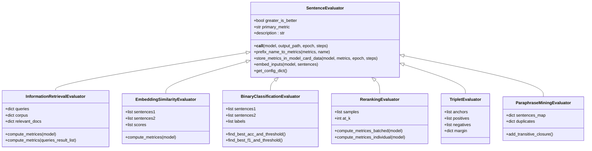
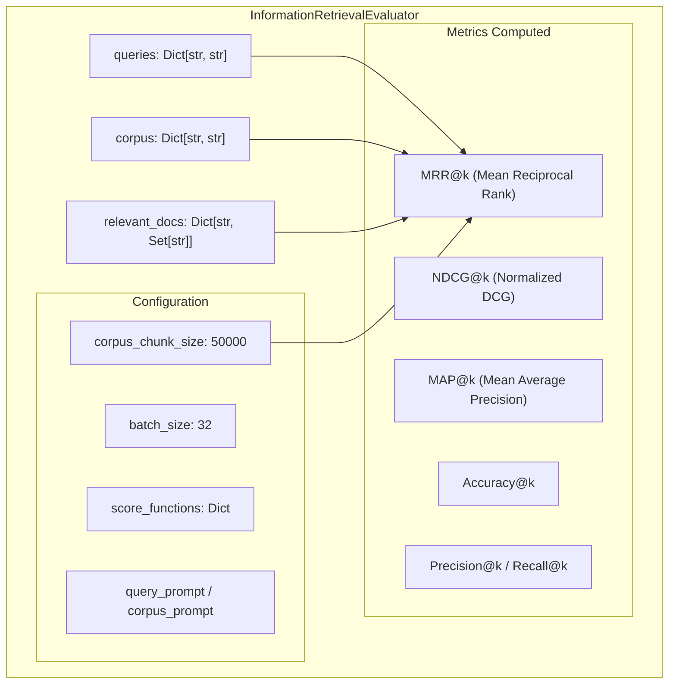
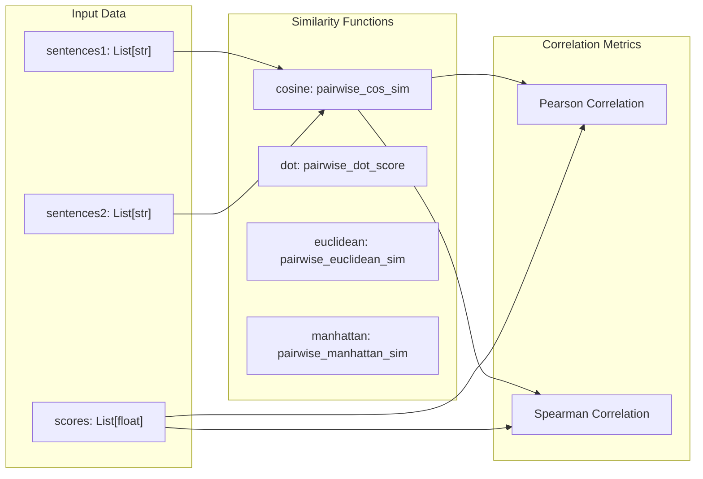
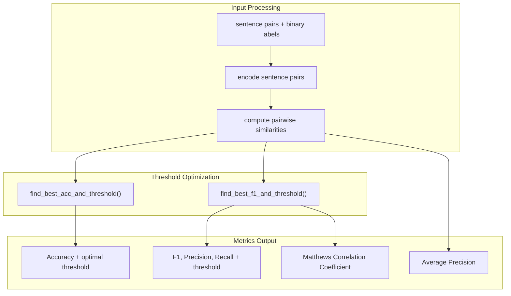
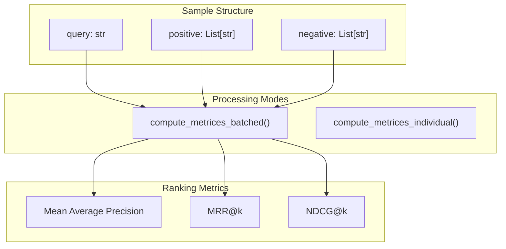
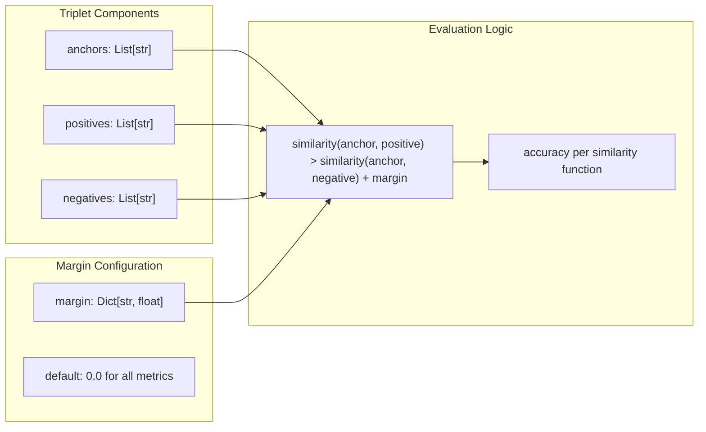
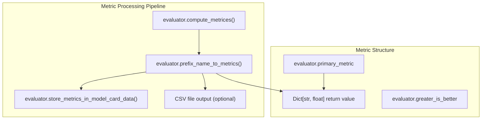
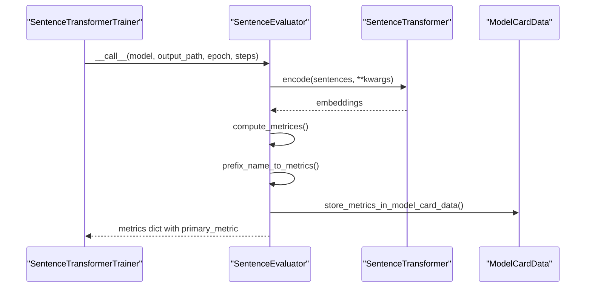

similarity_fn_names = ["cosine", "dot", "euclidean", "manhattan"]
```

This generates metrics for each function, with optional `max_*` aggregated metrics for overall performance assessment.

### Prediction Output

The `InformationRetrievalEvaluator` supports `write_predictions=True` to output retrieval results in JSONL format, enabling downstream analysis and fusion with other retrieval systems.

### Embedding Optimization

Several evaluators support advanced embedding configurations:
- **Precision Control**: `precision` parameter for quantized embeddings (`"int8"`, `"binary"`, etc.)
- **Dimension Truncation**: `truncate_dim` for reduced-dimension evaluation
- **Normalization**: Automatic normalization for certain precision modes

Sources: [sentence_transformers/evaluation/EmbeddingSimilarityEvaluator.py:171-176](), [sentence_transformers/evaluation/InformationRetrievalEvaluator.py:374-396]()

# SentenceTransformer Evaluators


This document covers the evaluation system for `SentenceTransformer` models, including the base evaluator architecture and all available evaluator implementations. These evaluators are used during training to assess model performance on various downstream tasks, enabling automatic model selection and performance monitoring.

For evaluation of sparse encoder models, see [SparseEncoder Evaluators](#4.2). For cross-encoder evaluation, see [CrossEncoder Evaluators](#4.3). For comprehensive benchmark evaluation, see [NanoBEIR Evaluation](#4.4).

## Evaluator Architecture

All SentenceTransformer evaluators inherit from the `SentenceEvaluator` base class, which provides a standardized interface for evaluation during training and inference.

### Base Evaluator Structure



**Sources:** [sentence_transformers/evaluation/SentenceEvaluator.py:13-121]()

### Key Base Class Features

The `SentenceEvaluator` base class provides several critical features:

| Feature | Purpose | Key Methods |
|---------|---------|-------------|
| **Primary Metric** | Identifies the main metric for model selection | `primary_metric` attribute |
| **Metric Direction** | Indicates if higher scores are better | `greater_is_better` attribute |
| **Metric Prefixing** | Adds evaluator names to metric keys | `prefix_name_to_metrics()` |
| **Model Card Integration** | Stores evaluation results in model metadata | `store_metrics_in_model_card_data()` |
| **Embedding Interface** | Standardized text encoding | `embed_inputs()` |

**Sources:** [sentence_transformers/evaluation/SentenceEvaluator.py:26-121]()

## Core Evaluator Types

### Information Retrieval Evaluator

The `InformationRetrievalEvaluator` is designed for search and retrieval tasks, computing standard IR metrics across large corpora.



Key features:
- **Chunked Processing**: Handles large corpora via `corpus_chunk_size` parameter [sentence_transformers/evaluation/InformationRetrievalEvaluator.py:130]()
- **Multiple Score Functions**: Supports different similarity functions via `score_functions` [sentence_transformers/evaluation/InformationRetrievalEvaluator.py:141]()
- **Asymmetric Encoding**: Different prompts for queries vs documents [sentence_transformers/evaluation/InformationRetrievalEvaluator.py:143-146]()
- **Prediction Export**: Optional JSONL output for downstream analysis [sentence_transformers/evaluation/InformationRetrievalEvaluator.py:147]()

**Sources:** [sentence_transformers/evaluation/InformationRetrievalEvaluator.py:23-568]()

### Embedding Similarity Evaluator

The `EmbeddingSimilarityEvaluator` measures correlation between predicted and ground-truth similarity scores.



Key features:
- **Multiple Similarity Functions**: Supports cosine, dot product, Euclidean, and Manhattan distance [sentence_transformers/evaluation/EmbeddingSimilarityEvaluator.py:184-189]()
- **Precision Support**: Handles quantized embeddings (int8, uint8, binary, ubinary) [sentence_transformers/evaluation/EmbeddingSimilarityEvaluator.py:93]()
- **Automatic Deduplication**: Avoids re-encoding identical sentences [sentence_transformers/evaluation/EmbeddingSimilarityEvaluator.py:225-237]()

**Sources:** [sentence_transformers/evaluation/EmbeddingSimilarityEvaluator.py:27-272]()

### Binary Classification Evaluator

The `BinaryClassificationEvaluator` treats similarity as a binary classification problem.



**Sources:** [sentence_transformers/evaluation/BinaryClassificationEvaluator.py:27-379]()

### Reranking Evaluator

The `RerankingEvaluator` evaluates models on reranking tasks with query-document relevance.



Key features:
- **Flexible Processing**: Choice between batched and individual encoding [sentence_transformers/evaluation/RerankingEvaluator.py:98]()
- **Memory Optimization**: Batched mode for speed, individual mode for memory efficiency [sentence_transformers/evaluation/RerankingEvaluator.py:210-214]()

**Sources:** [sentence_transformers/evaluation/RerankingEvaluator.py:25-372]()

## Specialized Evaluators

### Triplet Evaluator

Evaluates triplet ranking performance where positive examples should be closer than negative examples.



**Sources:** [sentence_transformers/evaluation/TripletEvaluator.py:26-271]()

### Paraphrase Mining Evaluator

Evaluates paraphrase detection performance by mining similar sentences from a corpus.

Key features:
- **Transitive Closure**: Optional transitive relationship enforcement [sentence_transformers/evaluation/ParaphraseMiningEvaluator.py:97]()
- **Scalable Mining**: Uses `paraphrase_mining` utility for efficient processing [sentence_transformers/evaluation/ParaphraseMiningEvaluator.py:172-182]()
- **F1 Optimization**: Finds optimal similarity threshold for paraphrase detection [sentence_transformers/evaluation/ParaphraseMiningEvaluator.py:187-212]()

**Sources:** [sentence_transformers/evaluation/ParaphraseMiningEvaluator.py:18-279]()

### Translation Evaluator

Measures cross-lingual alignment by checking if translations have highest mutual similarity.

**Sources:** [sentence_transformers/evaluation/TranslationEvaluator.py:22-192]()

### Knowledge Distillation Evaluators

Two evaluators support knowledge distillation scenarios:

- **MSEEvaluator**: Computes MSE between teacher and student embeddings [sentence_transformers/evaluation/MSEEvaluator.py:18-158]()
- **MSEEvaluatorFromDataFrame**: Structured multilingual distillation evaluation [sentence_transformers/evaluation/MSEEvaluatorFromDataFrame.py:20-139]()

## Common Usage Patterns

### Evaluation During Training

All evaluators follow the same calling convention for integration with training loops:

```python
# Standard evaluator call signature
results = evaluator(
    model=sentence_transformer_model,
    output_path="./evaluation_results",
    epoch=current_epoch,
    steps=current_step
)
```

### Metric Organization



**Sources:** [sentence_transformers/evaluation/SentenceEvaluator.py:57-75]()

### Configuration Management

Each evaluator provides configuration introspection via `get_config_dict()`:

| Evaluator | Key Configuration Parameters |
|-----------|------------------------------|
| `InformationRetrievalEvaluator` | `truncate_dim`, `query_prompt`, `corpus_prompt` |
| `EmbeddingSimilarityEvaluator` | `truncate_dim`, `precision` |
| `BinaryClassificationEvaluator` | `truncate_dim` |
| `RerankingEvaluator` | `at_k`, `truncate_dim` |
| `TripletEvaluator` | `margin`, `truncate_dim` |

**Sources:** Multiple evaluator `get_config_dict()` methods across evaluation files

## Integration with Training

Evaluators integrate seamlessly with the SentenceTransformer training system:



The training system uses `evaluator.primary_metric` and `evaluator.greater_is_better` for:
- **Model Selection**: Choosing best checkpoint when `load_best_model_at_end=True`
- **Early Stopping**: Monitoring convergence based on evaluation metrics
- **Logging**: Tracking primary metrics across training runs

**Sources:** [sentence_transformers/evaluation/SentenceEvaluator.py:26-75]()