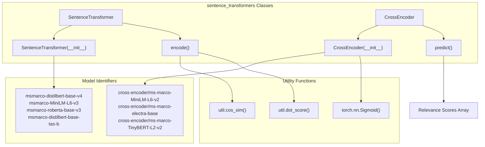
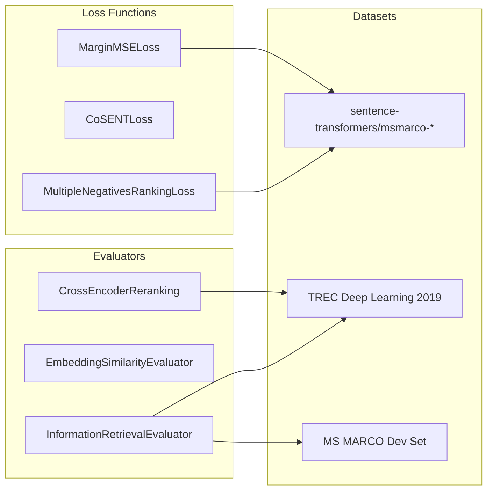

This document covers specialized pretrained models trained on the MS MARCO dataset for passage retrieval tasks. These models are optimized for semantic search scenarios where queries need to be matched against relevant passages. For general dense embedding models, see [SentenceTransformer Models](#5.1). For cross-encoder models trained on other datasets, see [CrossEncoder Models](#5.3).

## Dataset Overview

MS MARCO (Microsoft Machine Reading Comprehension) is a large-scale information retrieval corpus created from real user search queries using the Bing search engine. The dataset consists of:

- **Training data**: Over 500,000 query-passage examples
- **Complete corpus**: Over 8.8 million passages  
- **Evaluation**: TREC Deep Learning 2019 and MS MARCO Passage Retrieval datasets
- **Task type**: Asymmetric semantic search (short queries → longer passages)

The dataset enables training models that can find semantically relevant passages given natural language queries, making it ideal for search and question-answering applications.

**Sources:** [docs/pretrained-models/msmarco-v3.md:1-5](), [docs/pretrained-models/ce-msmarco.md:1-6]()

## Model Architecture Types

MS MARCO models are available across multiple architectures, each optimized for different use cases in the retrieval pipeline:

### Code Entity Mapping



### Training Components



**Sources:** [docs/pretrained-models/msmarco-v3.md:6-16](), [docs/cross_encoder/pretrained_models.md:27-44]()

## Dense Embedding Models

Dense embedding models use the `SentenceTransformer` class and encode queries and passages into dense vector representations for efficient similarity search:

### Cosine Similarity Models

These models are optimized for cosine similarity computation and tend to prefer shorter, more focused passages:

| Model Name | NDCG@10 (TREC DL 19) | MRR@10 (MS Marco Dev) | Queries/sec (GPU/CPU) | Docs/sec (GPU/CPU) |
|------------|---------------------|----------------------|---------------------|-------------------|
| `msmarco-MiniLM-L6-v3` | 67.46 | 32.27 | 18,000 / 750 | 2,800 / 180 |
| `msmarco-MiniLM-L12-v3` | 65.14 | 32.75 | 11,000 / 400 | 1,500 / 90 |
| `msmarco-distilbert-base-v3` | 69.02 | 33.13 | 7,000 / 350 | 1,100 / 70 |
| `msmarco-distilbert-base-v4` | **70.24** | **33.79** | 7,000 / 350 | 1,100 / 70 |
| `msmarco-roberta-base-v3` | 69.08 | 33.01 | 4,000 / 170 | 540 / 30 |

### Dot Product Models

These models are optimized for dot product similarity and tend to prefer longer, more comprehensive passages:

| Model Name | NDCG@10 (TREC DL 19) | MRR@10 (MS Marco Dev) | Queries/sec (GPU/CPU) | Docs/sec (GPU/CPU) |
|------------|---------------------|----------------------|---------------------|-------------------|
| `msmarco-distilbert-base-dot-prod-v3` | 68.42 | 33.04 | 7,000 / 350 | 1,100 / 70 |
| `msmarco-roberta-base-ance-firstp` | 67.84 | 33.01 | 4,000 / 170 | 540 / 30 |
| `msmarco-distilbert-base-tas-b` | **71.04** | **34.43** | 7,000 / 350 | 1,100 / 70 |

**Sources:** [docs/pretrained-models/msmarco-v3.md:27-44]()

## Cross-Encoder Models

Cross-encoder models use the `CrossEncoder` class for reranking retrieved passages. They process query-passage pairs jointly and output relevance scores:

| Model Name | NDCG@10 (TREC DL 19) | MRR@10 (MS Marco Dev) | Docs/sec |
|------------|---------------------|----------------------|----------|
| `cross-encoder/ms-marco-TinyBERT-L2-v2` | 69.84 | 32.56 | 9,000 |
| `cross-encoder/ms-marco-MiniLM-L2-v2` | 71.01 | 34.85 | 4,100 |
| `cross-encoder/ms-marco-MiniLM-L4-v2` | 73.04 | 37.70 | 2,500 |
| `cross-encoder/ms-marco-MiniLM-L6-v2` | **74.30** | **39.01** | 1,800 |
| `cross-encoder/ms-marco-MiniLM-L12-v2` | 74.31 | 39.02 | 960 |
| `cross-encoder/ms-marco-electra-base` | 71.99 | 36.41 | 340 |

**Sources:** [docs/cross_encoder/pretrained_models.md:35-43](), [docs/pretrained-models/ce-msmarco.md:41-48]()

## Usage Examples

### Dense Embedding Model Usage

```python
from sentence_transformers import SentenceTransformer, util