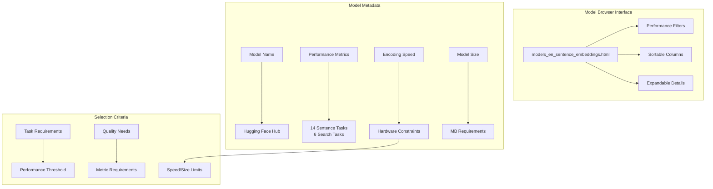

emb = model.encode("Text to encode", prompt="Represent this text: ")
```

**Performance Optimization**:
- `normalize_embeddings=True`: Enable dot-product similarity
- `convert_to_tensor=False`: Return numpy arrays for storage
- `precision="int8"`: Quantized embeddings for memory efficiency
- `batch_size=64`: Adjust for your hardware

Sources: [sentence_transformers/SentenceTransformer.py:309-386](), [sentence_transformers/SentenceTransformer.py:424-432]()

## Model Discovery and Metadata

The interactive model browser provides comprehensive model information:



The browser enables filtering by performance, speed, and size to find optimal models for specific requirements.

Sources: [docs/_static/html/models_en_sentence_embeddings.html:106-228](), [docs/sentence_transformer/pretrained_models.md:41-49]()