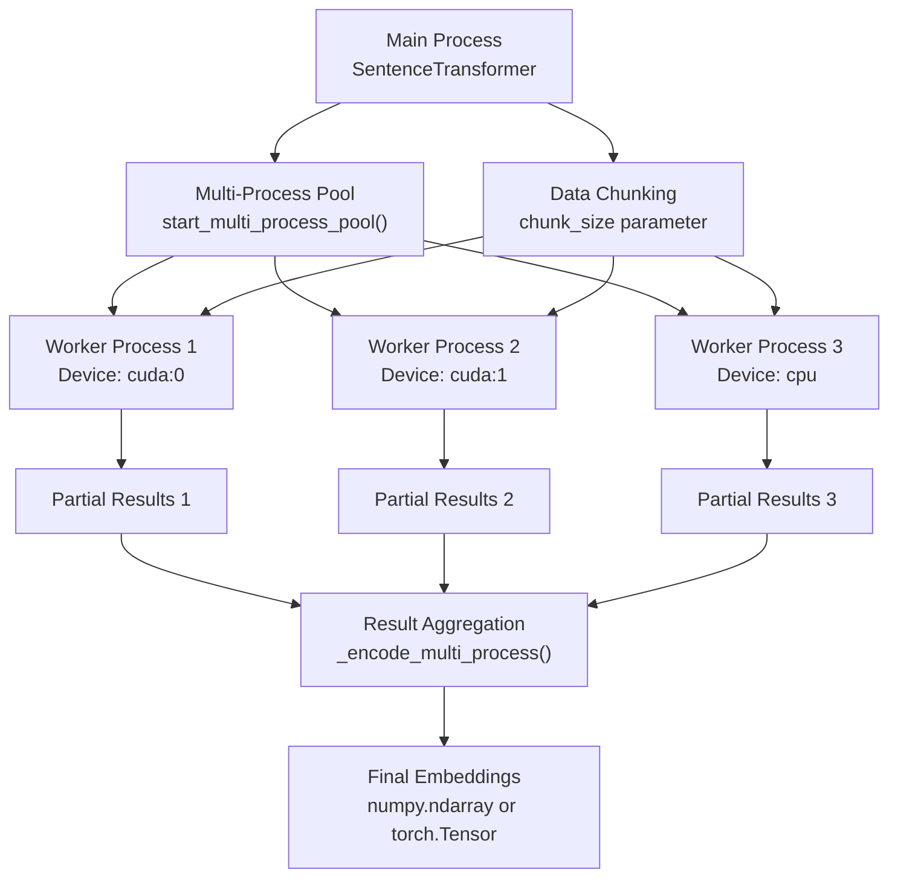
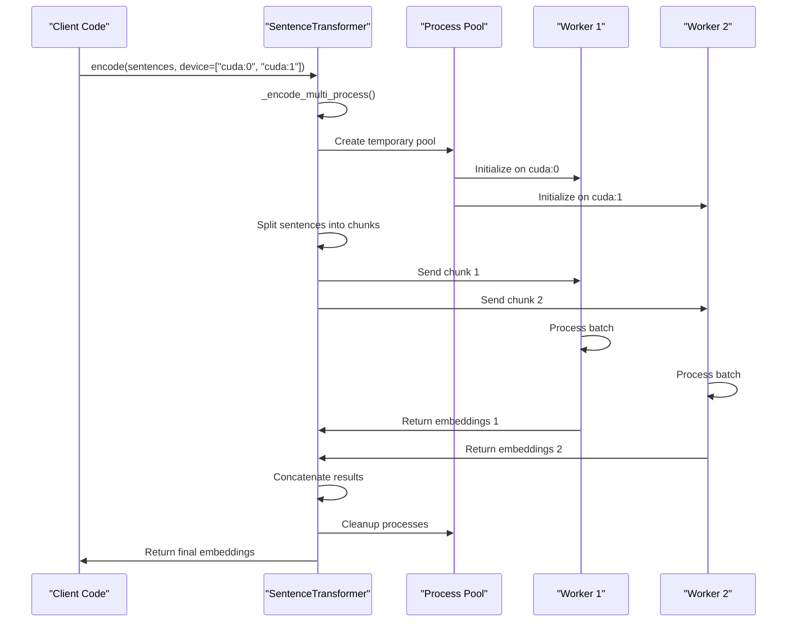
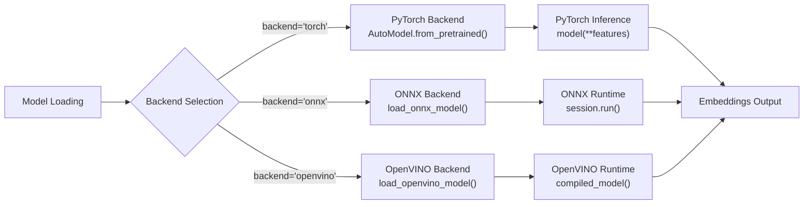
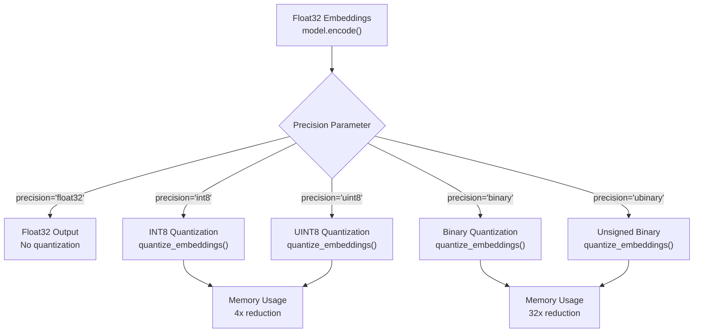
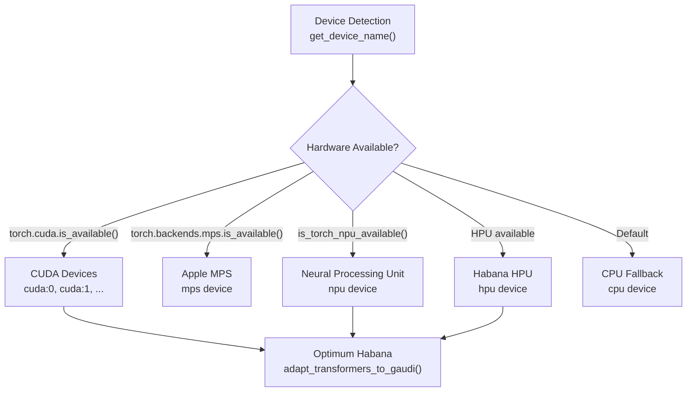
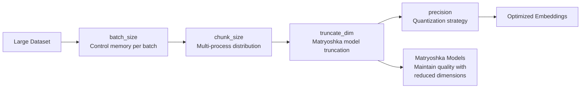
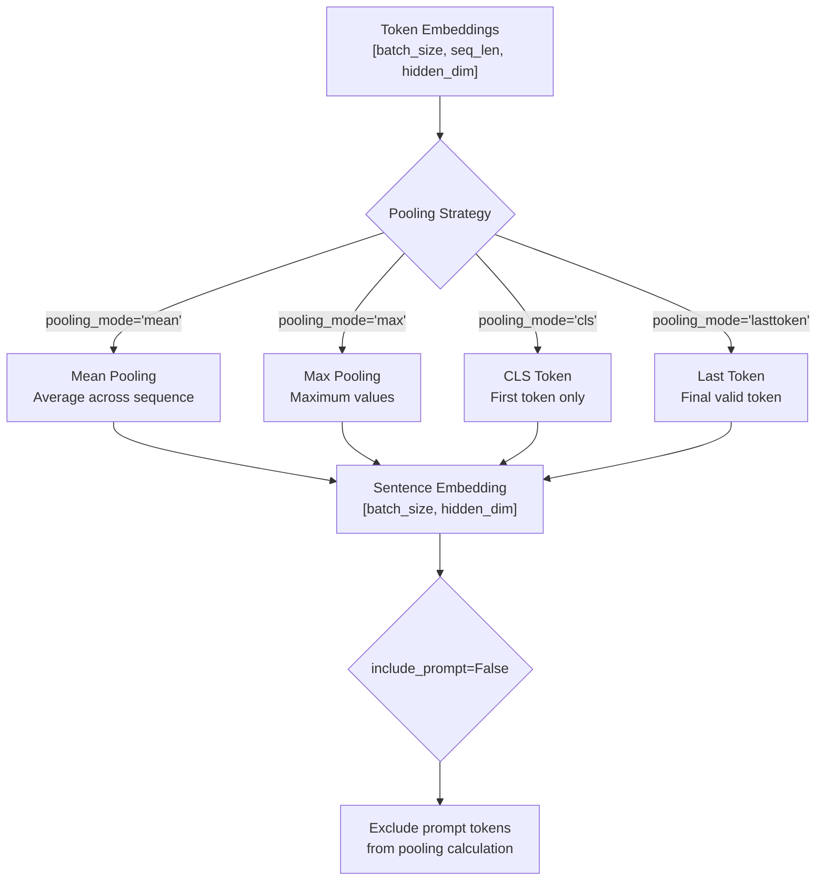

This page covers performance optimization techniques available in sentence-transformers, including multi-processing for distributed encoding, backend optimization with ONNX and OpenVINO, quantization strategies, and hardware acceleration. These optimization methods can significantly improve inference speed and reduce memory usage when working with large datasets or resource-constrained environments.

For general model usage and basic inference, see the quickstart guide in [2.1](#2.1). For training optimization techniques, see [3.7](#3.7).

## Multi-Processing Architecture

The sentence-transformers library provides built-in multi-processing capabilities that allow distributing encoding tasks across multiple devices or CPU processes. This is particularly useful when processing large datasets or when multiple GPUs are available.



**Sources:** [sentence_transformers/SentenceTransformer.py:1046-1158](), [tests/test_multi_process.py:14-42]()

### Pool Management

Multi-processing pools are managed through dedicated methods that handle worker process lifecycle:

| Method | Purpose | Returns |
|--------|---------|---------|
| `start_multi_process_pool(target_devices)` | Creates worker processes for specified devices | Pool dictionary |
| `stop_multi_process_pool(pool)` | Terminates worker processes and cleanup | None |
| `encode(..., pool=pool)` | Uses existing pool for encoding | Embeddings |
| `encode(..., device=["cuda:0", "cuda:1"])` | Auto-creates temporary pool | Embeddings |

**Sources:** [sentence_transformers/SentenceTransformer.py:1915-1970](), [tests/test_multi_process.py:61-81]()

### Distributed Encoding Process



**Sources:** [sentence_transformers/SentenceTransformer.py:1077-1158](), [sentence_transformers/sparse_encoder/SparseEncoder.py:514-532]()

## Backend Optimization

Sentence-transformers supports multiple inference backends beyond PyTorch, enabling significant performance improvements for production deployments.

### Backend Architecture



**Sources:** [sentence_transformers/models/Transformer.py:173-203](), [sentence_transformers/cross_encoder/CrossEncoder.py:236-257]()

### Backend Configuration

Each model type supports backend selection through the `backend` parameter:

| Model Type | Backend Support | Configuration |
|------------|----------------|---------------|
| `SentenceTransformer` | torch, onnx, openvino | `SentenceTransformer(model_name, backend="onnx")` |
| `SparseEncoder` | torch, onnx, openvino | `SparseEncoder(model_name, backend="openvino")` |
| `CrossEncoder` | torch, onnx, openvino | `CrossEncoder(model_name, backend="torch")` |

**Sources:** [sentence_transformers/SentenceTransformer.py:186](), [sentence_transformers/sparse_encoder/SparseEncoder.py:151](), [sentence_transformers/cross_encoder/CrossEncoder.py:135]()

### Backend-Specific Parameters

Additional configuration options are available through `model_kwargs`:

```python
# ONNX provider selection
model = SentenceTransformer(
    "model-name", 
    backend="onnx",
    model_kwargs={"provider": "CUDAExecutionProvider"}
)

# Optimized model file selection
model = SentenceTransformer(
    "model-name",
    backend="openvino", 
    model_kwargs={"file_name": "model_optimized.xml"}
)

# Auto-export control
model = SentenceTransformer(
    "model-name",
    backend="onnx",
    model_kwargs={"export": True}
)
```

**Sources:** [sentence_transformers/SentenceTransformer.py:113-119](), [sentence_transformers/backend.py]()

## Quantization and Precision

The library provides multiple quantization strategies to reduce memory usage and improve inference speed with minimal accuracy loss.

### Quantization Pipeline



**Sources:** [sentence_transformers/SentenceTransformer.py:424](), [sentence_transformers/quantization.py]()

### Precision Performance Characteristics

| Precision | Memory Factor | Speed Factor | Use Case |
|-----------|---------------|--------------|----------|
| `float32` | 1x | 1x | Highest accuracy |
| `int8` | 4x smaller | ~2x faster | Balanced accuracy/speed |
| `uint8` | 4x smaller | ~2x faster | Positive-only embeddings |
| `binary` | 32x smaller | ~10x faster | Similarity search |
| `ubinary` | 32x smaller | ~10x faster | Unsigned binary encoding |

**Sources:** [sentence_transformers/quantization.py:15-142](), [sentence_transformers/SentenceTransformer.py:469-473]()

## Hardware Acceleration

### Device Management

The library automatically detects and utilizes available hardware acceleration:



**Sources:** [sentence_transformers/SentenceTransformer.py:217-224](), [sentence_transformers/util.py:47-77]()

### Mixed Precision Support

Hardware acceleration includes mixed precision training and inference:

| `torch_dtype` | Description | Memory Savings |
|---------------|-------------|----------------|
| `"auto"` | Use model's default dtype | Varies |
| `torch.float16` | Half precision | 50% reduction |
| `torch.bfloat16` | Brain floating point | 50% reduction |
| `torch.float32` | Full precision | Baseline |

**Sources:** [sentence_transformers/SentenceTransformer.py:95-106](), [tests/test_sentence_transformer.py:96-106]()

## Memory Optimization Strategies

### Efficient Encoding Parameters

Several parameters help optimize memory usage during encoding:



**Sources:** [sentence_transformers/SentenceTransformer.py:485-491](), [sentence_transformers/util.py:436-455]()

### Sparse Encoding Optimization

For `SparseEncoder` models, additional memory optimizations are available:

| Parameter | Effect | Usage |
|-----------|--------|-------|
| `max_active_dims` | Limits non-zero dimensions | Reduce memory and computation |
| `convert_to_sparse_tensor` | Use sparse tensor format | Memory efficient storage |
| `save_to_cpu` | Move results to CPU | Free GPU memory |

**Sources:** [sentence_transformers/sparse_encoder/SparseEncoder.py:192](), [sentence_transformers/sparse_encoder/SparseEncoder.py:467-469]()

### Pooling Configuration for Memory

The `Pooling` module provides memory-efficient pooling strategies:



**Sources:** [sentence_transformers/models/Pooling.py:135-241](), [sentence_transformers/models/Pooling.py:142-152]()