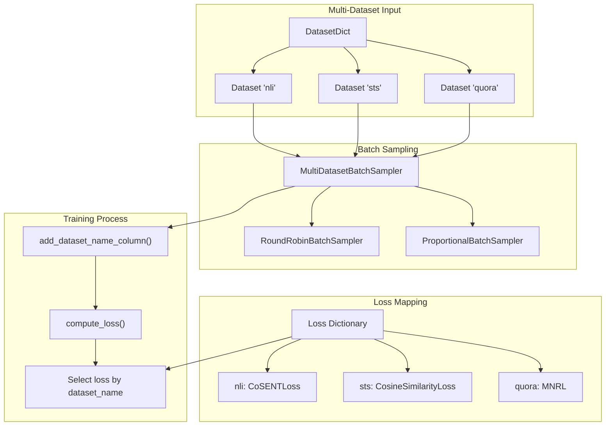

loss = {
    "dataset1": CoSENTLoss(model),
    "dataset2": MultipleNegativesRankingLoss(model)
}
```

Sources: [sentence_transformers/trainer.py:291-310]()

## Multi-Dataset Training

The training system supports training on multiple datasets simultaneously using `DatasetDict`:



**Multi-Dataset Training Architecture**

Sources: [sentence_transformers/trainer.py:295-310](), [sentence_transformers/trainer.py:416-422](), [sentence_transformers/trainer.py:785-800]()

## Router Support for Asymmetric Training

The training system integrates with the `Router` module to enable asymmetric architectures where different paths are used for queries vs documents:

### Router Configuration

```python