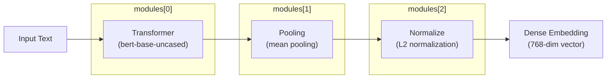
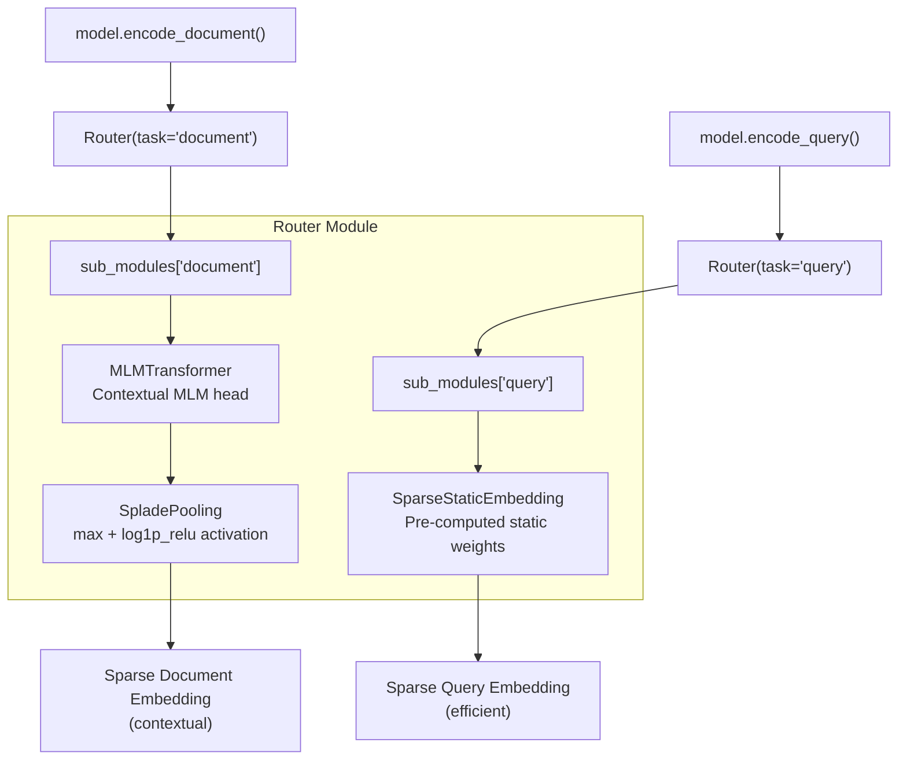
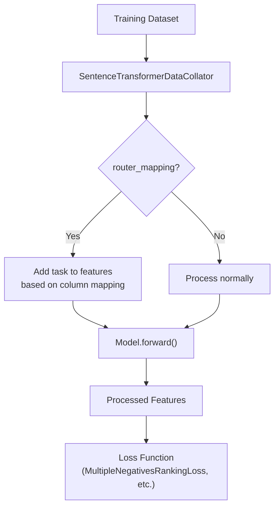
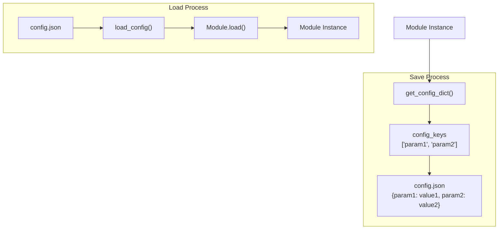
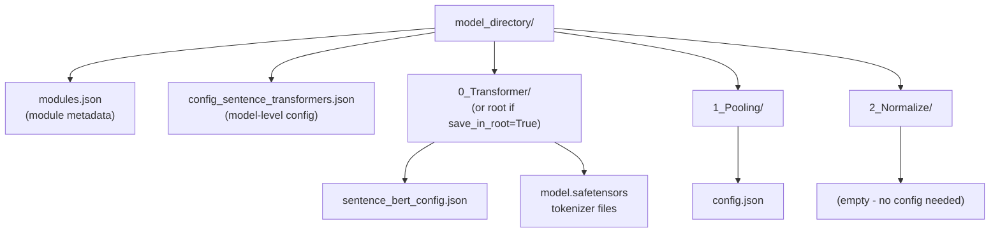
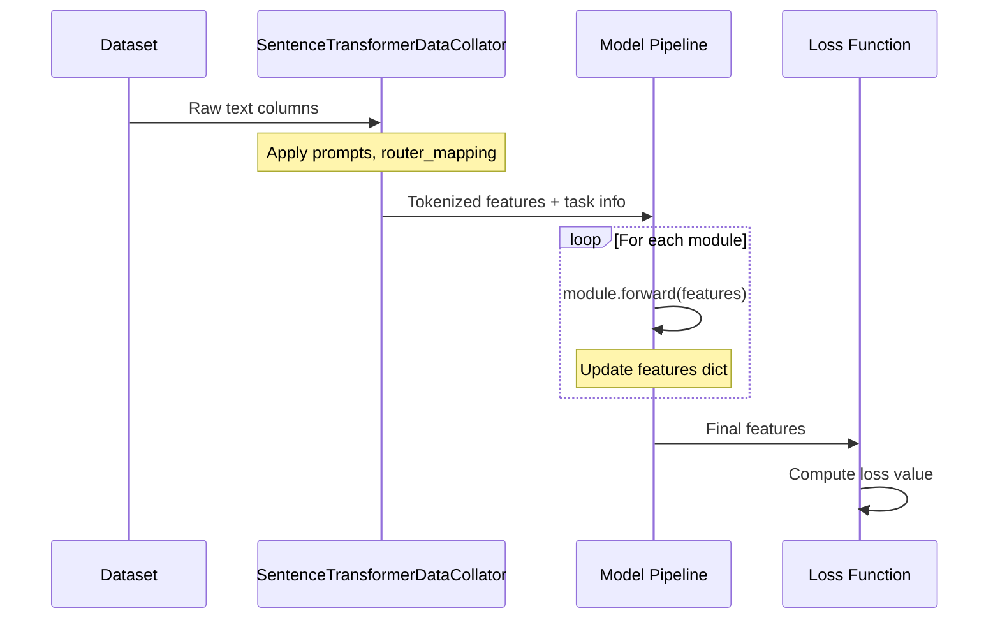

router = Router(
    sub_modules={
        "query": [efficient_module],
        "document": [contextual_module, pooling_module]
    },
    default_route="document"
)
```

Key attributes:
- `sub_modules`: `nn.ModuleDict` mapping task types to `nn.Sequential` module chains
- `default_route`: Default task when `task` not specified in features
- `allow_empty_key`: Whether to allow no default route
- `forward_kwargs`: List of kwargs forwarded to modules (includes `"task"`)

Sources: [sentence_transformers/models/Router.py:22-418](), [sentence_transformers/models/Router.py:187-215](), [sentence_transformers/models/Router.py:217-245]()

## Module Composition Examples

### Dense Embedding Model (SentenceTransformer)



### Asymmetric Model with Router

#### Asymmetric SparseEncoder Architecture



#### Router Training Requirements

```python
# Training args must specify router_mapping
args = SparseEncoderTrainingArguments(
    router_mapping={
        "question": "query",      # Dataset column -> router task
        "positive": "document", 
        "negative": "document"
    }
)

# Data collator uses mapping to set task in features
collator = SparseEncoderDataCollator(
    tokenize_fn=model.tokenize,
    router_mapping=args.router_mapping
)
```

Sources: [sentence_transformers/models/Router.py:104-156](), [sentence_transformers/sparse_encoder/trainer.py:180-186](), [sentence_transformers/sparse_encoder/data_collator.py:55-68]()

### Training Pipeline Integration



Sources: [sentence_transformers/trainer.py:198-204](), [sentence_transformers/data_collator.py:55-68]()

## Module Loading and Saving

### Module Configuration System

Each module uses a configuration system for persistence:



Key configuration attributes:
- `config_keys`: List of attributes to save/load
- `config_file_name`: Name of config file (usually `"config.json"`)
- `save_in_root`: Whether to save in model root or subfolder

### Model Directory Structure



The `modules.json` file contains metadata about each module:

| Field | Description |
|-------|-------------|
| `idx` | Module index in pipeline |
| `name` | Module identifier |
| `path` | Directory path relative to model root |
| `type` | Full Python class path |

Sources: [docs/sentence_transformer/usage/custom_models.rst:43-101]()

## Training Integration

### Data Flow in Training



### Router Training Requirements

When using `Router` modules, additional training configuration is required:

```python