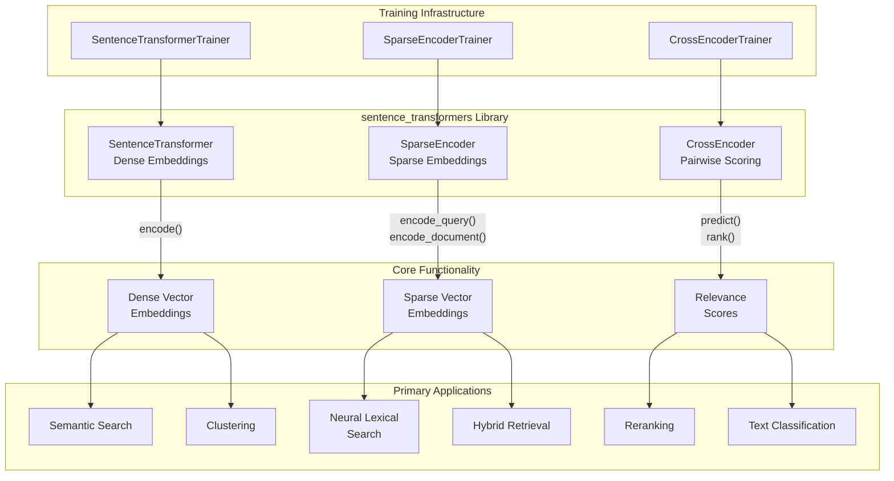
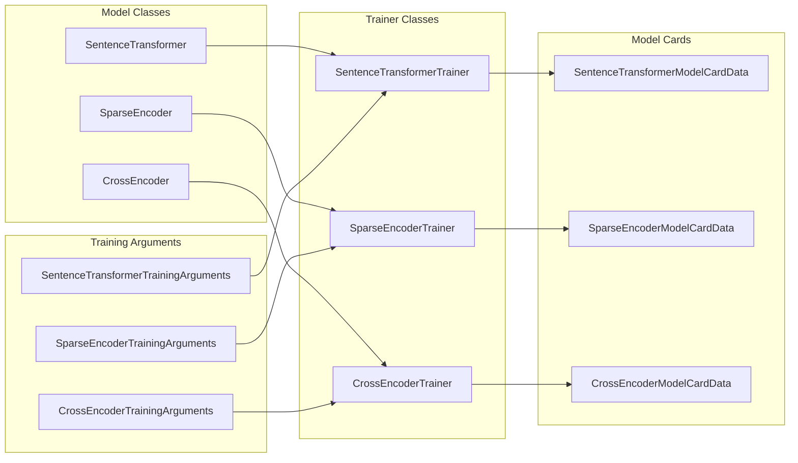
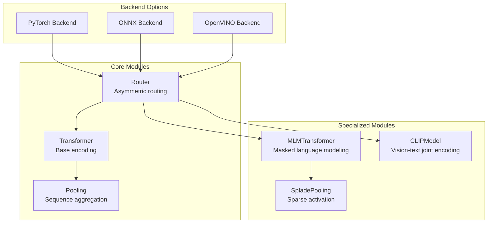

## Purpose and Scope

The sentence-transformers library is a comprehensive Python framework for accessing, using, and training state-of-the-art embedding and reranker models. It provides three core model types that serve different purposes in natural language processing pipelines: `SentenceTransformer` for dense embeddings, `SparseEncoder` for sparse embeddings, and `CrossEncoder` for pairwise scoring and reranking.

This document covers the high-level architecture and core concepts of the sentence-transformers library. For specific usage instructions, see [Quickstart Guide](#2.1). For detailed training procedures, see [Training](#3). For performance optimization, see [Advanced Topics](#7).

Sources: [README.md:15-21](), [sentence_transformers/__init__.py:27-34]()

## Core Architecture

The sentence-transformers library is built around three fundamental model architectures that can be used independently or in combination for various NLP tasks:



Each model type has corresponding trainer classes and specialized loss functions optimized for their specific use cases. The library provides over 15,000 pretrained models available through Hugging Face Hub.

Sources: [sentence_transformers/__init__.py:15-36](), [README.md:19](), [index.rst:12-15]()

## Model Types

### SentenceTransformer

The `SentenceTransformer` class produces dense vector embeddings where semantically similar texts have similar vector representations. These models use bi-encoder architectures that independently encode each input text.

**Key characteristics:**
- Output: Dense vectors (typically 384-1024 dimensions)
- Use case: Semantic similarity, clustering, dense retrieval
- Similarity functions: Cosine similarity, dot product, Euclidean distance
- Example models: `all-MiniLM-L6-v2`, `all-mpnet-base-v2`

**Basic usage pattern:**
```python
from sentence_transformers import SentenceTransformer
model = SentenceTransformer("all-MiniLM-L6-v2")
embeddings = model.encode(sentences)
similarities = model.similarity(embeddings, embeddings)
```

Sources: [README.md:56-87](), [sentence_transformers/__init__.py:27]()

### SparseEncoder

The `SparseEncoder` class generates sparse vector embeddings where most dimensions are zero, creating interpretable representations that combine neural and lexical matching signals.

**Key characteristics:**
- Output: Sparse vectors (vocabulary-size dimensions, ~99% zeros)
- Use case: Neural lexical search, hybrid retrieval, interpretability
- Similarity functions: Dot product on sparse representations
- Example models: `naver/splade-cocondenser-ensembledistil`

**Basic usage pattern:**
```python
from sentence_transformers import SparseEncoder
model = SparseEncoder("naver/splade-cocondenser-ensembledistil")
embeddings = model.encode(sentences)
stats = SparseEncoder.sparsity(embeddings)
```

Sources: [README.md:133-167](), [sentence_transformers/__init__.py:29-34]()

### CrossEncoder

The `CrossEncoder` class performs joint encoding of text pairs to produce similarity scores, making it ideal for reranking and classification tasks where high precision is required.

**Key characteristics:**
- Output: Scalar similarity scores
- Use case: Reranking, text pair classification, high-precision ranking
- Architecture: Joint encoding (both texts processed together)
- Example models: `cross-encoder/ms-marco-MiniLM-L6-v2`

**Basic usage pattern:**
```python
from sentence_transformers import CrossEncoder
model = CrossEncoder("cross-encoder/ms-marco-MiniLM-L6-v2")
scores = model.predict([(query, passage) for passage in passages])
ranks = model.rank(query, passages, return_documents=True)
```

Sources: [README.md:89-132](), [sentence_transformers/__init__.py:15-20]()

## Training Infrastructure

Each model type has specialized training infrastructure with corresponding trainer classes, loss functions, and evaluation metrics:



The library provides 20+ loss functions for SentenceTransformer training, 10+ for SparseEncoder training, and 10+ for CrossEncoder training, enabling fine-tuning for specific tasks and domains.

Sources: [sentence_transformers/__init__.py:35-64](), [README.md:195]()

## Integration Ecosystem

The sentence-transformers library integrates with a wide ecosystem of tools and platforms:

**Backend Support:**
- PyTorch (default)
- ONNX Runtime for optimized inference
- Intel OpenVINO for CPU optimization

**Vector Databases:**
- Pinecone, Weaviate, Qdrant, ChromaDB

**Search Engines:**
- Elasticsearch, OpenSearch, Apache Solr

**ML Frameworks:**
- Hugging Face ecosystem (transformers, datasets, hub)
- LangChain, Haystack, LlamaIndex

**Specialized Libraries:**
- BERTopic, KeyBERT, SetFit for domain-specific applications

Sources: [sentence_transformers/__init__.py:10-14](), [README.md:172-189]()

## Module Architecture

The library follows a modular design where models are composed of reusable components:



This modular architecture enables flexible model composition and optimization for different use cases. For detailed information about the module system, see [Module Architecture](#1.2).

Sources: [sentence_transformers/__init__.py:10-14](), [pyproject.toml:52-54]()