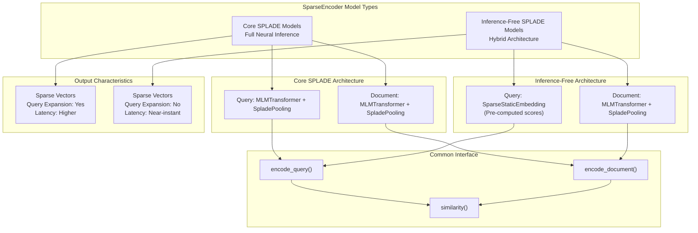
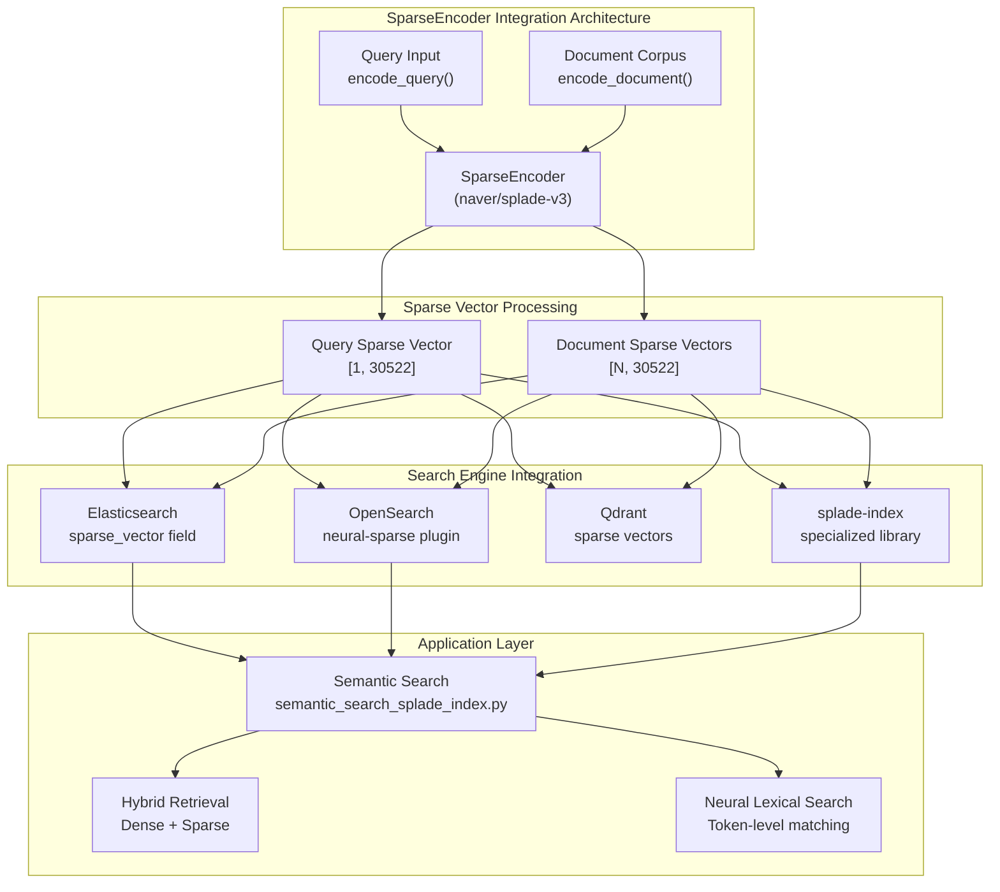
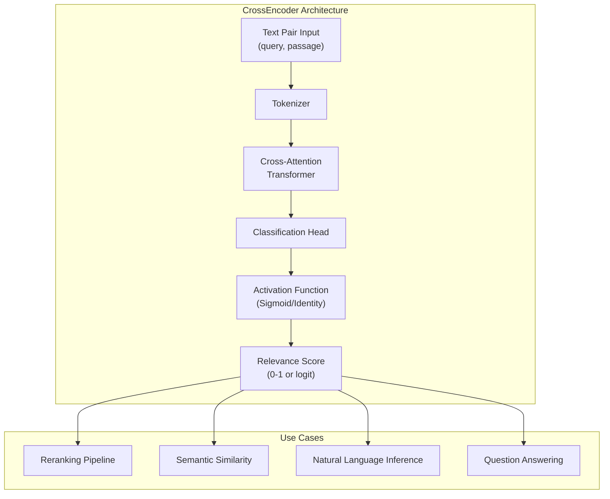
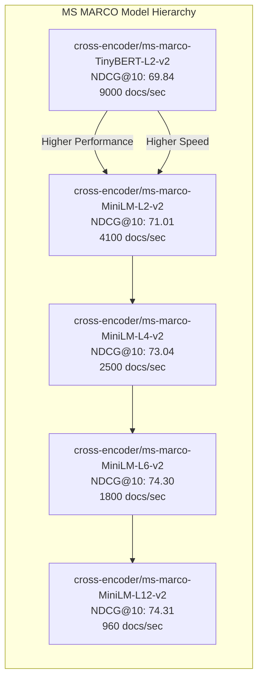
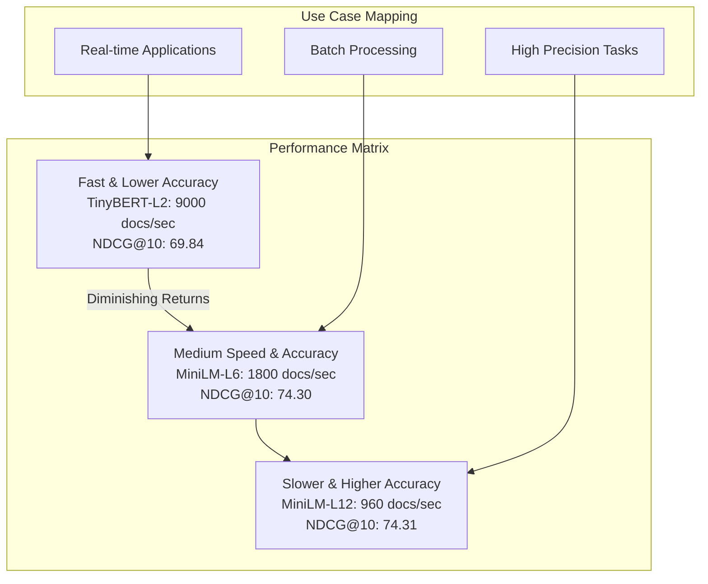
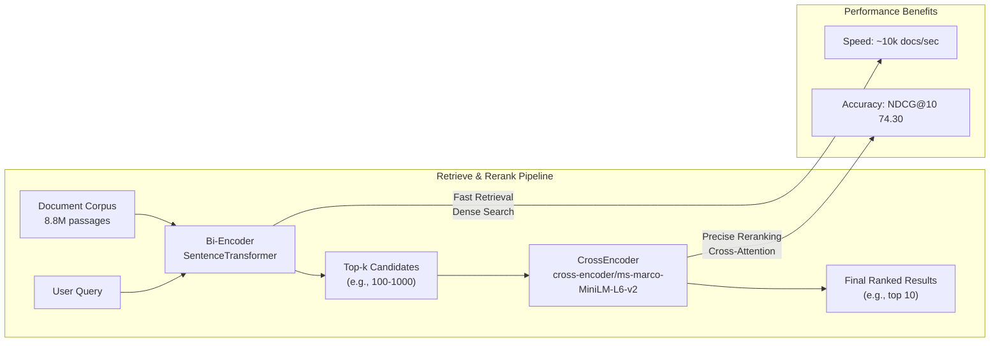
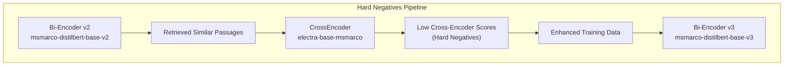

This page documents the pretrained SparseEncoder models available in the sentence-transformers library, including their characteristics, performance metrics, and usage patterns. SparseEncoder models generate sparse vector representations that enable efficient neural search while maintaining interpretability through token-level activation patterns.

For information about training SparseEncoder models, see [SparseEncoder Training](#3.2). For evaluation strategies, see [SparseEncoder Evaluators](#4.2).

## Model Architecture Types

SparseEncoder models in the sentence-transformers ecosystem fall into two primary architectural categories, each optimized for different use cases and performance requirements.



**SparseEncoder Model Architecture Types**

Sources: [docs/sparse_encoder/pretrained_models.md:62-76]()

## Core SPLADE Models

Core SPLADE models use neural inference for both queries and documents, providing query expansion capabilities and optimal retrieval performance. These models are trained on datasets like MS MARCO Passage Retrieval and evaluated on BEIR benchmarks.

| Model Name | MS MARCO MRR@10 | BEIR-13 avg nDCG@10 | Parameters | Architecture |
|------------|:---------------:|:-------------------:|-----------:|-------------|
| [opensearch-project/opensearch-neural-sparse-encoding-v2-distill](https://huggingface.co/opensearch-project/opensearch-neural-sparse-encoding-v2-distill) | NA | **52.8** | 67M | DistilBERT |
| [opensearch-project/opensearch-neural-sparse-encoding-v1](https://huggingface.co/opensearch-project/opensearch-neural-sparse-encoding-v1) | NA | 52.4 | 133M | BERT |
| [naver/splade-v3](https://huggingface.co/naver/splade-v3) | **40.2** | 51.7 | 109M | BERT |
| [ibm-granite/granite-embedding-30m-sparse](https://huggingface.co/ibm-granite/granite-embedding-30m-sparse) | NA | 50.8 | 30M | Custom |
| [naver/splade-cocondenser-selfdistil](https://huggingface.co/naver/splade-cocondenser-selfdistil) | 37.6 | 50.7 | 109M | BERT |
| [naver/splade_v2_distil](https://huggingface.co/naver/splade_v2_distil) | 36.8 | 50.6 | 67M | DistilBERT |
| [naver/splade-v3-distilbert](https://huggingface.co/naver/splade-v3-distilbert) | 38.7 | 50.0 | 67M | DistilBERT |
| [naver/splade-v3-lexical](https://huggingface.co/naver/splade-v3-lexical) | 40.0 | 49.1 | 109M | BERT |
| [rasyosef/splade-mini](https://huggingface.co/rasyosef/splade-mini) | 33.2 | 42.5 | 11M | Mini |
| [rasyosef/splade-tiny](https://huggingface.co/rasyosef/splade-tiny) | 30.9 | 40.6 | 4M | Tiny |

**Note:** BM25 baseline achieves 18.4 MS MARCO MRR@10 and 45.6 BEIR-13 avg nDCG@10.

Sources: [docs/sparse_encoder/pretrained_models.md:36-60]()

## Inference-Free SPLADE Models

Inference-free SPLADE models use `SparseStaticEmbedding` for queries (pre-computed token scores) and traditional SPLADE architecture for documents. This design sacrifices query expansion for near-instant query processing speed.

| Model Name | BEIR-13 avg nDCG@10 | Parameters | Document Architecture |
|------------|:-------------------:|-----------:|---------------------|
| [opensearch-project/opensearch-neural-sparse-encoding-doc-v3-gte](https://huggingface.co/opensearch-project/opensearch-neural-sparse-encoding-doc-v3-gte) | **54.6** | 137M | BERT-Large |
| [opensearch-project/opensearch-neural-sparse-encoding-doc-v3-distill](https://huggingface.co/opensearch-project/opensearch-neural-sparse-encoding-doc-v3-distill) | 51.7 | 67M | DistilBERT |
| [opensearch-project/opensearch-neural-sparse-encoding-doc-v2-distill](https://huggingface.co/opensearch-project/opensearch-neural-sparse-encoding-doc-v2-distill) | 50.4 | 67M | DistilBERT |
| [opensearch-project/opensearch-neural-sparse-encoding-doc-v2-mini](https://huggingface.co/opensearch-project/opensearch-neural-sparse-encoding-doc-v2-mini) | 49.7 | 23M | Mini |
| [opensearch-project/opensearch-neural-sparse-encoding-doc-v1](https://huggingface.co/opensearch-project/opensearch-neural-sparse-encoding-doc-v1) | 49.0 | 133M | BERT |
| [naver/splade-v3-doc](https://huggingface.co/naver/splade-v3-doc) | 47.0 | 109M | BERT |

Sources: [docs/sparse_encoder/pretrained_models.md:62-76]()

## Basic Usage Pattern

All SparseEncoder models follow a consistent interface for encoding queries and documents:

```python
from sentence_transformers import SparseEncoder

# Load any SparseEncoder model
model = SparseEncoder("naver/splade-v3")

# Encode queries and documents
queries = ["what causes aging fast"]
documents = ["UV-A light causes skin aging...", "Alzheimer's disease..."]

query_embeddings = model.encode_query(queries)
document_embeddings = model.encode_document(documents)

# Compute similarities
similarities = model.similarity(query_embeddings, document_embeddings)
```

The `encode_query()` and `encode_document()` methods return sparse tensors with shape `[batch_size, vocab_size]`, where non-zero values indicate token activations.

Sources: [docs/sparse_encoder/pretrained_models.md:12-33]()

## Integration with Search Systems

SparseEncoder models integrate seamlessly with various search infrastructures, leveraging their sparse vector representations for efficient retrieval.



**SparseEncoder Integration with Search Systems**

Sources: [examples/sparse_encoder/applications/semantic_search/semantic_search_splade_index.py:1-52](), [docs/sparse_encoder/pretrained_models.md:1-83]()

## Model Selection Guidelines

### Performance Considerations

- **Highest BEIR Performance**: `opensearch-project/opensearch-neural-sparse-encoding-v2-distill` (52.8 nDCG@10)
- **Highest MS MARCO Performance**: `naver/splade-v3` (40.2 MRR@10)
- **Best Efficiency Trade-off**: `rasyosef/splade-tiny` (4M parameters, 40.6 BEIR nDCG@10)
- **Fastest Query Processing**: Inference-free models with `SparseStaticEmbedding`

### Use Case Recommendations

| Use Case | Recommended Model | Rationale |
|----------|-------------------|-----------|
| Production Search | `naver/splade-v3` | Best MS MARCO performance, proven reliability |
| Resource-Constrained | `rasyosef/splade-tiny` | Minimal parameters, decent performance |
| High-Throughput Queries | `opensearch-project/opensearch-neural-sparse-encoding-doc-v3-gte` | Inference-free query processing |
| Research/Experimentation | `opensearch-project/opensearch-neural-sparse-encoding-v2-distill` | Highest BEIR performance |

Sources: [docs/sparse_encoder/pretrained_models.md:36-76]()

## Model Collections

Pre-organized collections of SparseEncoder models are available on the Hugging Face Hub:

- **[SPLADE Models](https://huggingface.co/collections/sparse-encoder/splade-models-6862be100374b320d826eeaa)**: Complete collection of core SPLADE models
- **[Inference-Free SPLADE Models](https://huggingface.co/collections/sparse-encoder/inference-free-splade-models-6862be3a1d72eab38920bc6a)**: Models optimized for query speed

These collections provide curated access to models with consistent naming conventions and documented performance characteristics.

Sources: [docs/sparse_encoder/pretrained_models.md:77-83]()

# CrossEncoder Models


This document covers the pretrained CrossEncoder models available in the sentence-transformers library, their characteristics, performance metrics, and usage patterns. CrossEncoder models are designed for pairwise text scoring and classification tasks, making them particularly effective for reranking, semantic similarity measurement, and natural language inference.

For information about training CrossEncoder models, see [CrossEncoder Training](#3.3). For details about CrossEncoder evaluation methods, see [CrossEncoder Evaluators](#4.3).

## Model Architecture and Purpose

CrossEncoder models process pairs of texts jointly through a single transformer model, producing similarity scores or classification outputs. Unlike bi-encoder architectures that encode texts independently, CrossEncoders perform cross-attention between the input texts, enabling more precise but computationally expensive comparisons.



**Sources:** [docs/cross_encoder/pretrained_models.md:1-33](), [docs/pretrained-models/ce-msmarco.md:1-63]()

## Available Model Categories

The sentence-transformers library provides several categories of pretrained CrossEncoder models, each optimized for specific tasks and domains.

| Category | Purpose | Key Models | Performance Metric |
|----------|---------|------------|-------------------|
| MS MARCO | Information Retrieval | `cross-encoder/ms-marco-MiniLM-L6-v2` | NDCG@10, MRR@10 |
| STSbenchmark | Semantic Similarity | `cross-encoder/stsb-roberta-base` | Pearson Correlation |
| NLI | Natural Language Inference | `cross-encoder/nli-deberta-v3-base` | Accuracy |
| QNLI | Question-Passage Matching | `cross-encoder/qnli-electra-base` | Accuracy |
| Quora | Duplicate Detection | `cross-encoder/quora-roberta-base` | Average Precision |

**Sources:** [docs/cross_encoder/pretrained_models.md:27-112]()

### MS MARCO Models

MS MARCO CrossEncoder models are specifically trained for information retrieval and reranking tasks using real user queries from Bing search engine.



**Sources:** [docs/cross_encoder/pretrained_models.md:35-42](), [docs/pretrained-models/ce-msmarco.md:41-48]()

### Community Models

The ecosystem includes high-quality community-contributed models for specialized domains:

- **BAAI BGE Rerankers**: `BAAI/bge-reranker-base`, `BAAI/bge-reranker-large`, `BAAI/bge-reranker-v2-m3`
- **Jina AI Models**: `jinaai/jina-reranker-v1-tiny-en`, `jinaai/jina-reranker-v1-turbo-en`
- **Mixedbread AI**: `mixedbread-ai/mxbai-rerank-base-v1`, `mixedbread-ai/mxbai-rerank-large-v1`
- **Alibaba GTE**: `Alibaba-NLP/gte-reranker-modernbert-base`, `Alibaba-NLP/gte-multilingual-reranker-base`

**Sources:** [docs/cross_encoder/pretrained_models.md:114-130]()

## Usage Patterns

### Basic Usage with SentenceTransformers

```python
from sentence_transformers import CrossEncoder
import torch

# Load with sigmoid activation for 0-1 scores
model = CrossEncoder("cross-encoder/ms-marco-MiniLM-L6-v2", activation_fn=torch.nn.Sigmoid())
scores = model.predict([
    ("How many people live in Berlin?", "Berlin had a population of 3,520,031 registered inhabitants."),
    ("How many people live in Berlin?", "Berlin is well known for its museums."),
])
# => array([0.9998173 , 0.01312432], dtype=float32)
```

### Integration with Transformers Library

```python
from transformers import AutoTokenizer, AutoModelForSequenceClassification
import torch

model = AutoModelForSequenceClassification.from_pretrained("cross-encoder/ms-marco-MiniLM-L6-v2")
tokenizer = AutoTokenizer.from_pretrained("cross-encoder/ms-marco-MiniLM-L6-v2")

features = tokenizer(["Query", "Query"], ["Paragraph1", "Paragraph2"], 
                    padding=True, truncation=True, return_tensors="pt")

with torch.no_grad():
    scores = model(**features).logits
```

**Sources:** [docs/cross_encoder/pretrained_models.md:12-33](), [docs/pretrained-models/ce-msmarco.md:19-33]()

## Performance Characteristics

### Speed vs Accuracy Trade-offs



### Activation Function Impact

| Activation Function | Output Range | Use Case |
|-------------------|--------------|----------|
| `torch.nn.Sigmoid()` | 0.0 - 1.0 | Probability-like scores |
| `None` (Identity) | -∞ to +∞ | Raw logits for ranking |

**Sources:** [docs/cross_encoder/pretrained_models.md:31-42](), [docs/pretrained-models/ce-msmarco.md:41-62]()

## Integration with Retrieval Systems

CrossEncoder models are typically used in the reranking stage of two-stage retrieval systems, where they refine results from faster bi-encoder models.



### Hard Negatives Mining

CrossEncoder models are used to generate hard negatives for training bi-encoder models, creating a feedback loop for model improvement.



**Sources:** [docs/pretrained-models/msmarco-v3.md:53-58](), [docs/cross_encoder/pretrained_models.md:44]()

## Model Selection Guidelines

| Task Type | Recommended Model | Key Considerations |
|-----------|------------------|-------------------|
| Information Retrieval | `cross-encoder/ms-marco-MiniLM-L6-v2` | Best balance of speed/accuracy |
| Semantic Similarity | `cross-encoder/stsb-roberta-large` | Optimized for similarity scoring |
| Question Answering | `cross-encoder/qnli-electra-base` | Passage-question relevance |
| Duplicate Detection | `cross-encoder/quora-roberta-base` | Text pair classification |
| Multilingual Tasks | `Alibaba-NLP/gte-multilingual-reranker-base` | Cross-lingual support |

**Sources:** [docs/cross_encoder/pretrained_models.md:1-130](), [docs/pretrained-models/ce-msmarco.md:1-63]()