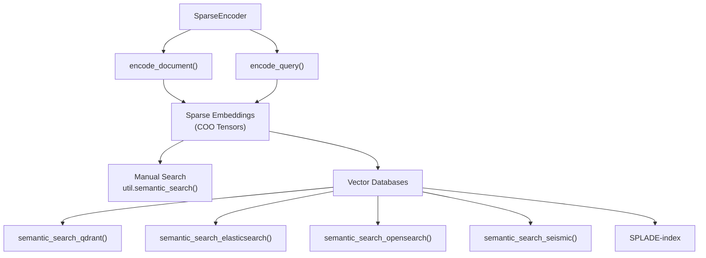
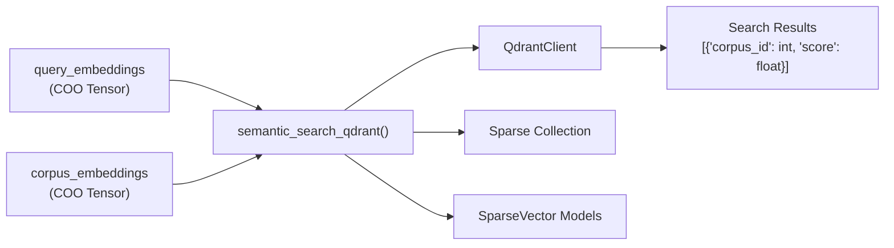
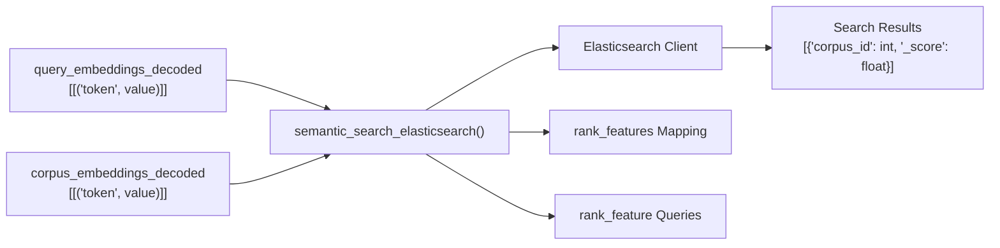
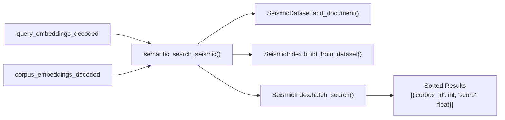
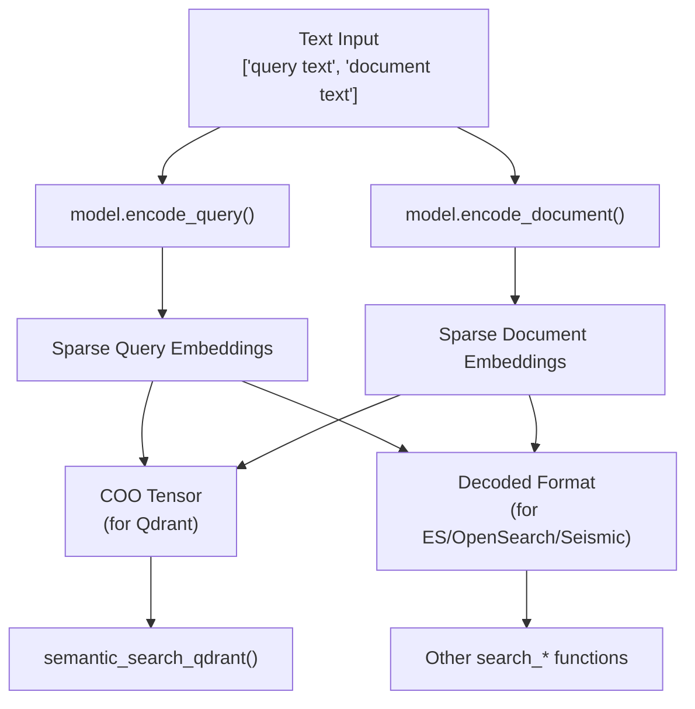
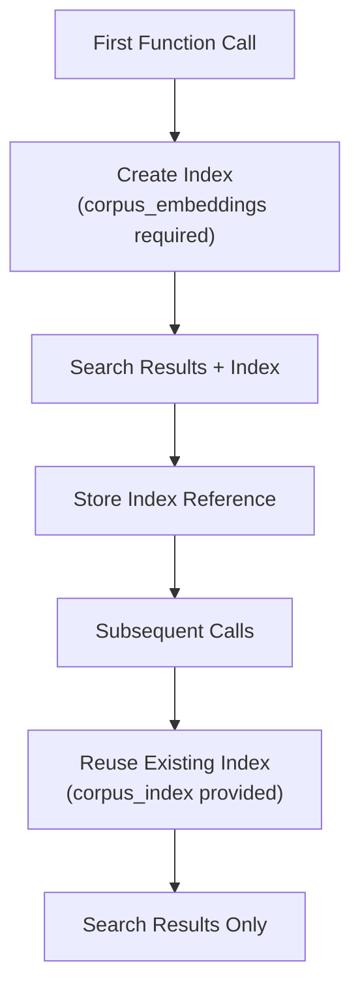

This page covers how to integrate sparse encoder models with search engines and vector databases for semantic search applications. Sparse encoders generate embeddings where most values are zero, enabling efficient storage and search while maintaining semantic understanding capabilities. 

For information about dense semantic search with `SentenceTransformer` models, see [Semantic Search](#6.1). For general sparse encoder training and usage, see [SparseEncoder Training](#3.2).

## Overview

Sparse search integration allows `SparseEncoder` models to work with external search systems that can efficiently handle sparse vector data. The integration supports both manual in-memory search and production-ready vector database solutions.

**Architecture Components for Sparse Search Integration**

Sources: [sentence_transformers/sparse_encoder/search_engines.py:1-556](), [examples/sparse_encoder/applications/semantic_search/README.md:1-529]()

## Manual Search vs Vector Database Search

### Manual Search Approach

Manual search performs similarity computation directly in memory using PyTorch operations. This approach is suitable for small to medium-sized corpora and provides full control over the search process.

| Component | Function | Purpose |
|-----------|----------|---------|
| Document Encoding | `model.encode_document()` | Convert documents to sparse embeddings |
| Query Encoding | `model.encode_query()` | Convert queries to sparse embeddings |
| Similarity Computation | `util.semantic_search()` | Compute similarity scores between query and corpus |
| Results Analysis | `model.intersection()` | Analyze token-level contributions to similarity |

### Vector Database Search Approach

Vector database search leverages specialized systems optimized for sparse vector operations, providing better scalability and performance for large corpora.

| Search Engine | Function | Index Type | Key Features |
|---------------|----------|------------|--------------|
| Qdrant | `semantic_search_qdrant()` | Sparse vectors | Native sparse vector support |
| Elasticsearch | `semantic_search_elasticsearch()` | rank_features | Elastic stack integration |
| OpenSearch | `semantic_search_opensearch()` | neural_sparse | Amazon OpenSearch compatibility |
| Seismic | `semantic_search_seismic()` | SeismicIndex | High-performance in-memory search |
| SPLADE-index | External library | SciPy sparse matrices | BM25s-based implementation |

Sources: [examples/sparse_encoder/applications/semantic_search/README.md:11-132]()

## Search Engine Integration Functions

### Qdrant Integration

The `semantic_search_qdrant()` function provides native integration with Qdrant's sparse vector capabilities.

**Qdrant Integration Data Flow**

The integration handles COO sparse tensors directly and creates collections with `SparseVectorParams` configuration.

**Key Parameters:**
- Input: PyTorch COO sparse tensors
- Collection: Auto-generated with timestamp
- Indexing: Batch processing with configurable `batch_size`
- Search: Native sparse vector queries using `models.SparseVector`

Sources: [sentence_transformers/sparse_encoder/search_engines.py:32-158](), [examples/sparse_encoder/applications/semantic_search/semantic_search_qdrant.py:1-64]()

### Elasticsearch Integration  

The `semantic_search_elasticsearch()` function uses Elasticsearch's `rank_features` field type for sparse vector storage and search.

**Elasticsearch Integration Data Flow**

**Key Features:**
- Input: Decoded embeddings in `[('token', value)]` format
- Mapping: Uses `rank_features` field type for sparse vectors
- Indexing: Bulk operations with configurable batch size
- Search: `rank_feature` queries with `saturation` and `boost` parameters

Sources: [sentence_transformers/sparse_encoder/search_engines.py:160-297](), [examples/sparse_encoder/applications/semantic_search/semantic_search_elasticsearch.py:1-68]()

### OpenSearch Integration

The `semantic_search_opensearch()` function leverages OpenSearch's `neural_sparse` query capabilities.

**Key Differences from Elasticsearch:**
- Uses `neural_sparse` query type instead of `rank_feature`
- Compatible with Amazon OpenSearch Service
- Supports asymmetric sparse encoder architectures

Sources: [sentence_transformers/sparse_encoder/search_engines.py:428-556](), [examples/sparse_encoder/applications/semantic_search/semantic_search_opensearch.py:1-87]()

### Seismic Integration

The `semantic_search_seismic()` function provides integration with the high-performance Seismic library for in-memory sparse vector search.

**Seismic Integration Architecture**

**Performance Features:**
- `SeismicDataset` for document management
- `SeismicIndex.build_from_dataset()` with configurable index parameters
- `batch_search()` with `query_cut` and `heap_factor` optimizations
- Order-of-magnitude performance improvements over IVF approaches

Sources: [sentence_transformers/sparse_encoder/search_engines.py:299-426](), [examples/sparse_encoder/applications/semantic_search/semantic_search_seismic.py:1-66]()

## Data Format Requirements

### Input Formats by Search Engine

| Search Engine | Input Format | Conversion Method |
|---------------|--------------|-------------------|
| Qdrant | PyTorch COO sparse tensor | `convert_to_sparse_tensor=True` |
| Elasticsearch | Decoded embeddings list | `model.decode(embeddings)` |
| OpenSearch | Decoded embeddings list | `model.decode(embeddings)` |
| Seismic | Decoded embeddings list | `model.decode(embeddings)` |

### Encoding Workflow

**Data Format Conversion Pipeline**

### Sparse Tensor Formats

**COO Sparse Tensor (Qdrant):**
- Format: PyTorch coordinate format sparse tensor
- Indices: `[row_indices, col_indices]`
- Values: Sparse embedding values
- Advantages: Direct tensor operations, GPU compatibility

**Decoded Format (Others):**
- Format: `List[List[Tuple[str, float]]]`
- Structure: `[[('token1', 0.5), ('token2', 0.3)], ...]`
- Advantages: Human-readable, search engine compatible

Sources: [sentence_transformers/sparse_encoder/search_engines.py:67-76](), [examples/sparse_encoder/applications/semantic_search/README.md:53-83]()

## Integration Patterns

### Reusable Index Pattern

All search engine integrations support index reuse through the `output_index` parameter:

**Index Reuse Pattern for Production Workflows**

### Error Handling and Validation

All integration functions include comprehensive input validation:

- Sparse tensor format validation for Qdrant
- Decoded embedding format validation for other engines  
- Client availability checks with helpful error messages
- Required dependency import validation

Sources: [sentence_transformers/sparse_encoder/search_engines.py:67-76](), [sentence_transformers/sparse_encoder/search_engines.py:204-218]()

## Performance Considerations

### Sparsity Advantages

Sparse embeddings provide several performance benefits for search:

| Advantage | Description | Impact |
|-----------|-------------|---------|
| Storage Efficiency | Most dimensions are zero | Reduced memory footprint |
| Search Speed | Skip zero-value computations | Faster similarity calculations |
| Interpretability | Non-zero dimensions map to tokens | Explainable search results |
| Exact Matching | Preserve lexical signals | Hybrid semantic-lexical search |

### Scalability Recommendations

- **Small Corpora (< 10K docs):** Manual search with `util.semantic_search()`
- **Medium Corpora (10K-1M docs):** Qdrant or Seismic for performance
- **Large Corpora (> 1M docs):** Elasticsearch/OpenSearch with distributed setup
- **Real-time Applications:** Seismic for lowest latency in-memory search

Sources: [examples/sparse_encoder/applications/semantic_search/README.md:127-132](), [examples/sparse_encoder/applications/semantic_search/README.md:388-396]()