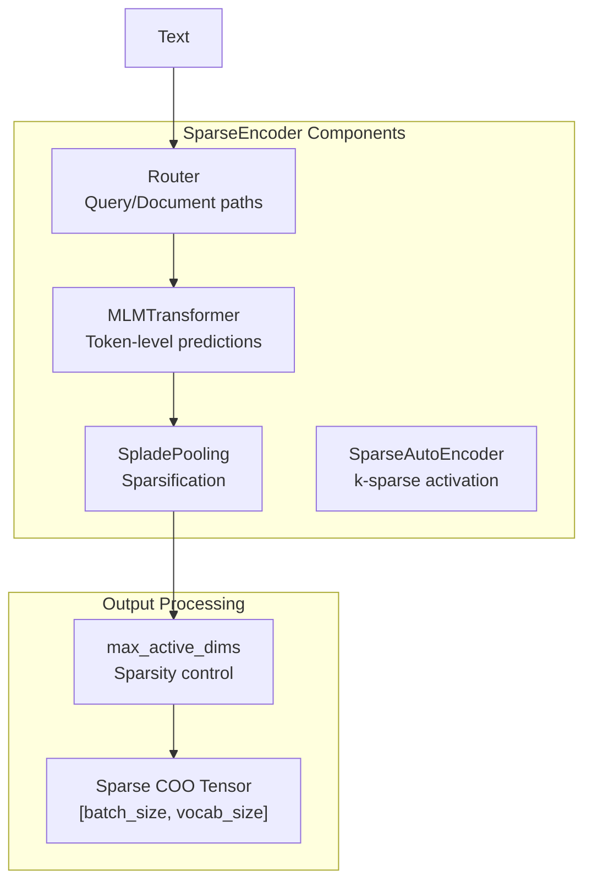

model.prompts = {"query": "query: ", "document": "passage: "}
query_emb = model.encode_query("What is AI?")
doc_emb = model.encode_document("AI is artificial intelligence")
```

**Sources:** [sentence_transformers/SentenceTransformer.py:61-407](), [sentence_transformers/SentenceTransformer.py:416-675](), [tests/test_sentence_transformer.py:309-346]()

## SparseEncoder

The `SparseEncoder` class extends `SentenceTransformer` to produce sparse vector representations where most dimensions are zero. This architecture is particularly effective for lexical matching and hybrid retrieval scenarios.

### Sparse Architecture Components



### Key Differences from SentenceTransformer

- **Vocabulary-Sized Output**: Embeddings have dimensions equal to tokenizer vocabulary size
- **Sparsity Control**: `max_active_dims` parameter limits non-zero dimensions
- **Sparse Tensor Format**: Outputs can be sparse COO tensors for memory efficiency
- **Term Importance**: Non-zero values represent importance of vocabulary terms

### Decoding and Interpretation

The `SparseEncoder` provides a `decode()` method to interpret sparse embeddings as weighted vocabulary terms:

```python
model = SparseEncoder("naver/splade-cocondenser-ensembledistil")
embeddings = model.encode("machine learning")
tokens_weights = model.decode(embeddings, top_k=10)