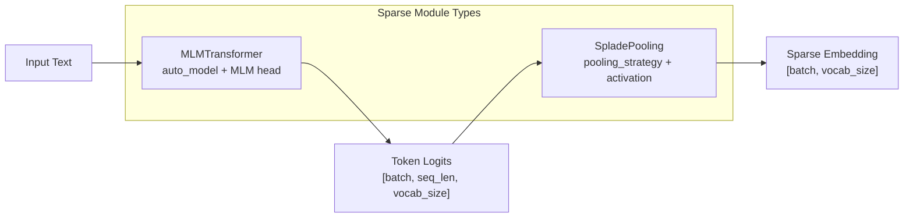
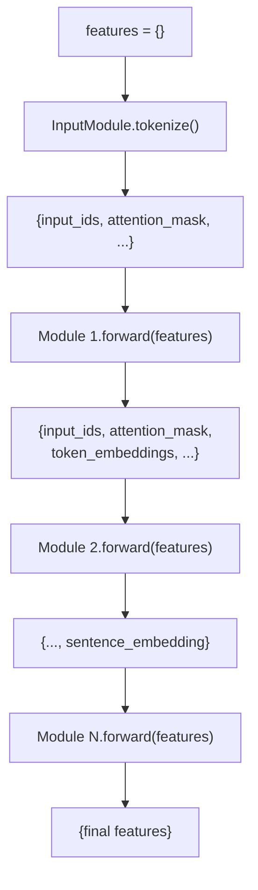
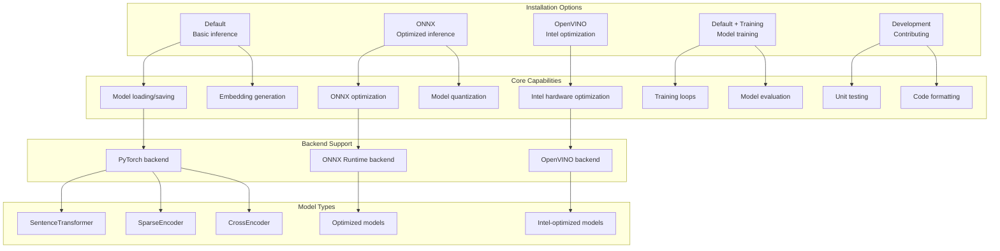

args = SentenceTransformerTrainingArguments(
    router_mapping={
        "question": "query",
        "positive": "document", 
        "negative": "document"
    }
)
```

The `router_mapping` tells the data collator which dataset columns correspond to which router tasks.

Sources: [sentence_transformers/trainer.py:198-204](), [sentence_transformers/sparse_encoder/trainer.py:180-186]()

## Advanced Module Types

### Sparse Encoder Modules

For sparse embeddings, specialized modules are used that produce high-dimensional sparse vectors:

#### Sparse Module Pipeline



#### Sparse Module Types

| Module | Purpose | Output Shape |
|--------|---------|--------------|
| `MLMTransformer` | Contextual token predictions | `[batch, seq_len, vocab_size]` |
| `SpladePooling` | Aggregate tokens to sparse vector | `[batch, vocab_size]` |
| `SparseStaticEmbedding` | Pre-computed static weights | `[batch, vocab_size]` |
| `SparseAutoEncoder` | Learned sparse representations | `[batch, latent_dim]` |

Key configuration:
- `pooling_strategy`: `"max"`, `"mean"`, `"sum"`  
- `activation_function`: `"relu"`, `"log1p_relu"`, `"identity"`
- `k`: Number of top-k active dimensions (for `SparseAutoEncoder`)

Sources: [sentence_transformers/sparse_encoder/models/MLMTransformer.py](), [sentence_transformers/sparse_encoder/models/SpladePooling.py](), [sentence_transformers/sparse_encoder/models/SparseStaticEmbedding.py](), [sentence_transformers/sparse_encoder/models/SparseAutoEncoder.py]()

### Backend Support

The `Transformer` module supports multiple inference backends:

| Backend | Description | Requirements |
|---------|-------------|--------------|
| `torch` | Standard PyTorch | Default |
| `onnx` | ONNX Runtime optimization | `optimum[onnxruntime]` |
| `openvino` | Intel hardware acceleration | `optimum[openvino]` |

Backend selection affects model loading and inference performance but not the module interface.

Sources: [sentence_transformers/models/Transformer.py:174-195](), [sentence_transformers/models/Transformer.py:196-248]()

## Module Forward Pass Interface

### Feature Dictionary Flow

All modules operate on a shared features dictionary that flows through the pipeline:



Common feature keys:
- `input_ids`, `attention_mask`: From tokenization
- `token_embeddings`: Per-token representations
- `sentence_embedding`: Final sentence representation
- `task`: Task type for Router modules

### Module Interface Requirements

Each module must implement:

```python
def forward(self, features: dict[str, torch.Tensor]) -> dict[str, torch.Tensor]:
    # Transform features and return updated dictionary
    pass

def save(self, output_path: str, **kwargs) -> None:
    # Save module configuration and weights
    pass
```

InputModules additionally require:

```python
def tokenize(self, texts: list[str], **kwargs) -> dict[str, torch.Tensor]:
    # Convert text to model features
    pass
```

Sources: [sentence_transformers/models/Module.py:33-89](), [sentence_transformers/models/InputModule.py:60-73]()

## Use Cases and Applications

The CrossEncoder is commonly used in several scenarios:

1. **Reranking**: As the second stage in a retrieve-and-rerank pipeline
   ```
   Query → SentenceTransformer (retrieval) → Top-k documents → CrossEncoder (reranking) → Reranked results
   ```

2. **Text Pair Classification**: Directly scoring or classifying pairs of texts
   - Natural language inference (entailment/contradiction)
   - Semantic textual similarity
   - Question-answer relevance

3. **High-Precision Scoring**: When maximum accuracy is needed for a limited number of text pairs

CrossEncoder models typically achieve higher accuracy than SentenceTransformer models for direct text pair comparison tasks, but they are computationally more expensive for large-scale comparisons.

Sources: [README.md:93-131]()

## Selection Guide: CrossEncoder vs SentenceTransformer

| Aspect | CrossEncoder | SentenceTransformer |
|--------|-------------|---------------------|
| **Output** | Scores/labels for text pairs | Embeddings for individual texts |
| **Comparison** | Direct scoring of pairs | Similarity between embeddings |
| **Scaling** | O(n) comparisons need O(n) inference calls | O(n) comparisons need O(1) inference calls |
| **Accuracy** | Generally higher for direct comparisons | Good for retrieval, less precise for direct comparison |
| **Use case** | Reranking, high-precision scoring of few pairs | Retrieval, semantic search, clustering |

Typically, the optimal approach is to combine both: use SentenceTransformer for efficient retrieval of candidate documents, then use CrossEncoder for precise reranking of the top results.

Sources: [README.md:93-131](), [index.rst:65-98]()

# Installation & Setup


This document covers installation procedures and dependency requirements for the sentence-transformers library. It explains the different installation options available for various use cases including basic inference, training, backend optimization, and development. For basic usage examples after installation, see [Quickstart Guide](#2.1). For training-specific setup details, see [Training](#3).

## System Requirements

The sentence-transformers library requires **Python 3.9+**, **PyTorch 1.11.0+**, and **transformers v4.41.0+**. The library supports multiple backends and deployment scenarios through optional dependencies.

### Installation Options Overview

The library provides five main installation configurations that correspond to different usage patterns:



**Sources:** [docs/installation.md:3-8]()

## Package Manager Installation

### pip Installation

The recommended installation method uses pip with specific extras for different use cases:

| Installation Type | Command | Use Case |
|------------------|---------|----------|
| Default | `pip install -U sentence-transformers` | Basic inference only |
| ONNX (GPU+CPU) | `pip install -U "sentence-transformers[onnx-gpu]"` | Optimized inference with GPU support |
| ONNX (CPU only) | `pip install -U "sentence-transformers[onnx]"` | CPU-only optimized inference |
| OpenVINO | `pip install -U "sentence-transformers[openvino]"` | Intel hardware optimization |
| Training | `pip install -U "sentence-transformers[train]"` | Model training capabilities |
| Development | `pip install -U "sentence-transformers[dev]"` | Full development environment |

### conda Installation

For conda users, the base package is available through conda-forge:

```bash