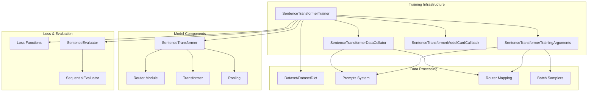
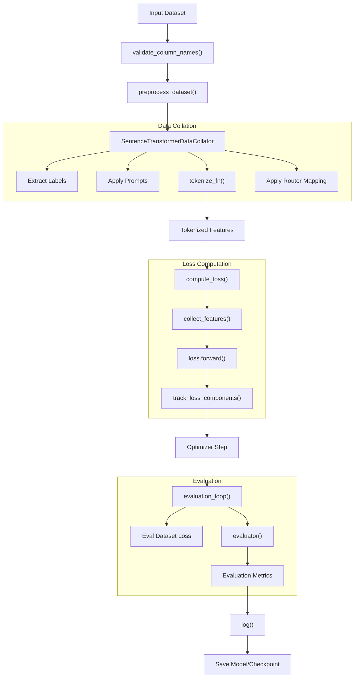
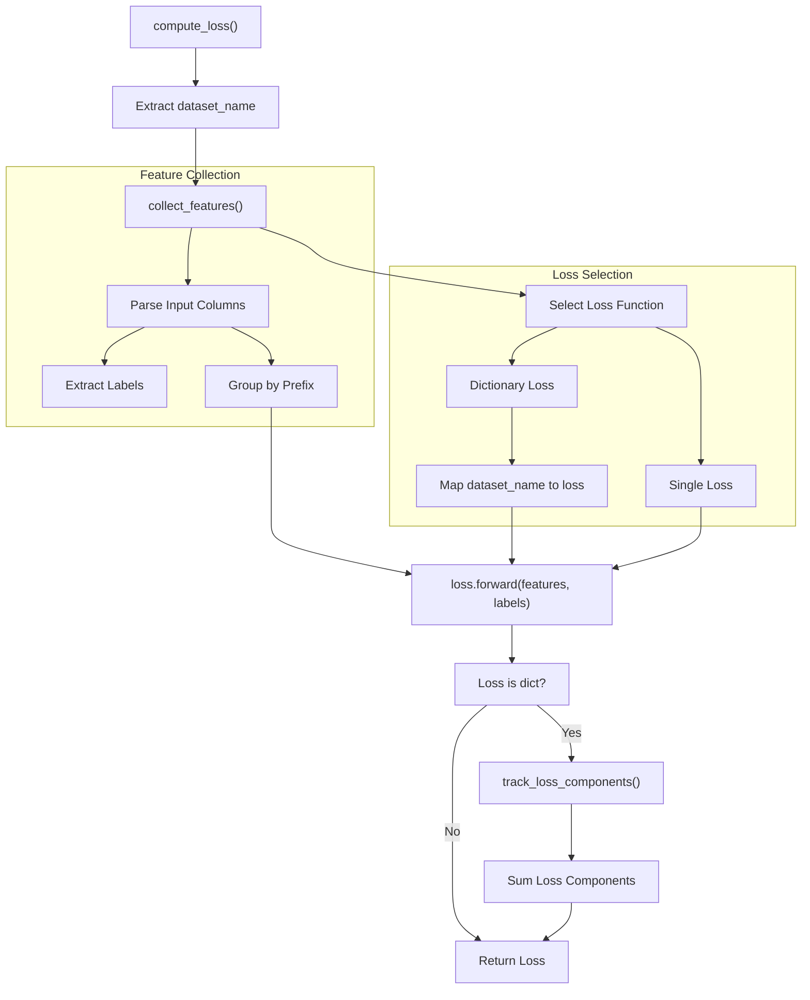
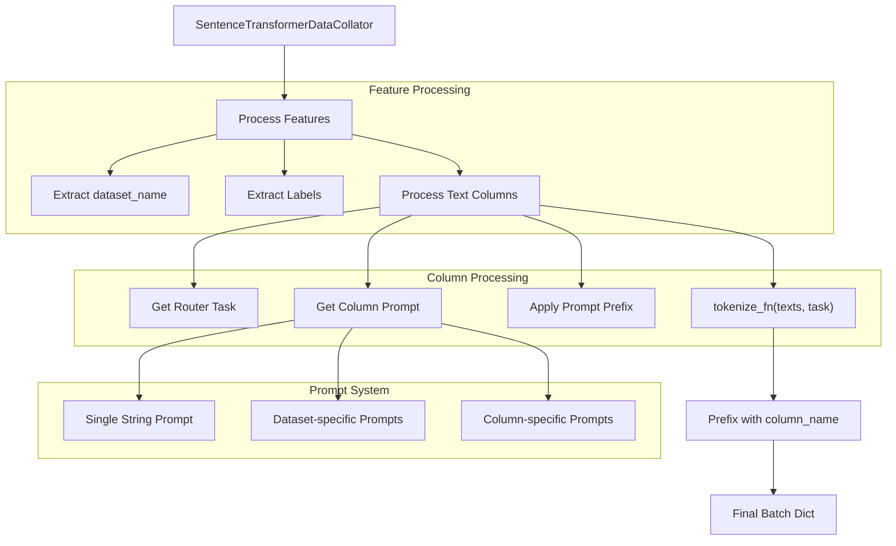
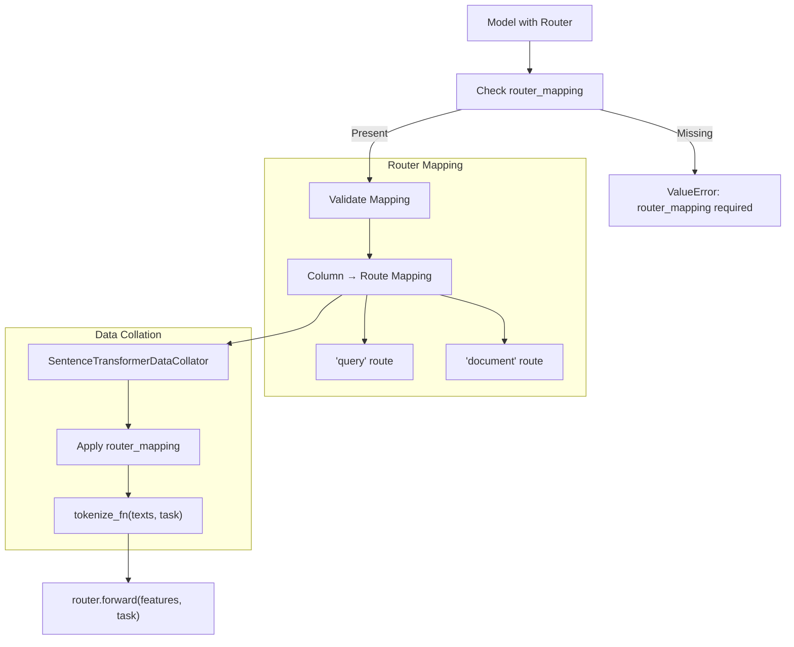
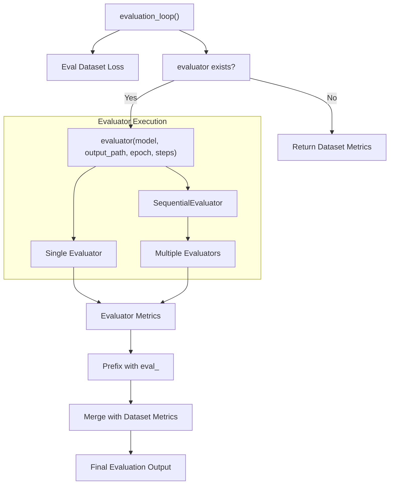
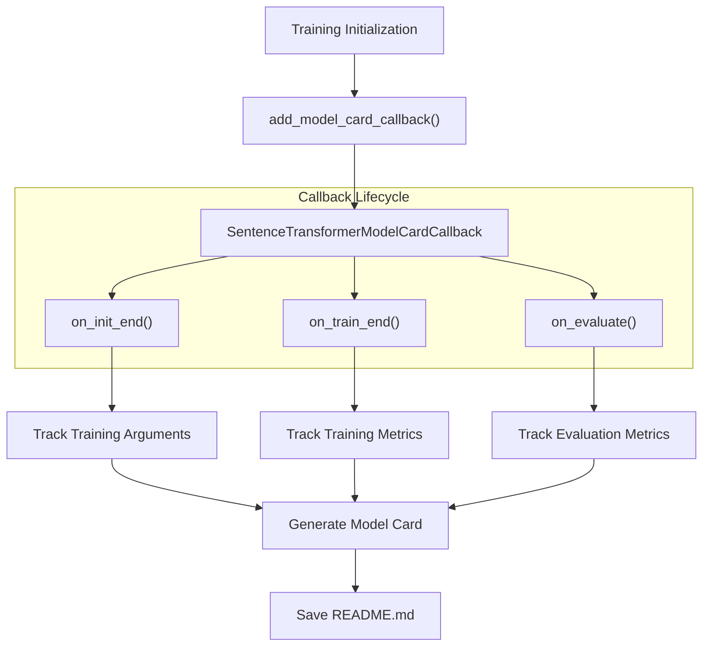

args = SentenceTransformerTrainingArguments(
    router_mapping={
        "question": "query",
        "positive": "document", 
        "negative": "document"
    }
)
```

### Data Collator Integration

The data collator uses `router_mapping` to pass task information to the `Router.tokenize()` method:

Sources: [sentence_transformers/data_collator.py:55-68](), [sentence_transformers/data_collator.py:92-94](), [sentence_transformers/models/Router.py:287-324]()

### Validation

The trainer validates that models using `Router` modules have proper `router_mapping` configured:

Sources: [sentence_transformers/trainer.py:206-212]()

## Memory-Efficient Training Features

The training system includes several memory optimization features:

| Feature | Purpose | Implementation |
|---------|---------|----------------|
| Gradient Caching | Enables larger effective batch sizes | `CachedMultipleNegativesRankingLoss` |
| Multi-Dataset Batching | Efficient sampling across datasets | `MultiDatasetBatchSampler` classes |
| Loss Component Tracking | Monitors complex loss breakdowns | `track_loss_components()` |
| Model Card Generation | Automatic documentation | `SentenceTransformerModelCardCallback` |

Sources: [sentence_transformers/trainer.py:443-462](), [sentence_transformers/trainer.py:327-345]()

## Next Steps

For detailed training guides specific to each model type:
- [SentenceTransformer Training](#3.1) - Dense embedding model training
- [SparseEncoder Training](#3.2) - Sparse embedding model training  
- [CrossEncoder Training](#3.3) - Cross-encoder reranking model training
- [Memory-Efficient Training](#3.7) - Advanced memory optimization techniques

# SentenceTransformer Training


This document covers the comprehensive training system for SentenceTransformer models, including the trainer architecture, data processing pipeline, loss functions, and evaluation mechanisms. It focuses on the `SentenceTransformerTrainer` class and its supporting infrastructure for training dense embedding models.

For information about training sparse encoder models, see [SparseEncoder Training](#3.2). For training cross-encoder models, see [CrossEncoder Training](#3.3). For detailed information about available loss functions, see [Loss Functions for SentenceTransformer](#3.4).

## Training System Architecture

The SentenceTransformer training system is built around the `SentenceTransformerTrainer` class, which extends the Hugging Face Transformers `Trainer` with specialized functionality for embedding model training.



**Sources:** [sentence_transformers/trainer.py:59-127](), [sentence_transformers/training_args.py](), [sentence_transformers/data_collator.py:13-23]()

## Core Training Flow

The training process follows a structured pipeline from data input to model optimization:



**Sources:** [sentence_transformers/trainer.py:391-441](), [sentence_transformers/trainer.py:531-592](), [sentence_transformers/data_collator.py:35-119]()

## SentenceTransformerTrainer

The `SentenceTransformerTrainer` class is the central component that orchestrates the entire training process. It extends the Hugging Face `Trainer` with specialized functionality for embedding models.

### Key Features

- **Multi-dataset training support** through `DatasetDict`
- **Loss component tracking** for complex loss functions that return dictionaries
- **Router module integration** for asymmetric training architectures
- **Prompt system support** for instruction-based training
- **Automatic model card generation** during training

### Initialization and Configuration

The trainer accepts several key parameters:

```python
# Key trainer initialization parameters from trainer.py:129-148
model: SentenceTransformer | None = None
args: SentenceTransformerTrainingArguments | None = None
train_dataset: Dataset | DatasetDict | IterableDataset | dict[str, Dataset] | None = None
eval_dataset: Dataset | DatasetDict | IterableDataset | dict[str, Dataset] | None = None
loss: nn.Module | dict[str, nn.Module] | Callable | dict[str, Callable] | None = None
evaluator: SentenceEvaluator | list[SentenceEvaluator] | None = None
```

**Sources:** [sentence_transformers/trainer.py:129-148](), [sentence_transformers/trainer.py:291-310]()

### Loss Computation Pipeline

The trainer implements a sophisticated loss computation system that supports both single and multi-dataset training:



**Sources:** [sentence_transformers/trainer.py:391-441](), [sentence_transformers/trainer.py:496-529](), [sentence_transformers/trainer.py:443-462]()

## Training Arguments

The `SentenceTransformerTrainingArguments` class extends Hugging Face's `TrainingArguments` with additional parameters specific to embedding model training.

### Key SentenceTransformer-Specific Arguments

- **`batch_sampler`**: Controls how batches are constructed (e.g., `NO_DUPLICATES`, `GROUP_BY_LABEL`)
- **`multi_dataset_batch_sampler`**: Strategy for sampling from multiple datasets
- **`prompts`**: System for adding prompts to input text
- **`router_mapping`**: Maps dataset columns to Router module routes
- **`learning_rate_mapping`**: Allows different learning rates for different model components

**Sources:** [sentence_transformers/training_args.py](), [sentence_transformers/trainer.py:156-163]()

## Data Processing System

### SentenceTransformerDataCollator

The data collator handles the conversion from raw dataset samples to tokenized model inputs:



**Sources:** [sentence_transformers/data_collator.py:35-119](), [sentence_transformers/data_collator.py:90-118]()

### Prompt System

The training system supports a flexible prompting mechanism:

- **Single prompt**: Applied to all columns and datasets
- **Column-specific prompts**: Different prompts for different input columns
- **Dataset-specific prompts**: Different prompts for different datasets in multi-dataset training
- **Combined prompts**: Dataset and column-specific combinations

**Sources:** [sentence_transformers/data_collator.py:69-89](), [sentence_transformers/data_collator.py:96-101]()

## Router Module Integration

The Router module enables asymmetric training architectures where different input types (e.g., queries vs documents) are processed through different model paths.

### Router Training Requirements

When using a Router module, specific training arguments are required:



**Sources:** [sentence_transformers/trainer.py:206-212](), [sentence_transformers/models/Router.py:217-245](), [sentence_transformers/data_collator.py:92-94]()

### Router Configuration Example

```python
# Router mapping example from training arguments
router_mapping = {
    "question": "query",
    "positive": "document", 
    "negative": "document"
}
```

**Sources:** [sentence_transformers/models/Router.py:45-54](), [tests/models/test_router.py:432-433]()

## Evaluation System

The training system supports evaluation through both dataset-based metrics and custom evaluators.

### Evaluation Pipeline



**Sources:** [sentence_transformers/trainer.py:545-592](), [sentence_transformers/trainer.py:312-315]()

## Batch Sampling Strategies

The training system provides several batch sampling strategies to optimize training performance:

### Available Batch Samplers

- **`DefaultBatchSampler`**: Standard random sampling
- **`NoDuplicatesBatchSampler`**: Ensures no duplicate samples in batch (useful for in-batch negatives)
- **`GroupByLabelBatchSampler`**: Groups samples by label
- **`ProportionalBatchSampler`**: Maintains dataset proportions in multi-dataset training
- **`RoundRobinBatchSampler`**: Alternates between datasets

**Sources:** [sentence_transformers/trainer.py:623-684](), [sentence_transformers/sampler.py]()

## Model Card Generation

The training system automatically generates model cards that document the training process:



**Sources:** [sentence_transformers/trainer.py:327-345](), [sentence_transformers/model_card.py]()