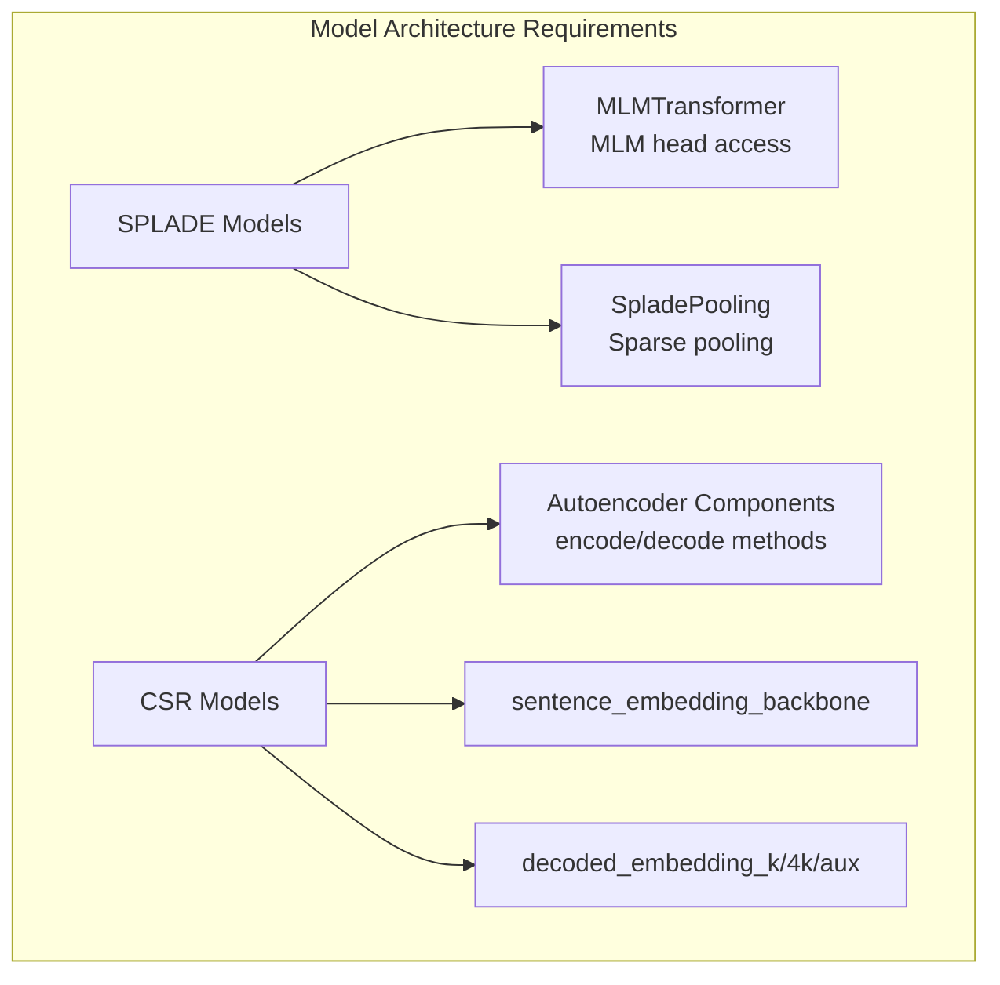

model = SparseEncoder("sentence-transformers/all-MiniLM-L6-v2")

loss = CSRLoss(
    model=model,
    loss=SparseMultipleNegativesRankingLoss(model),
    beta=0.1,  # L_aux weight
    gamma=1.0  # Main loss weight
)
```

### Architecture Requirements



Sources: [sentence_transformers/sparse_encoder/models/MLMTransformer.py:26-54](), [sentence_transformers/sparse_encoder/models/SpladePooling.py:13-39](), [sentence_transformers/sparse_encoder/losses/CSRLoss.py:68-98]()