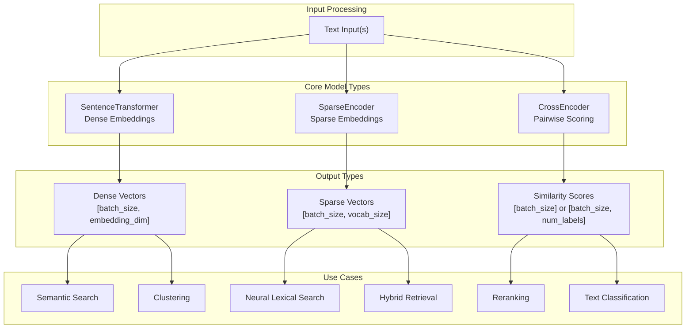
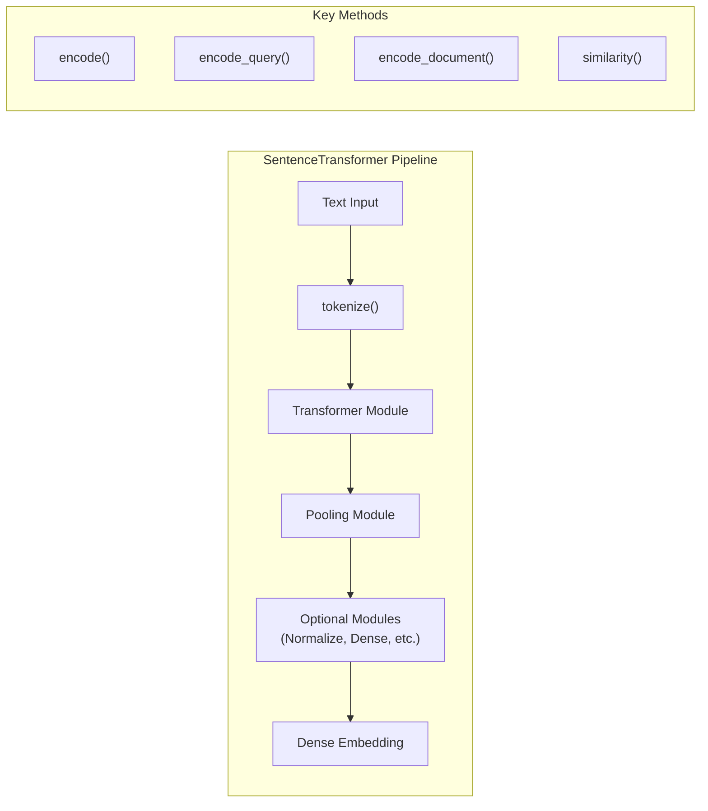

This document covers the three core model architectures in the sentence-transformers library: `SentenceTransformer`, `SparseEncoder`, and `CrossEncoder`. Each serves distinct use cases in text encoding and similarity tasks.

For information about training these model types, see pages [3.1](#3.1), [3.2](#3.2), and [3.3](#3.3). For details on available pretrained models, see pages [5.1](#5.1), [5.2](#5.2), and [5.3](#5.3).

## Architecture Overview

The sentence-transformers library provides three main model architectures that differ in their encoding approach and use cases:



**Sources:** [sentence_transformers/SentenceTransformer.py:61-163](), [sentence_transformers/sparse_encoder/SparseEncoder.py:27-129](), [sentence_transformers/cross_encoder/CrossEncoder.py:48-116](), [README.md:15-17]()

## SentenceTransformer

The `SentenceTransformer` class is the primary model for generating dense vector embeddings from text. It encodes individual sentences or documents into fixed-size dense vectors suitable for semantic similarity tasks.

### Core Architecture



The `SentenceTransformer` class inherits from `nn.Sequential`, `FitMixin`, and `PeftAdapterMixin`, allowing it to function as a sequential pipeline of modules while supporting training and PEFT adapters.

### Key Features

- **Modular Design**: Composed of sequential modules like `Transformer`, `Pooling`, `Normalize`
- **Prompt Support**: Configurable prompts for different tasks via `prompts` dictionary
- **Task-Specific Encoding**: `encode_query()` and `encode_document()` methods for asymmetric retrieval
- **Multiple Backends**: Supports PyTorch, ONNX, and OpenVINO backends
- **Similarity Functions**: Built-in similarity computation with configurable functions

### Usage Patterns

```python