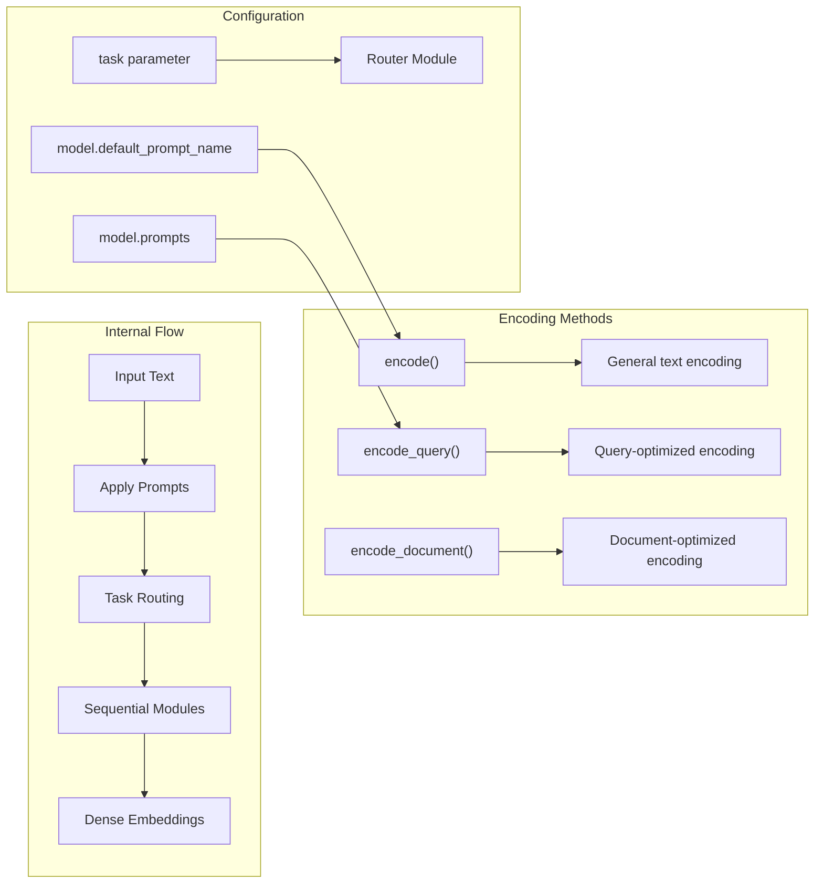

model = SentenceTransformer(
    "all-mpnet-base-v2",
    device="cuda",
    truncate_dim=512,  # Reduce dimensions
    model_kwargs={"torch_dtype": "float16"}  # Memory optimization
)
```

The `SentenceTransformer.__init__()` method in [sentence_transformers/SentenceTransformer.py:167-187]() handles model loading with various configuration options.

### Encoding Methods



**Method Selection**:
- `encode()`: General-purpose encoding for similarity tasks
- `encode_query()`: Optimized for search queries, applies "query" prompt if available
- `encode_document()`: Optimized for documents, applies "document"/"passage"/"corpus" prompts

Sources: [sentence_transformers/SentenceTransformer.py:416-543](), [sentence_transformers/SentenceTransformer.py:545-675]()

### Advanced Configuration

**Prompts and Task Types**: Many models support prompts for different use cases:

```python