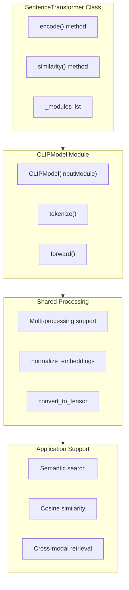

inputs = [
    Image.open('image1.jpg'),
    "Text description 1", 
    Image.open('image2.jpg'),
    "Text description 2"
]

embeddings = model.encode(inputs)
```

Sources: [tests/test_image_embeddings.py:14-31]()

## Integration with SentenceTransformer Ecosystem

The `CLIPModel` integrates with the sentence-transformers ecosystem through the modular architecture and supports the same operations as text-only models.

**Integration Architecture**


**Module System Integration**

| Component | Role | Implementation |
|-----------|------|----------------|
| `CLIPModel` | Input processing | Inherits from `InputModule` |
| `Pooling` | Optional embedding processing | Can be added after `CLIPModel` |
| `Normalize` | L2 normalization | Applied to final embeddings |

The `CLIPModel` appears in the module registry and supports the same configuration patterns as other sentence-transformers modules.

Sources: [sentence_transformers/models/CLIPModel.py:15](), [sentence_transformers/models/__init__.py:6,40]()

## Model Loading and Configuration

CLIP models are loaded through the standard `SentenceTransformer` interface or by constructing `CLIPModel` instances directly.

**Configuration Options**

| Parameter | Purpose | Default | Example |
|-----------|---------|---------|---------|
| `model_name` | Base CLIP model | Required | `'openai/clip-vit-base-patch32'` |
| `processor_name` | Processor configuration | `model_name` | Custom processor path |
| `max_seq_length` | Text sequence limit | From tokenizer | 77 for CLIP models |

**Loading Patterns**

```python