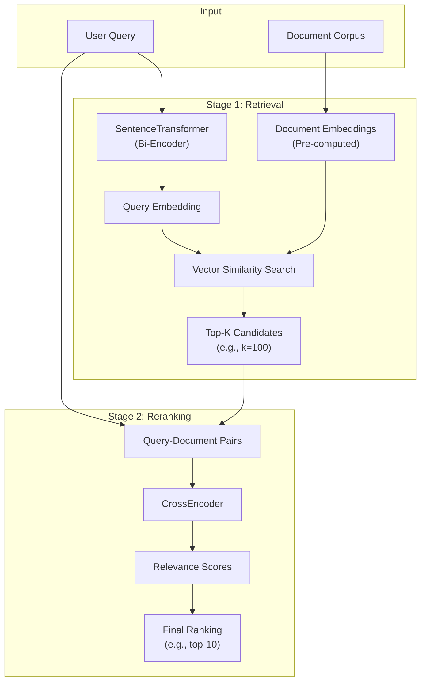
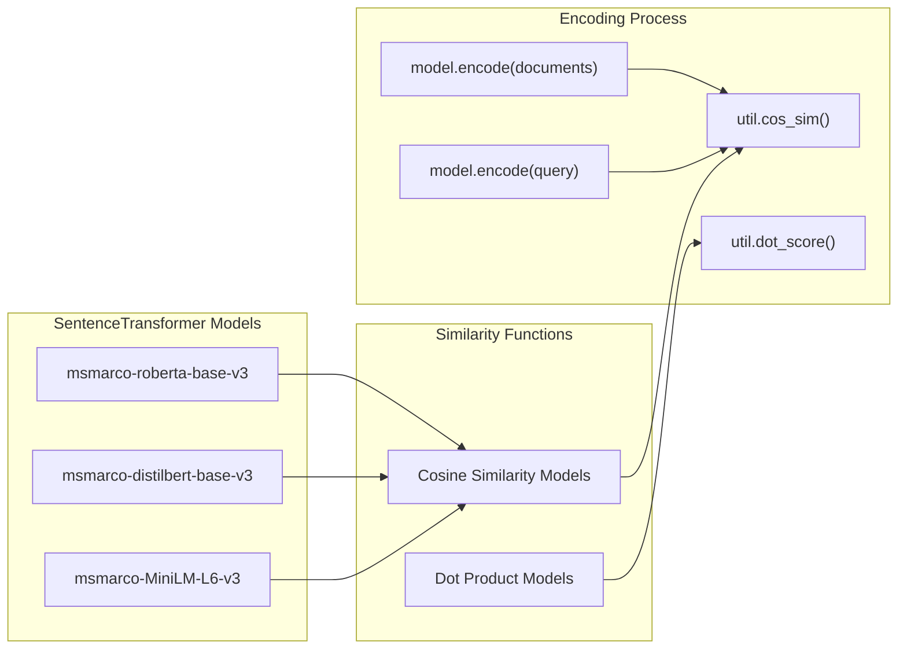
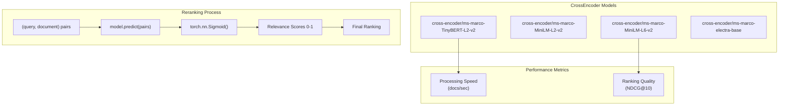
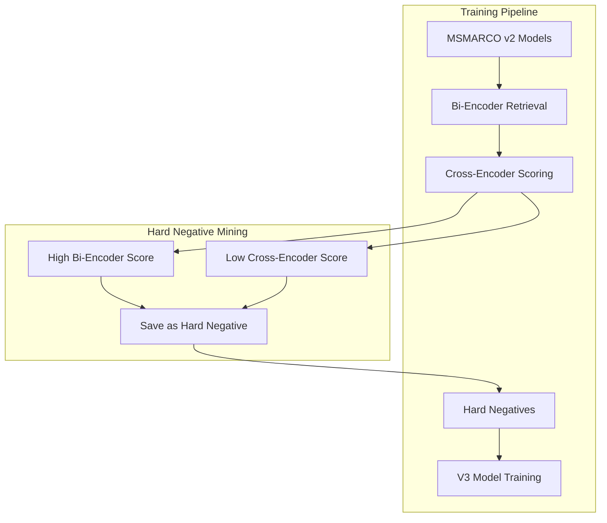

This document explains the two-stage retrieval architecture that combines bi-encoders (`SentenceTransformer`) for efficient retrieval with cross-encoders (`CrossEncoder`) for high-precision reranking. This approach balances computational efficiency with ranking quality by leveraging the strengths of both model types.

For information about individual model types, see [SentenceTransformer Models](#5.1) and [CrossEncoder Models](#5.3). For basic semantic search implementations, see [Semantic Search](#6.1).

## Architecture Overview

The retrieve & rerank architecture consists of two sequential stages that process user queries against a document corpus:

**Two-Stage Retrieve & Rerank Pipeline**

This architecture optimizes the trade-off between efficiency and quality. The `SentenceTransformer` handles the computationally expensive task of searching through millions of documents efficiently, while the `CrossEncoder` provides more accurate scoring for a smaller set of candidates.

Sources: [docs/pretrained-models/msmarco-v3.md:54-58](), [docs/cross_encoder/pretrained_models.md:44](), [docs/pretrained-models/ce-msmarco.md:36-48]()

## Retrieval Stage: SentenceTransformer

The first stage uses a `SentenceTransformer` model to encode queries and documents into dense vector embeddings. This bi-encoder approach processes queries and documents independently, enabling efficient pre-computation and fast similarity search.

**SentenceTransformer Retrieval Components**

### Model Selection for Retrieval

The choice of retrieval model depends on similarity function and performance requirements:

| Model | NDCG@10 (TREC DL 19) | MRR@10 (MS Marco Dev) | Similarity Function |
|-------|---------------------|----------------------|-------------------|
| `msmarco-MiniLM-L6-v3` | 67.46 | 32.27 | Cosine |
| `msmarco-distilbert-base-v3` | 69.02 | 33.13 | Cosine |
| `msmarco-distilbert-base-v4` | 70.24 | 33.79 | Cosine |
| `msmarco-distilbert-base-dot-prod-v3` | 68.42 | 33.04 | Dot Product |

Models tuned for cosine similarity prefer shorter passages, while dot-product models prefer longer passages.

Sources: [docs/pretrained-models/msmarco-v3.md:27-48](), [docs/pretrained-models/msmarco-v3.md:6-16]()

## Reranking Stage: CrossEncoder

The second stage uses a `CrossEncoder` model to perform joint encoding of query-document pairs, producing more accurate relevance scores for the top-k candidates from the retrieval stage.

**CrossEncoder Reranking Pipeline**

### Model Selection for Reranking

CrossEncoder models provide different speed-quality trade-offs:

| Model | NDCG@10 (TREC DL 19) | MRR@10 (MS Marco Dev) | Docs/Sec |
|-------|---------------------|----------------------|----------|
| `cross-encoder/ms-marco-TinyBERT-L2-v2` | 69.84 | 32.56 | 9000 |
| `cross-encoder/ms-marco-MiniLM-L6-v2` | 74.30 | 39.01 | 1800 |
| `cross-encoder/ms-marco-MiniLM-L12-v2` | 74.31 | 39.02 | 960 |
| `cross-encoder/ms-marco-electra-base` | 71.99 | 36.41 | 340 |

The `cross-encoder/ms-marco-MiniLM-L6-v2` model provides the best balance of quality and speed for most applications.

Sources: [docs/cross_encoder/pretrained_models.md:35-43](), [docs/pretrained-models/ce-msmarco.md:41-53]()

## Training Data Integration

The MSMARCO v3 models demonstrate how retrieve & rerank architectures are used during training to improve model quality:

**Hard Negative Mining in MSMARCO v3 Training**

This process identifies passages that receive high scores from the bi-encoder but low scores from the (more accurate) cross-encoder, creating challenging training examples that improve model quality.

Sources: [docs/pretrained-models/msmarco-v3.md:53-58]()

## Performance Characteristics

The retrieve & rerank architecture provides several performance advantages:

### Computational Efficiency
- **Pre-computation**: Document embeddings are computed once and stored
- **Fast Retrieval**: Vector similarity search scales to millions of documents  
- **Selective Reranking**: Only top-k candidates require expensive cross-encoder processing

### Quality Improvements
- **Broader Recall**: Bi-encoders capture semantic similarity across large corpora
- **Precise Ranking**: Cross-encoders provide accurate relevance scoring for final results
- **Hard Negative Training**: Improved training data quality through cross-encoder feedback

### Typical Configuration
- **Retrieval**: Return top-100 to top-1000 candidates
- **Reranking**: Score and return top-10 to top-20 final results
- **Latency**: ~10-50ms for retrieval + ~50-200ms for reranking

Sources: [docs/pretrained-models/msmarco-v3.md:27-50](), [docs/cross_encoder/pretrained_models.md:35-43]()

## Implementation Considerations

### Model Compatibility
Both retrieval and reranking models should be trained on similar datasets (e.g., MSMARCO) to ensure consistent relevance understanding.

### Activation Functions
CrossEncoder models may require specific activation functions: `activation_fn=torch.nn.Sigmoid()` ensures scores are normalized between 0 and 1.

### Similarity Functions
Ensure consistency between training and inference similarity functions (cosine vs. dot product) for optimal performance.

Sources: [docs/cross_encoder/pretrained_models.md:17-33](), [docs/pretrained-models/msmarco-v3.md:46-47]()