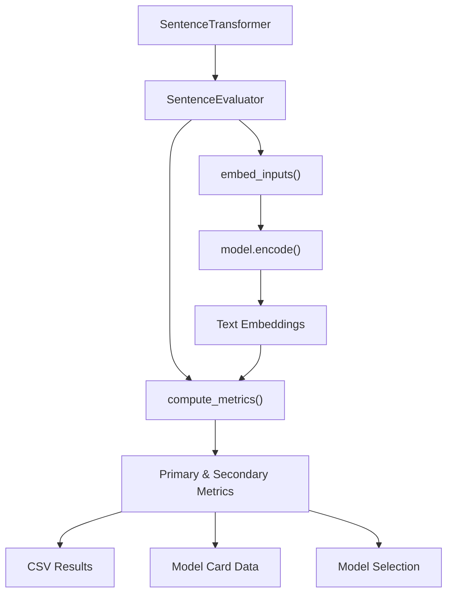
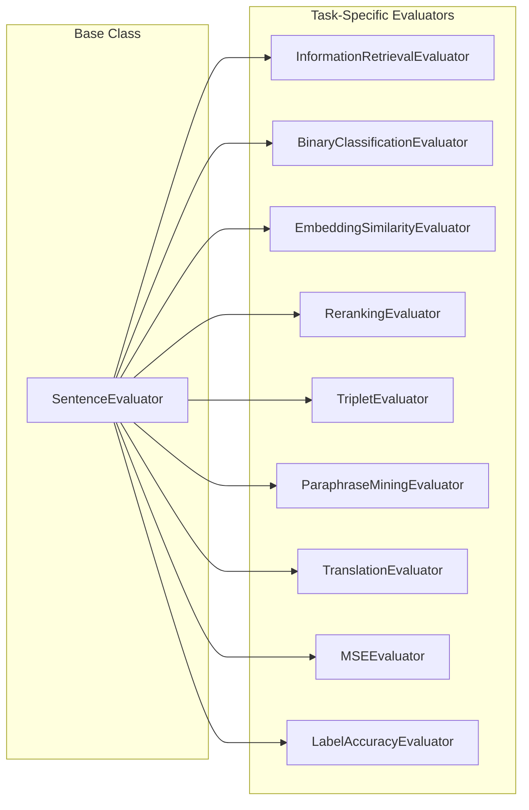
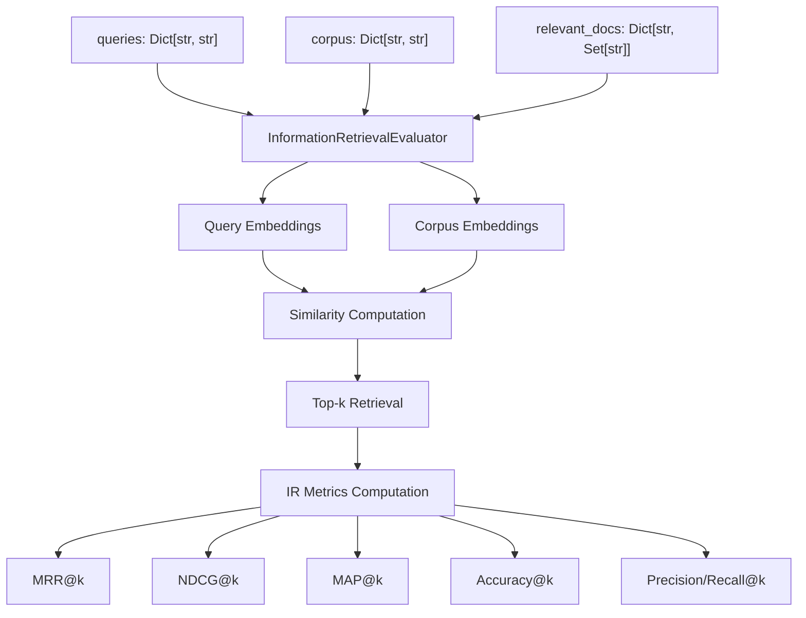
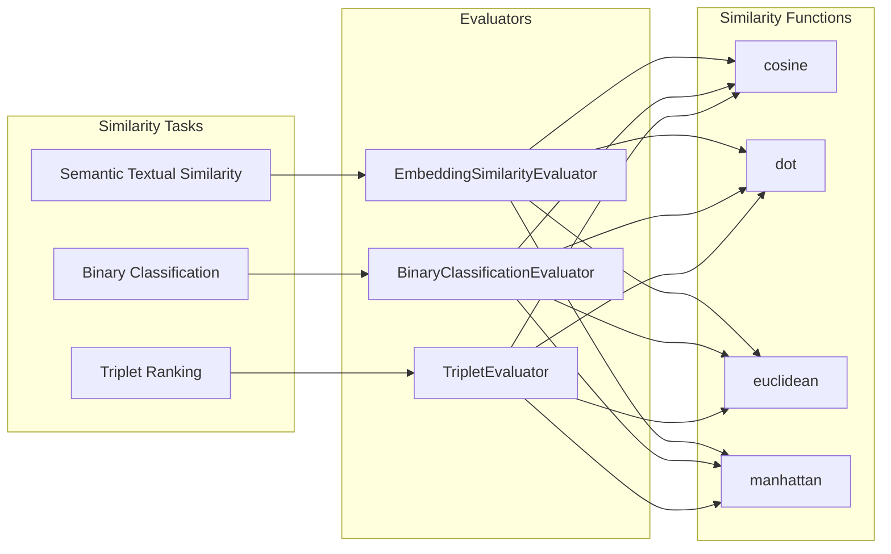
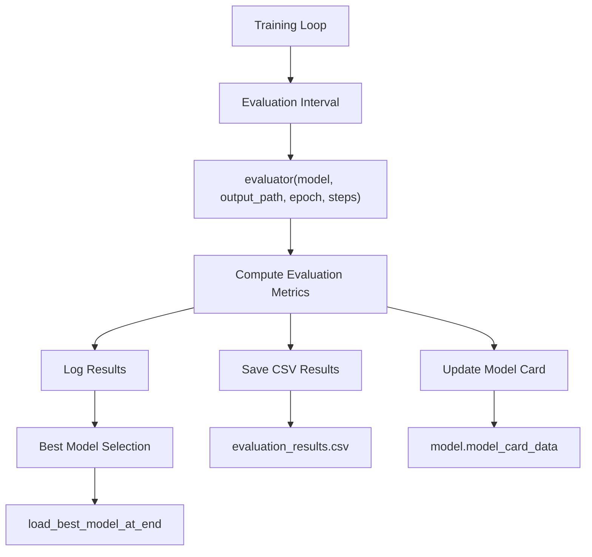

if Router in [module.__class__ for module in model.children()] and not args.router_mapping:
    raise ValueError(
        "You are using a Router module in your model, but you did not provide a "
        "`router_mapping` in the training arguments."
    )

args = SentenceTransformerTrainingArguments(
    router_mapping={
        "question": "query", 
        "answer": "document"
    },
    learning_rate_mapping={
        r"SparseStaticEmbedding\.*": 1e-3,  # Higher LR for static embeddings
        r".*": 2e-5                         # Lower LR for transformer layers
    }
)
```

**Sources:** [sentence_transformers/trainer.py:206-212](), [sentence_transformers/models/Router.py:47-68](), [tests/models/test_router.py:414-454]()

## Performance Considerations

### Memory vs Speed Trade-offs

| Technique | Memory Reduction | Speed Impact | Use Case |
|-----------|------------------|--------------|----------|
| Cached Losses | ~75% | -20% | Large batch training |
| Mini-batching | Configurable | Variable | Memory-constrained environments |
| Matryoshka | None | +10% | Multi-resolution embeddings |
| Router | ~50% for queries | +5% | Asymmetric retrieval |

### Optimal Configuration Guidelines

1. **Cached losses**: Use `mini_batch_size` as large as your GPU memory allows
2. **Matryoshka**: Set `n_dims_per_step=1` for memory efficiency, `-1` for speed
3. **Router**: Use lightweight query encoders with powerful document encoders
4. **Gradient accumulation**: Generally unnecessary with cached losses

**Sources:** [sentence_transformers/losses/CachedMultipleNegativesRankingLoss.py:88-92](), [sentence_transformers/losses/MatryoshkaLoss.py:140-144]()

# Evaluation


The evaluation system in sentence-transformers provides comprehensive metrics and benchmarking capabilities for assessing model performance across diverse tasks. This system supports evaluation during training for model selection, standalone evaluation for benchmarking, and integration with various downstream applications.

For training-specific guidance including how evaluators integrate with the training loop, see [Training](#3). For task-specific evaluator details, see [SentenceTransformer Evaluators](#4.1), [SparseEncoder Evaluators](#4.2), and [CrossEncoder Evaluators](#4.3).

## Evaluation Architecture

The evaluation system is built around a modular architecture where all evaluators inherit from the `SentenceEvaluator` base class. This design provides consistent interfaces while allowing specialized implementations for different task types.

### Core Evaluation Flow



**Evaluation Flow in sentence-transformers**

The base `SentenceEvaluator` class defines the evaluation interface and common functionality shared across all evaluators. Every evaluator implements the `__call__` method to perform evaluation and return metrics.

Sources: [sentence_transformers/evaluation/SentenceEvaluator.py:13-121]()

### Key Evaluation Concepts

| Concept | Description | Implementation |
|---------|-------------|----------------|
| **Primary Metric** | Main metric used for model selection | `evaluator.primary_metric` attribute |
| **Greater is Better** | Whether higher scores indicate better performance | `evaluator.greater_is_better` boolean |
| **CSV Logging** | Track metrics over training epochs/steps | `write_csv` parameter across evaluators |
| **Model Card Integration** | Store evaluation results in model metadata | `store_metrics_in_model_card_data()` method |



**Evaluator Class Hierarchy**

Sources: [sentence_transformers/evaluation/SentenceEvaluator.py:13-121](), [sentence_transformers/evaluation/InformationRetrievalEvaluator.py:23-568](), [sentence_transformers/evaluation/BinaryClassificationEvaluator.py:27-379]()

## Evaluation Categories

### Information Retrieval Evaluation

The `InformationRetrievalEvaluator` is the most comprehensive evaluator, designed for search and retrieval tasks. It computes standard IR metrics including Mean Reciprocal Rank (MRR), Normalized Discounted Cumulative Gain (NDCG), Mean Average Precision (MAP), precision, recall, and accuracy at various k values.



**Information Retrieval Evaluation Pipeline**

Key parameters for IR evaluation:
- `corpus_chunk_size`: Controls memory usage during large corpus evaluation
- `score_functions`: Multiple similarity functions can be evaluated simultaneously
- `write_predictions`: Enable writing retrieval results for downstream analysis

Sources: [sentence_transformers/evaluation/InformationRetrievalEvaluator.py:23-568]()

### Similarity and Classification Evaluation

For tasks involving sentence pair similarity or binary classification:

| Evaluator | Primary Use Case | Key Metrics |
|-----------|------------------|-------------|
| `EmbeddingSimilarityEvaluator` | Semantic textual similarity | Pearson, Spearman correlation |
| `BinaryClassificationEvaluator` | Binary similarity classification | Accuracy, F1, Precision, Recall, AP |
| `TripletEvaluator` | Triplet-based ranking | Accuracy with configurable margins |



**Similarity and Classification Evaluation Framework**

Sources: [sentence_transformers/evaluation/EmbeddingSimilarityEvaluator.py:27-272](), [sentence_transformers/evaluation/BinaryClassificationEvaluator.py:27-379](), [sentence_transformers/evaluation/TripletEvaluator.py:26-271]()

### Specialized Task Evaluation

Several evaluators target specific applications:

**Reranking Evaluation**: The `RerankingEvaluator` assesses models on reranking tasks where queries are paired with positive and negative documents. It computes MAP, MRR@k, and NDCG@k metrics.

**Paraphrase Mining**: The `ParaphraseMiningEvaluator` evaluates paraphrase detection by mining similar sentence pairs from a corpus and comparing against gold standard duplicates.

**Translation/Multilingual**: The `TranslationEvaluator` tests cross-lingual sentence alignment by checking if translated sentence pairs have the highest mutual similarity.

**Knowledge Distillation**: The `MSEEvaluator` measures mean squared error between teacher and student model embeddings for distillation tasks.

Sources: [sentence_transformers/evaluation/RerankingEvaluator.py:25-372](), [sentence_transformers/evaluation/ParaphraseMiningEvaluator.py:18-279](), [sentence_transformers/evaluation/TranslationEvaluator.py:22-192](), [sentence_transformers/evaluation/MSEEvaluator.py:18-158]()

## Integration with Training

Evaluators integrate seamlessly with the training pipeline for model selection and progress tracking. During training, evaluators are called at specified intervals to assess model performance.



**Evaluation Integration in Training Pipeline**

### Model Selection Mechanism

The training system uses the `primary_metric` and `greater_is_better` attributes to determine the best performing checkpoint:

- Each evaluator defines a `primary_metric` (e.g., `"ndcg@10"`, `"spearman_cosine"`)
- The `greater_is_better` boolean indicates optimization direction
- Best model loading occurs when `load_best_model_at_end=True` in training arguments

### Configuration and Extensibility

Common configuration options across evaluators:

| Parameter | Purpose | Available In |
|-----------|---------|--------------|
| `truncate_dim` | Embedding dimension truncation | Most evaluators |
| `batch_size` | Encoding batch size | All evaluators |
| `show_progress_bar` | Progress display | Most evaluators |
| `write_csv` | CSV result logging | All evaluators |
| `name` | Evaluator identifier | All evaluators |

Sources: [sentence_transformers/evaluation/SentenceEvaluator.py:71-75](), [sentence_transformers/evaluation/InformationRetrievalEvaluator.py:272-290]()

## Advanced Features

### Multi-Function Evaluation

Many evaluators support multiple similarity functions simultaneously, enabling comprehensive comparison:

```python