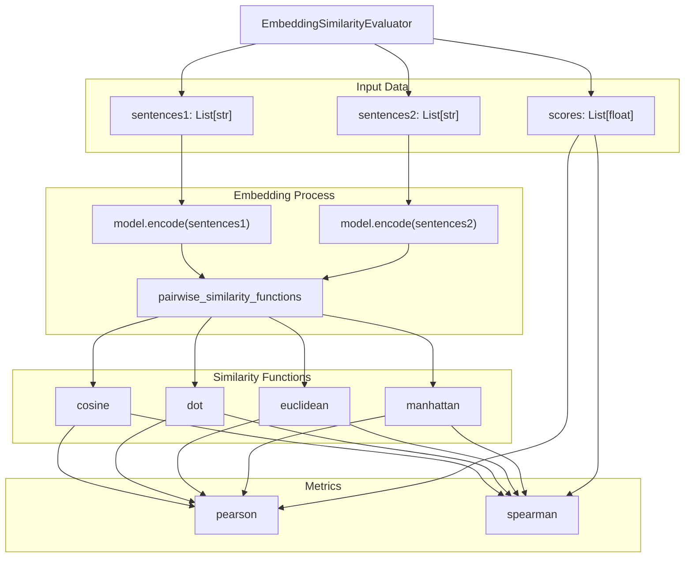
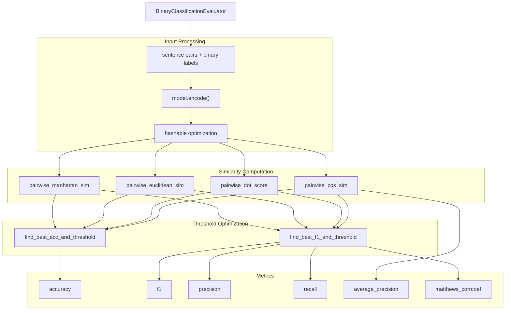
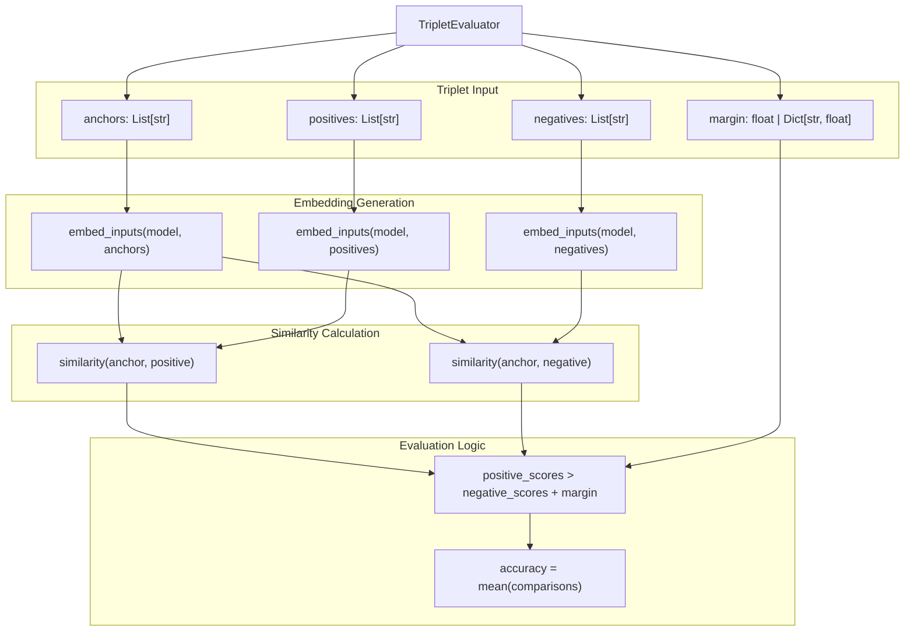
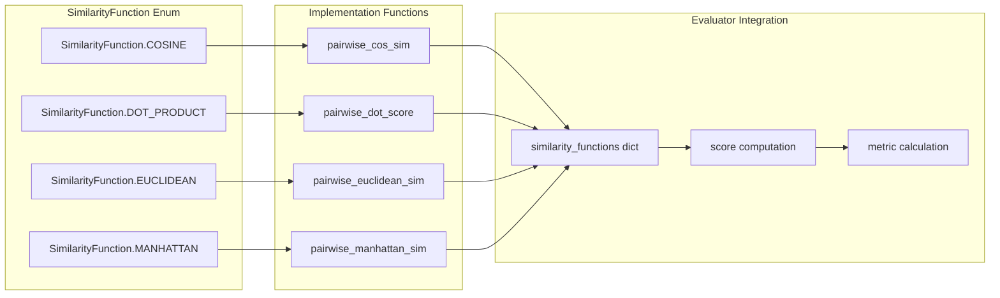
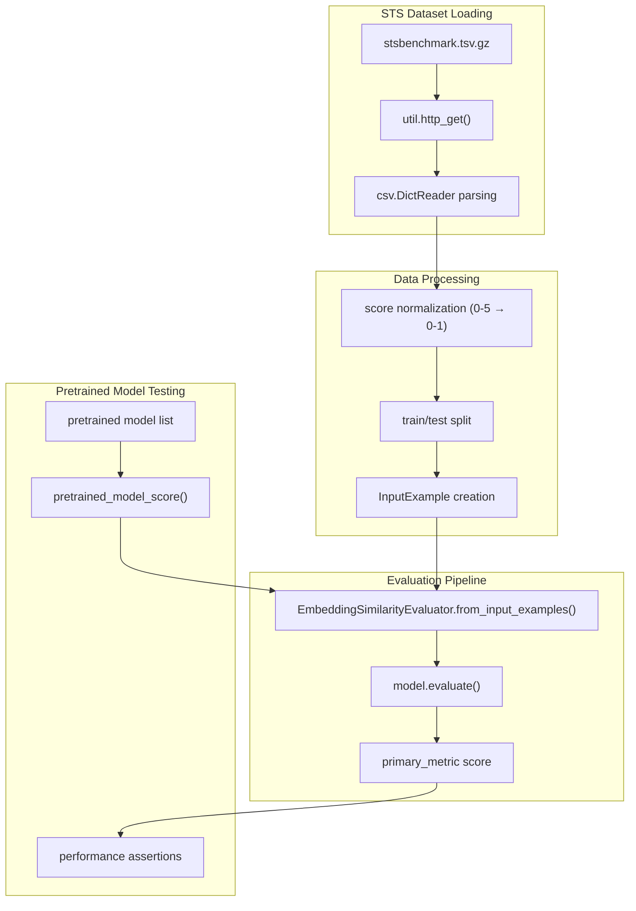
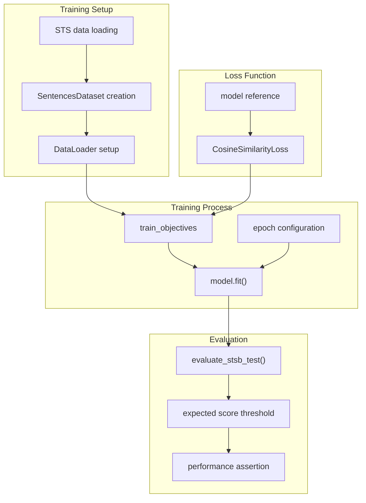

This page covers the evaluation and measurement of semantic textual similarity using sentence-transformers. It focuses on the various evaluators, similarity functions, and metrics available for assessing how semantically similar two pieces of text are to each other.

For information about using similarity for information retrieval tasks, see [Information Retrieval](#6.1). For details on training models with similarity-based objectives, see [Loss Functions for SentenceTransformer](#3.4).

## Core Similarity Evaluators

The sentence-transformers library provides several specialized evaluators for measuring semantic textual similarity, each designed for different evaluation scenarios and data formats.

### EmbeddingSimilarityEvaluator

The `EmbeddingSimilarityEvaluator` is the primary evaluator for semantic similarity tasks. It computes Spearman and Pearson rank correlations between predicted similarities and gold standard similarity scores.



**Sources:** [sentence_transformers/evaluation/EmbeddingSimilarityEvaluator.py:27-272]()

### BinaryClassificationEvaluator

The `BinaryClassificationEvaluator` treats semantic similarity as a binary classification problem, determining whether pairs of sentences are similar (1) or dissimilar (0).



**Sources:** [sentence_transformers/evaluation/BinaryClassificationEvaluator.py:27-379]()

### TripletEvaluator

The `TripletEvaluator` evaluates models using triplets of (anchor, positive, negative) sentences, ensuring that the anchor is more similar to the positive than to the negative example.



**Sources:** [sentence_transformers/evaluation/TripletEvaluator.py:26-271]()

## Similarity Functions and Metrics

The evaluators support multiple similarity functions, each with different mathematical properties and use cases.

| Similarity Function | Implementation | Use Case | Greater is Better |
|-------------------|----------------|----------|------------------|
| `cosine` | `pairwise_cos_sim` | General semantic similarity | ✓ |
| `dot` | `pairwise_dot_score` | When magnitude matters | ✓ |
| `euclidean` | `pairwise_euclidean_sim` | Distance-based similarity | ✗ |
| `manhattan` | `pairwise_manhattan_sim` | L1 distance similarity | ✗ |



**Sources:** [sentence_transformers/evaluation/EmbeddingSimilarityEvaluator.py:184-189](), [sentence_transformers/evaluation/BinaryClassificationEvaluator.py:238-259](), [sentence_transformers/evaluation/TripletEvaluator.py:187-204]()

## STS Benchmark Integration

The library includes extensive testing and evaluation capabilities for the STS (Semantic Textual Similarity) benchmark, a standard dataset for evaluating semantic similarity models.

### STS Benchmark Testing Framework



**Sources:** [tests/test_pretrained_stsb.py:18-49](), [tests/test_train_stsb.py:33-51]()

### Training with STS Data

The library supports training models specifically for semantic similarity using the STS benchmark:



**Sources:** [tests/test_train_stsb.py:74-103](), [tests/test_train_stsb.py:111-127]()

## Advanced Evaluation Features

### Precision and Quantization Support

The `EmbeddingSimilarityEvaluator` supports various embedding precisions for memory-efficient evaluation:

| Precision | Description | Binary Unpacking |
|-----------|-------------|------------------|
| `float32` | Standard floating point | ✗ |
| `int8` | 8-bit signed integer | ✗ |
| `uint8` | 8-bit unsigned integer | ✗ |
| `binary` | Binary with signed conversion | ✓ |
| `ubinary` | Unsigned binary | ✓ |

**Sources:** [sentence_transformers/evaluation/EmbeddingSimilarityEvaluator.py:171-176]()

### Multi-Metric Evaluation

All similarity evaluators support evaluation with multiple similarity functions simultaneously, computing max metrics across functions:

```python