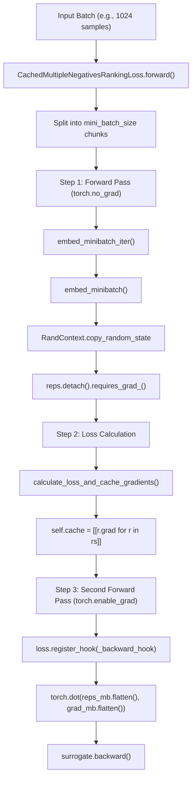
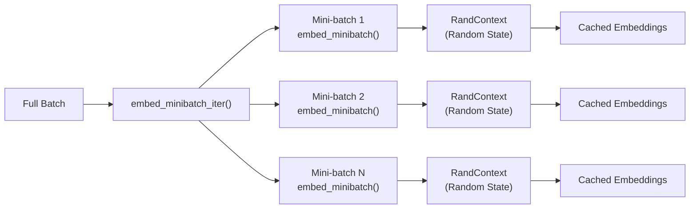
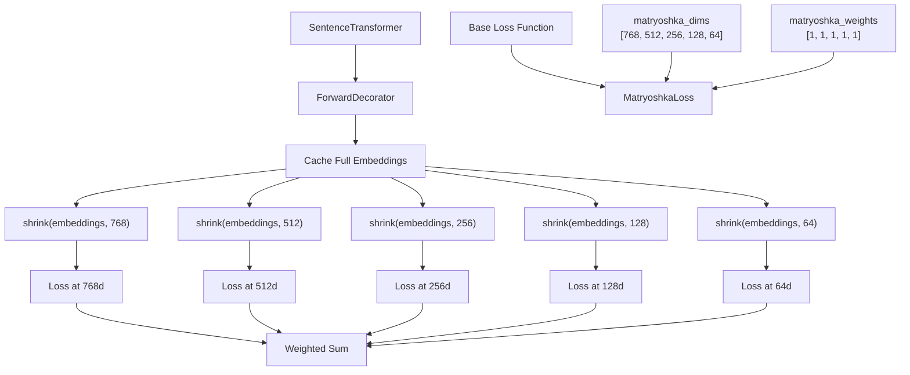
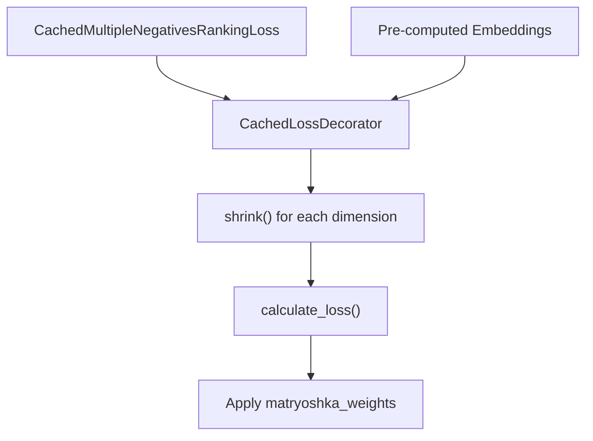
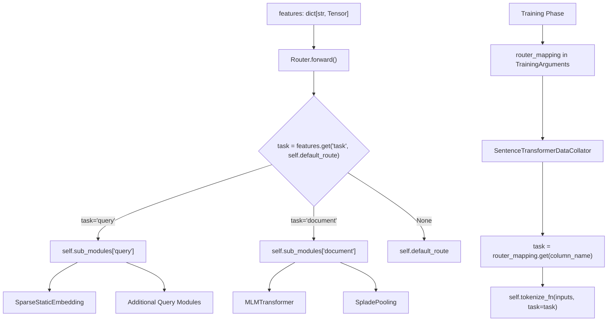
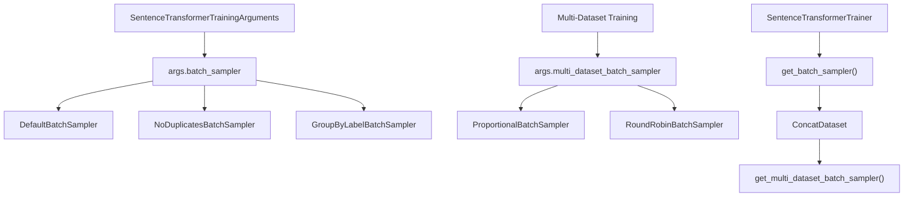
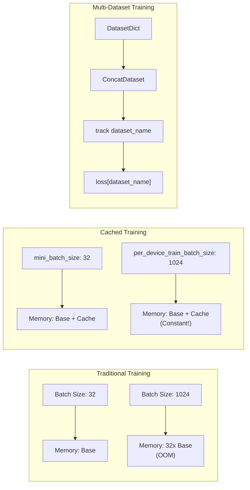
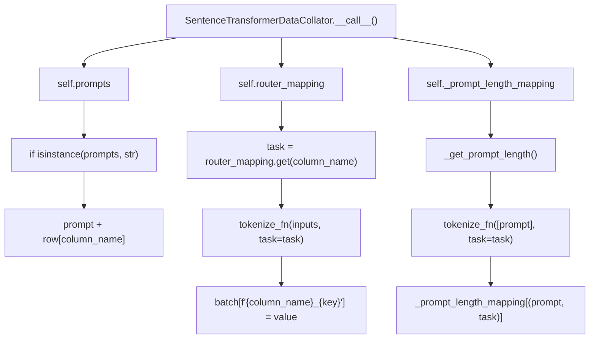
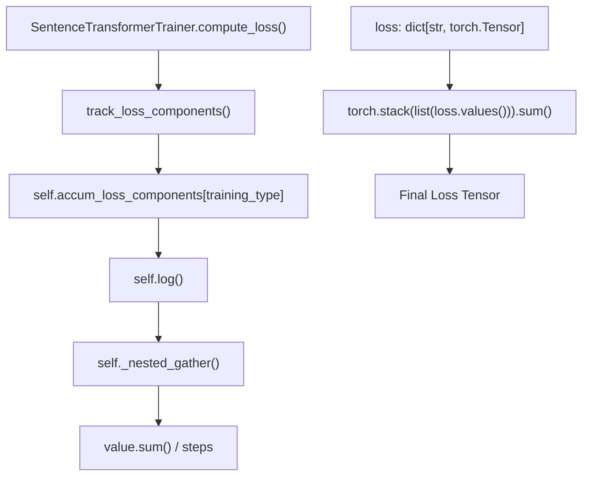

trainer = CrossEncoderTrainer(
    model=model,
    train_dataset=train_dataset,
    loss=loss,
)
trainer.train()
```

### Configuration Parameters

Common parameters across learning-to-rank losses:

| Parameter | Type | Purpose |
|-----------|------|---------|
| `model` | `CrossEncoder` | Model to train |
| `activation_fn` | `nn.Module` | Applied to logits before loss computation |
| `mini_batch_size` | `int` | Controls memory usage and processing speed |

Sources: [examples/cross_encoder/training/ms_marco/training_ms_marco_listmle.py:93-94](), [examples/cross_encoder/training/ms_marco/training_ms_marco_plistmle.py:96]()

## Performance Recommendations

Based on the documentation and implementation comments:

1. **LambdaLoss with NDCGLoss2PPScheme**: Generally performs best for ranking tasks
2. **PListMLELoss**: Outperforms standard ListMLELoss due to position weighting
3. **Mini-batch size**: Critical for memory management when processing many documents per query
4. **Hard negative mining**: Use `mine_hard_negatives` with `output_format="labeled-list"` for better training data

The learning-to-rank losses are optimized for handling variable numbers of documents per query and support both binary and continuous relevance labels.

Sources: [sentence_transformers/cross_encoder/losses/LambdaLoss.py:175-176](), [sentence_transformers/cross_encoder/losses/PListMLELoss.py:105-111](), [examples/cross_encoder/training/ms_marco/training_ms_marco_cmnrl.py:62-71]()

# Memory-Efficient Training


This document covers memory-efficient training techniques in sentence-transformers that allow training with large batch sizes and complex loss functions while maintaining reasonable memory usage. These techniques are essential for achieving optimal performance on modern embedding models without requiring excessive GPU memory.

For general training information, see [SentenceTransformer Training](#3.1). For specific loss functions, see [Loss Functions for SentenceTransformer](#3.4).

## Cached Loss Functions

The primary memory-efficient training technique uses **GradCache**, which enables training with much larger effective batch sizes while maintaining constant memory usage. This is implemented through cached versions of standard loss functions.

### GradCache Architecture



**Sources:** [sentence_transformers/losses/CachedMultipleNegativesRankingLoss.py:278-305](), [sentence_transformers/losses/CachedMultipleNegativesRankingLoss.py:42-62](), [sentence_transformers/losses/CachedMultipleNegativesRankingLoss.py:18-39]()

### Available Cached Loss Functions

| Standard Loss | Cached Version | Memory Benefit |
|---------------|----------------|----------------|
| `MultipleNegativesRankingLoss` | `CachedMultipleNegativesRankingLoss` | Constant memory for any batch size |
| `GISTEmbedLoss` | `CachedGISTEmbedLoss` | Large batch sizes with guide model |
| `MultipleNegativesSymmetricRankingLoss` | `CachedMultipleNegativesSymmetricRankingLoss` | Symmetric loss with caching |

**Sources:** [sentence_transformers/losses/CachedMultipleNegativesRankingLoss.py:64](), [sentence_transformers/losses/CachedGISTEmbedLoss.py:65](), [sentence_transformers/losses/CachedMultipleNegativesSymmetricRankingLoss.py:41]()

### Mini-batch Processing Implementation



The `mini_batch_size` parameter controls memory usage during training. Each mini-batch is processed through `embed_minibatch()` with `RandContext` ensuring reproducible embeddings across forward passes.

**Sources:** [sentence_transformers/losses/CachedMultipleNegativesRankingLoss.py:175-223](), [sentence_transformers/losses/CachedMultipleNegativesRankingLoss.py:18-39]()

## Matryoshka Training

Matryoshka training allows models to work efficiently at multiple embedding dimensions, reducing storage and computation costs for downstream applications.

### MatryoshkaLoss Architecture



**Sources:** [sentence_transformers/losses/MatryoshkaLoss.py:113-253](), [sentence_transformers/losses/MatryoshkaLoss.py:30-111]()

### Cached Matryoshka Integration

For cached losses, Matryoshka uses `CachedLossDecorator` instead of `ForwardDecorator`:



**Sources:** [sentence_transformers/losses/MatryoshkaLoss.py:67-111](), [sentence_transformers/losses/MatryoshkaLoss.py:195-204]()

## Router-based Asymmetric Models

The `Router` module enables memory-efficient asymmetric architectures where different encoders are used for queries and documents.

### Router Architecture



This enables memory-efficient asymmetric training where lightweight query encoders (e.g., `SparseStaticEmbedding`) can be combined with powerful document encoders, reducing both training and inference costs.

**Sources:** [sentence_transformers/models/Router.py:217-245](), [sentence_transformers/models/Router.py:287-324](), [sentence_transformers/data_collator.py:90-118]()

## Batch Sampling and Multi-Dataset Training

The `SentenceTransformerTrainer` provides memory-efficient batch sampling strategies for large-scale training:

### Batch Sampler Architecture



**Sources:** [sentence_transformers/trainer.py:623-684](), [sentence_transformers/trainer.py:685-737](), [sentence_transformers/sampler.py:28-35]()

### Memory Usage Patterns



**Sources:** [sentence_transformers/losses/CachedMultipleNegativesRankingLoss.py:100-107](), [sentence_transformers/trainer.py:416-422]()

### Data Collator Memory Optimizations

The `SentenceTransformerDataCollator` includes several memory-efficient features:



The prompt length caching in `_get_prompt_length()` prevents repeated tokenization of the same prompts, significantly reducing memory overhead during data loading.

**Sources:** [sentence_transformers/data_collator.py:35-119](), [sentence_transformers/data_collator.py:121-138]()

## Implementation Examples

### Using Cached Losses

```python
# Standard approach - memory scales with batch size
loss = MultipleNegativesRankingLoss(model)

# Cached approach - constant memory usage
loss = CachedMultipleNegativesRankingLoss(
    model, 
    mini_batch_size=32,  # Controls actual memory usage
    show_progress_bar=True
)
```

## Trainer Memory Optimizations

The `SentenceTransformerTrainer` includes several memory-efficient features beyond cached losses:

### Loss Component Tracking



This prevents memory spikes when losses return dictionaries with multiple components by accumulating and averaging them efficiently.

**Sources:** [sentence_transformers/trainer.py:443-462](), [sentence_transformers/trainer.py:464-494](), [sentence_transformers/trainer.py:431-441]()

### Training Arguments for Memory Efficiency

```python
args = SentenceTransformerTrainingArguments(
    per_device_train_batch_size=1024,  # Large effective batch size
    gradient_accumulation_steps=1,     # No additional accumulation needed
    dataloader_drop_last=True,         # Avoid uneven batches
    batch_sampler=BatchSamplers.NO_DUPLICATES,  # Memory-efficient sampling
    multi_dataset_batch_sampler=MultiDatasetBatchSamplers.PROPORTIONAL,
)
```

**Sources:** [sentence_transformers/trainer.py:623-684](), [sentence_transformers/training_args.py:37-39]()

### Router Training Configuration

```python