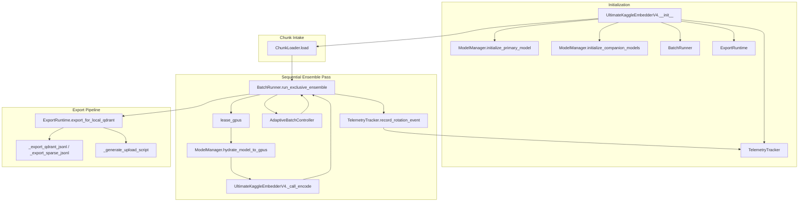

# Ultimate Embedder Architecture (Ground Truth)

## Component Flow


## Module Responsibilities
- `processor/ultimate_embedder/core.py`: Facade that owns configuration, lifecycle wiring, telemetry, and export hooks.
- `processor/ultimate_embedder/model_manager.py`: Hydrates primary, companion, and sparse encoders; stages models between CPU and CUDA for exclusive passes.
- `processor/ultimate_embedder/batch_runner.py`: Drives sequential ensemble execution, adaptive batching, and GPU leasing while normalizing outputs.
- `processor/ultimate_embedder/export_runtime.py`: Writes dense, sparse, and multivector artifacts plus the auto-generated Qdrant upload script.
- `processor/ultimate_embedder/controllers.py`: Captures GPU memory telemetry and reacts to pressure via `AdaptiveBatchController`.
- `processor/ultimate_embedder/telemetry.py`: Records mitigation, rotation, batch progress, and lease events for later run summaries.

## Execution Walkthrough
1. **Initialization**: `UltimateKaggleEmbedderV4.__init__` loads dense and companion encoders through `ModelManager`, prepares telemetry, performance monitoring, and export helpers, and resolves Hugging Face cache roots.
2. **Chunk intake**: `ChunkLoader.load` applies the preprocessing policy, populates `chunk_texts` and metadata, and primes sparse vectors.
3. **Sequential ensemble**: `BatchRunner.run_exclusive_ensemble` iterates each configured model, leases the GPUs, hydrates the encoder, adapts batch size when telemetry reports pressure, and aggregates normalized vectors.
4. **Telemetry & monitoring**: Each pass feeds `TelemetryTracker` with lease, mitigation, and rotation events; `PerformanceMonitor` samples CUDA and system stats while runs are active.
5. **Export**: `ExportRuntime.export_for_local_qdrant` serializes dense embeddings, sparse sidecars, multivectors, metadata, and the ready-to-run upload script targeting the resolved Qdrant collection.

## Code Integration Examples
### Exclusive ensemble pass (from `processor/ultimate_embedder/batch_runner.py`)
```python
with lease_gpus(embedder, model_name, logger) as lease:
    model = embedder.model_manager.hydrate_model_to_gpus(
        model_name,
        device_ids=lease.device_ids,
    )

    batch_embeddings = embedder._call_encode(
        model,
        texts,
        batch_size=batch_hint,
        device=target_device,
        progress_context=progress_context,
    )
```

### Facade usage tying everything together
```python
from processor.ultimate_embedder.config import EnsembleConfig, KaggleGPUConfig
from processor.ultimate_embedder.core import UltimateKaggleEmbedderV4

embedder = UltimateKaggleEmbedderV4(
    enable_ensemble=True,
    ensemble_config=EnsembleConfig(ensemble_models=["bge-m3", "qwen3-embedding-0.6b"]),
    gpu_config=KaggleGPUConfig(device_count=2),
)

embedder.load_chunks_from_processing("/kaggle/working/rag_clean/Chunked")
run_stats = embedder.generate_embeddings_kaggle_optimized()
exports = embedder.export_for_local_qdrant()
lease_history = embedder.telemetry.gpu_lease_events
```

## Monitoring & Telemetry Artifacts
- `TelemetryTracker.mitigation_events` captures adaptive batch and device reassignment outcomes for run summaries.
- `TelemetryTracker.gpu_lease_events` preserves before/after VRAM snapshots per model pass, matching the `lease_gpus` lifecycle.
- `PerformanceMonitor.processing_stats` aggregates CUDA and system metrics that are embedded into the exported stats JSON.
